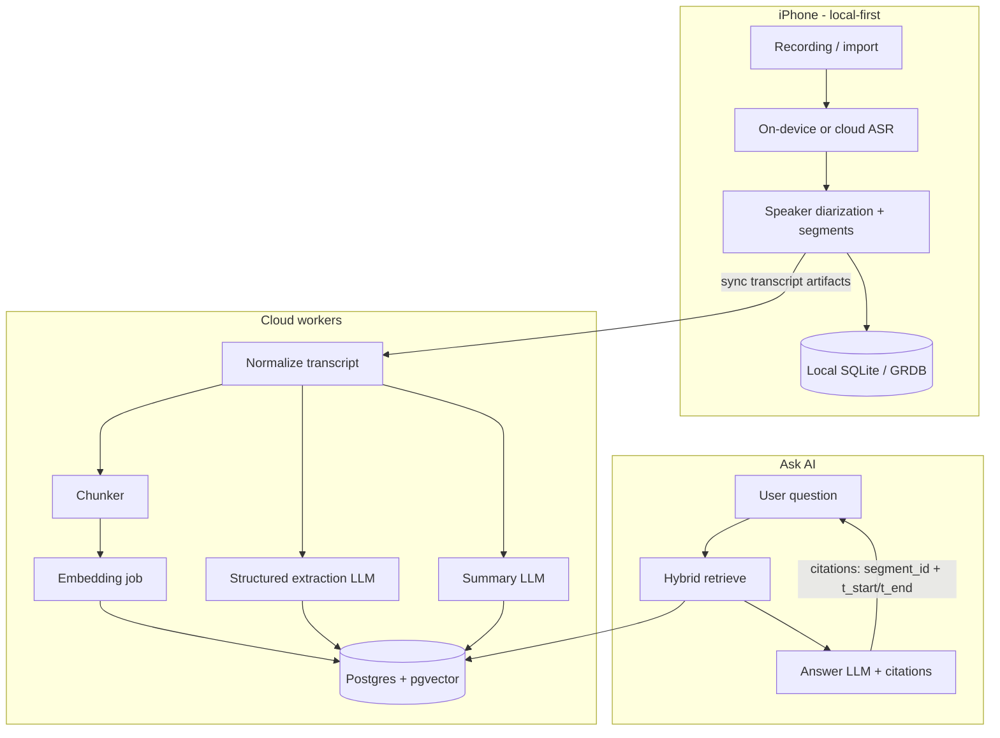
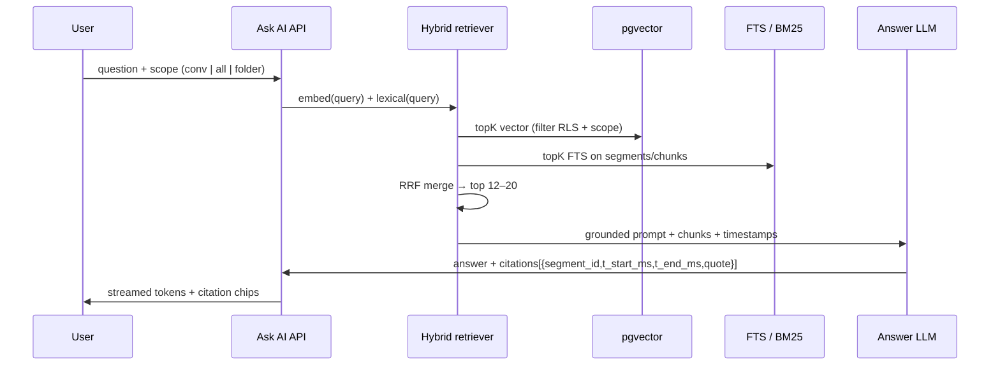
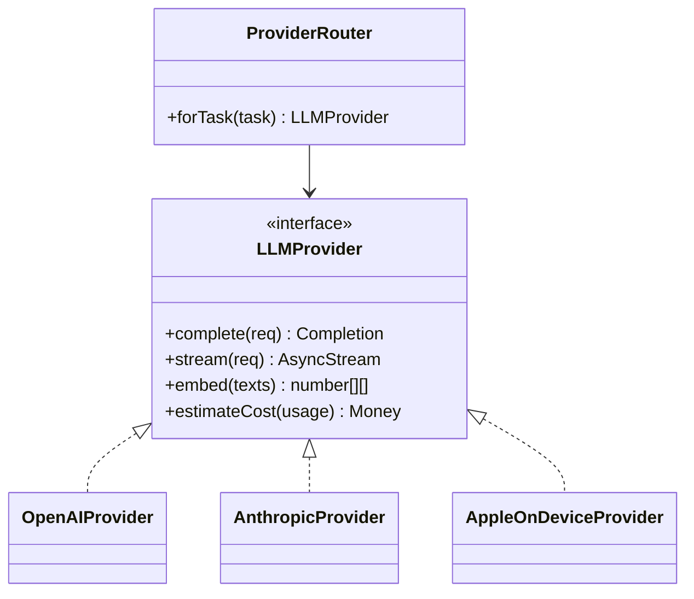

# AI Architecture — Afterna

**Product:** iPhone AI conversation memory app  
**Scope:** Per-conversation and cross-conversation intelligence, RAG, modular LLM providers, cost model  
**Companion docs:** [MEMORY_SEARCH_ARCHITECTURE.md](./MEMORY_SEARCH_ARCHITECTURE.md) · [BACKEND_ARCHITECTURE.md](./BACKEND_ARCHITECTURE.md)

---

## 1. Goals & constraints

| Goal | Constraint |
|------|------------|
| Extract structured memory from conversations | On-device first; cloud for heavy LLM + embeddings |
| Ask AI over one chat or all chats | Citations must point to transcript timestamps |
| Predictable cost at scale | Delete raw audio after successful transcription when policy allows |
| Swap LLM vendors without rewrite | Provider interface + typed prompts |

**Non-goals (V1):** Real-time streaming coaching during calls; fine-tuned private models; multi-modal vision of slides/screens.

---

## 2. Recommended AI pipeline



### Pipeline stages

1. **Capture** — Audio stays on device (or ephemeral upload) until transcription succeeds.
2. **Transcribe + diarize** — Prefer Apple Speech / Whisper-class cloud for quality; store `transcript_segments` with `t_start_ms`, `t_end_ms`, `speaker_id`, `text`.
3. **Audio disposal** — After transcript checksum verified and synced (or confirmed local-only), delete raw audio by default. User setting: “Keep audio for playback.”
4. **Normalize** — Punctuation cleanup, language detect, merge micro-segments (<400ms gaps, same speaker).
5. **Chunk** — See §4; write `embedding_chunks` linked to segment ranges.
6. **Embed** — Batch embeddings; store vectors in pgvector.
7. **Extract** — Single structured JSON pass (or two-pass for long meetings): summary, key points, decisions, action items, deadlines, entities.
8. **Ask AI** — Hybrid retrieve → rerank (optional) → grounded generation with mandatory citations.

---

## 3. Extraction schema (LLM output contract)

All extraction jobs return validated JSON (Zod / JSON Schema). Reject + retry on schema failure (max 2).

```json
{
  "summary": "2–5 sentence overview",
  "key_points": ["...", "..."],
  "decisions": [
    { "text": "...", "decided_by": "optional", "segment_ids": ["uuid"], "t_start_ms": 0, "t_end_ms": 0 }
  ],
  "action_items": [
    {
      "text": "...",
      "assignee": "optional person name",
      "due_date": "YYYY-MM-DD or null",
      "confidence": 0.0,
      "segment_ids": ["uuid"],
      "t_start_ms": 0,
      "t_end_ms": 0
    }
  ],
  "deadlines": [
    { "text": "...", "date": "YYYY-MM-DD", "segment_ids": ["uuid"] }
  ],
  "entities": [
    {
      "name": "Acme Corp",
      "type": "company|person|project|topic|place|other",
      "aliases": [],
      "mentions": [{ "segment_id": "uuid", "t_start_ms": 0, "t_end_ms": 0 }]
    }
  ]
}
```

**Prompt policy**

- System: “Extract only what is explicitly supported by the transcript. Prefer null over invention. Attach segment_ids for every decision/action/deadline.”
- Temperature: 0.1–0.3 for extraction; 0.2–0.5 for Ask AI.
- Long transcripts: map-reduce — chunk summaries → merge pass for global summary + deduped action items.

---

## 4. RAG design

### 4.1 Chunking

| Param | V1 recommendation |
|-------|-------------------|
| Unit | Time-aware speaker turns, not raw tokens only |
| Target size | 400–800 tokens ≈ 45–90s of speech |
| Overlap | 1 prior turn or ~15s / 80 tokens |
| Hard max | 1,200 tokens; split mid-turn only if needed |
| Metadata on chunk | `conversation_id`, `segment_id_range`, `t_start_ms`, `t_end_ms`, `speaker_ids[]`, `folder_ids[]`, `entity_ids[]` |

**Why time-aware turns:** Citations and “jump to moment” UX require stable `(t_start, t_end)` anchors; pure token windows break speaker continuity.

### 4.2 Embeddings

| Choice | Recommendation |
|--------|----------------|
| V1 model | `text-embedding-3-small` (OpenAI) or `voyage-3-lite` — 1536-d or 1024-d |
| Storage | `vector(1536)` + HNSW index in Postgres/pgvector |
| Normalization | L2-normalize at write time if using inner product |
| Re-embed | Version column `embedding_model`; background reindex on model bump |

### 4.3 Retrieval (per conversation & cross-conversation)



**Scopes**

- **Per conversation:** filter `conversation_id = $id`.
- **Cross-conversation:** filter by user (+ optional folder/tag/date range/entity).
- **Ask AI guardrails:** refuse if retrieval empty; never invent timestamps; quote ≤ 25 words per citation.

**Optional V1.1:** lightweight cross-encoder rerank on top 30 → top 10 (adds latency/cost; skip until quality metrics demand it).

### 4.4 Citation contract

Every answer must include:

```ts
type Citation = {
  conversation_id: string;
  segment_id: string;
  t_start_ms: number;
  t_end_ms: number;
  speaker_label?: string;
  quote: string; // verbatim span from segment
};
```

Client taps citation → seek transcript (audio only if retained).

---

## 5. Modular LLM providers



### Task → model routing (V1 defaults)

| Task | Default | Fallback | Notes |
|------|---------|----------|-------|
| ASR | Whisper large-v3 / Deepgram nova-2 / Apple Speech | Alternate ASR | Pick by language + cost |
| Embedding | OpenAI text-embedding-3-small | Voyage | Fixed dim in DB |
| Extraction / summary | Claude Sonnet or GPT-4.1-mini | Other | Structured JSON mode |
| Ask AI (short) | GPT-4.1-mini / Claude Haiku-class | — | Fast, cheap |
| Ask AI (hard / long context) | Sonnet / GPT-4.1 | — | Escalation flag |
| On-device redact / classify | Apple Foundation Models (when available) | Heuristics | PII pre-filter before cloud |

**Config:** `ai_provider_config` table + env secrets; per-tenant override later. All prompts versioned (`prompt_version`) and logged with token usage on `ai_queries` / `ai_jobs`.

---

## 6. Job types & idempotency

| Job | Trigger | Idempotency key | Output tables |
|-----|---------|-----------------|---------------|
| `transcribe` | upload/local complete | `recording_id` | segments |
| `extract` | transcript ready | `conversation_id:extract:vN` | summaries, action_items, entities |
| `embed` | segments ready | `conversation_id:embed:model` | embeddings |
| `ask` | user request | request_id (not cached by default) | ai_queries |
| `reindex` | model bump | batch cursor | embeddings |

Workers: Cloudflare Queues / Supabase + queue worker / Fly machine — see backend doc. Retries: exponential backoff; poison queue after 5.

---

## 7. Cost model

### 7.1 Assumptions (state explicitly)

| Assumption | Value |
|------------|-------|
| Avg conversation length | **30 minutes** |
| Words / minute | 140 → **~4,200 words ≈ 5,600 tokens** transcript |
| ASR cost | **$0.006 / min** (blended Whisper/Deepgram-class) |
| Embedding | **$0.02 / 1M tokens**; chunk overhead ×1.2 → ~6.7K tokens / conv |
| Extraction+summary prompt | ~6K in + 1.2K out |
| Extraction model blended | **$0.40 / 1M in**, **$1.60 / 1M out** (mini/haiku-class) |
| Ask AI: retrieve 8 chunks × ~600 tok = 4.8K + question 200 + system 400 ≈ **5.5K in**; answer **400 out** |
| Ask model blended | **$0.40 / 1M in**, **$1.60 / 1M out** |
| Asks / active user / month | **20** |
| Conversations / active user / month | **12** (≈ 6 hr audio) |
| “Active user” | Used app ≥1 day in month |
| Infra overhead (DB, workers, egress) | Modeled separately in backend doc; AI table below is **model+ASR only** |

### 7.2 Unit costs (AI + ASR)

| Unit | Formula | Est. cost |
|------|---------|-----------|
| **Per summary** (1 × 30-min conv: ASR + embed + extract) | ASR $0.18 + embed ≈ $0.00013 + LLM ≈ $0.0043 | **≈ $0.185** |
| **Per summary (LLM+embed only, ASR already paid)** | embed + extract | **≈ $0.0045** |
| **Per Ask AI question** | 5.5K in + 0.4K out | **≈ $0.0028** |
| **Per active user / month** | 12×$0.185 + 20×$0.0028 | **≈ $2.28** |

> If Apple on-device ASR is used for a large share, ASR drops toward $0 and **per-summary ≈ $0.005**, **per AU/mo ≈ $0.12** (LLM+embed only). Keep cloud ASR as quality/language fallback.

### 7.3 Scale table (model + ASR, monthly)

| Active users | Convos / mo | Asks / mo | ASR + LLM + embed | Notes |
|--------------|-------------|-----------|-------------------|-------|
| **1,000** | 12K | 20K | **≈ $2.3K** | Early stage |
| **10,000** | 120K | 200K | **≈ $23K** | Negotiate ASR; cache embeddings |
| **100,000** | 1.2M | 2M | **≈ $228K** | Aggressive on-device ASR + mini models; reserved capacity |

**Sensitivity**

| Lever | Effect |
|-------|--------|
| Cut avg length 30→15 min | ~50% ASR + ~40% LLM |
| 50% on-device ASR | ~$0.09 / summary all-in |
| Escalate 10% of Ask AI to premium model (10× output price) | +~$0.003 / ask blended → small vs ASR |
| Map-reduce on 90-min meetings | Extraction LLM ×1.5–2 |

**Product metering suggestion:** bill users on “hours transcribed” + “Ask AI credits”; your COGS floor ≈ $0.37/hr ASR + ~$0.01/hr post-process at mini rates.

---

## 8. Quality, safety, observability

| Area | V1 practice |
|------|-------------|
| Grounding | Citations required; highlight unsupported claims in eval harness |
| PII | Optional redact emails/phones before cloud; encrypt at rest |
| Eval set | 50 golden transcripts; track action-item F1, citation precision |
| Logging | `ai_queries`: tokens, latency, provider, prompt_version, retrieval_ids |
| Rate limits | Per-user daily Ask AI + monthly transcription minutes |
| Prompt injection | Treat transcript as untrusted data; delimit; ignore “system” instructions inside transcript |

---

## 9. Concrete V1 recommendations

1. **Ship:** chunked RAG + structured extraction; citations to segment timestamps.  
2. **Providers:** OpenAI or Anthropic for LLM; OpenAI/Voyage embeddings; pluggable ASR.  
3. **Defer:** knowledge-graph reasoning, custom fine-tunes, always-on premium models.  
4. **Cost control:** delete audio by default; prefer mini models; on-device ASR where quality OK; cache conversation-level summary in DB (don’t re-summarize on every open).  
5. **Cross-conversation Ask AI:** same RAG path with user-scoped filters — no separate “agent memory” store beyond entities + chunks (see memory doc).

---

## 10. Open decisions (product)

- Default audio retention: delete vs 7-day grace.  
- Whether extraction runs fully on-device for short notes (&lt;5 min) when Apple FM APIs suffice.  
- Premium tier: longer retention, premium Ask AI model, keep-audio.
