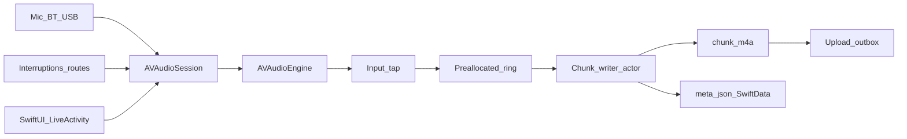
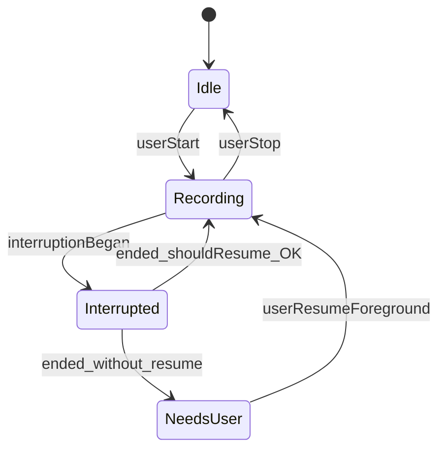

# Audio & Recording Architecture — Afterna

**Audience:** Audio & Recording Manager  
**Status:** CEO-approved baseline  
**Companion:** [IOS_ARCHITECTURE.md](./IOS_ARCHITECTURE.md)

---

## 1. Executive recommendation

| Topic | Recommendation |
|---|---|
| Capture API | **`AVAudioEngine`** (primary) for taps/VAD/metering |
| Session | `.playAndRecord` + `.spokenAudio` |
| Background | `UIBackgroundModes` → **`audio`** only (no voip hack) |
| Format | AAC mono `.m4a`, 64–96 kbps, 16–48 kHz |
| Long recordings (3h+) | Chunk every ~5 min; crash-safe sidecars |
| Bluetooth | `.allowBluetooth`; iOS 26+ `.bluetoothHighQualityRecording` |
| Indicators | System mic + in-app + **Live Activity** |
| Phone calls | Interruptions only — **cannot** capture Phone.app audio |

---

## 2. Hard impossibilities

| Claim | Reality |
|---|---|
| Record Phone/FaceTime system call mix | **Impossible** via public APIs |
| Silent recording | App Store violation (Guideline **2.5.14**) |
| Continue after force-quit | **Impossible**; only background uploads may continue |
| Start new recording purely from background | Highly constrained / often fails (`561145187`) |
| Use `voip` background mode as keep-alive | Review risk (Guideline **2.5.4**) — do not |
| Simulator for interruption/route validation | **Invalid** — hardware required |

Consent laws vary by jurisdiction — product shows awareness UX; do not claim legal compliance.

---

## 3. System architecture



### Session baseline

```swift
try session.setCategory(
  .playAndRecord,
  mode: .spokenAudio,
  options: [.allowBluetooth, .defaultToSpeaker, .mixWithOthers]
)
// iOS 26+: also .bluetoothHighQualityRecording
try session.setActive(true)
```

Info.plist: `NSMicrophoneUsageDescription`, `UIBackgroundModes = audio`. No `voip`.

### Audio thread rules

Inside `installTap`: no file I/O, no locks, no allocations — copy into preallocated ring; signal writer actor.

---

## 4. Background, lock screen, Live Activity

What keeps you alive: `audio` background mode + **active** session continuously capturing.

- Lock screen continues if above hold; never hide system mic indication.
- Start Live Activity from **foreground** when recording begins.
- Pause policy: end chunk + paused state requiring foreground resume (safest).
- App Review note: document “start record → background → lock → continues with Live Activity.”

---

## 5. Interruptions & routes



- Observe `interruptionNotification` and `routeChangeNotification`.
- Auto-resume only if `.shouldResume` and restart succeeds; else **Tap to resume**.
- Prefer reuse engine + reinstall taps; don’t recreate `AVAudioEngine()` mid-interruption.
- AirPods/BT drops: re-query `currentRoute`; never corrupt open chunk.
- **Never claim** “records your phone calls.”

---

## 6. Compression, VAD, battery

| Setting | Choice |
|---|---|
| Channels | Mono |
| Codec | AAC-LC `.m4a` |
| Bitrate | 64–96 kbps (~30–60 MB/hour) |
| Silence | Keep by default; optional user trim later |
| VAD | Lightweight RMS for meters; ML VAD optional behind flag |
| Battery | Expect ~8–15%/hour; measure on SE-class |

---

## 7. Long recordings & recovery

Chunk every ~5 minutes:

1. Finalize chunk (atomic rename).
2. Update `meta.json` + SwiftData.
3. Open next chunk immediately.
4. Optional: upload finished chunks while still recording.

| Failure | Recovery |
|---|---|
| Crash mid-record | Relaunch scans sidecars; recover chunks; prompt finalize/resume |
| Low disk | Warn ~500MB; auto-stop ~150MB; preserve chunks |
| Failed upload | Outbox retry + checksums; keep local until ACK |
| Force quit | Capture stops; uploads may continue via background URLSession |

---

## 8. Hardware test matrix (required)

Background 60+ min, lock screen, Phone interruption, Siri/alarm, AirPods connect/disconnect, wired unplug, Low Power Mode, disk fill, kill mid-record, kill mid-upload, 3h soak on SE-class.

---

## 9. Acceptance criteria

- [ ] Continues when backgrounded and locked
- [ ] Force quit stops capture; relaunch recovers files
- [ ] Phone call → defined Interrupted/NeedsUser state, no crash
- [ ] 3h produces valid playable audio without multi-minute dropouts
- [ ] Live Activity visible entire time mic is hot
- [ ] Marketing does not claim Phone.app call recording
- [ ] Upload retries are idempotent
