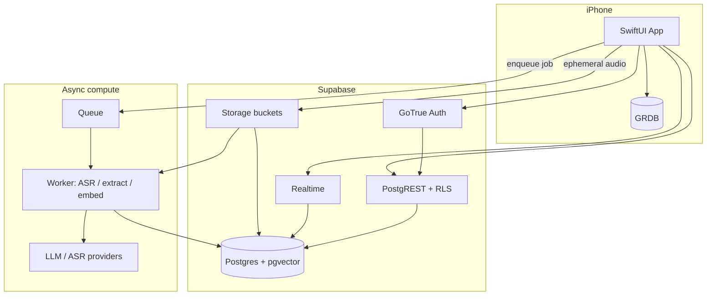
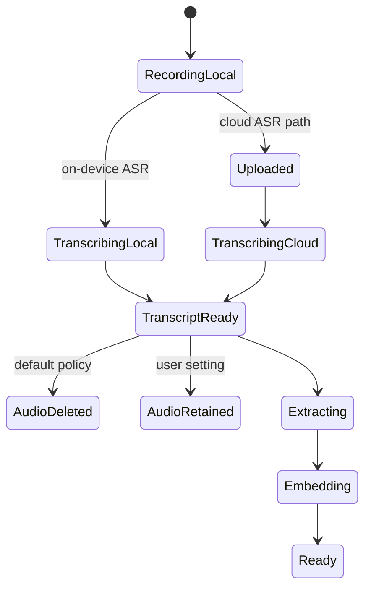
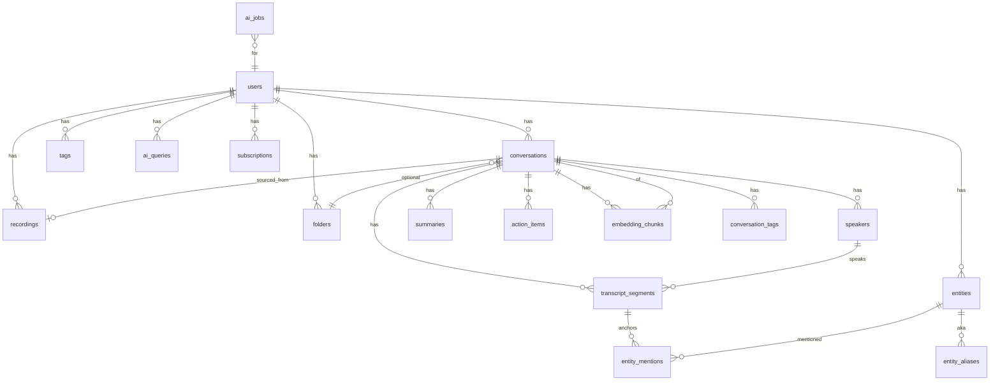

# Backend Architecture & Database Schema — Afterna

**Product:** iPhone AI conversation memory app  
**Scope:** Platform evaluation, recommended stack, sync model, billing-ready design, full Postgres schema  
**Companion docs:** [AI_ARCHITECTURE.md](./AI_ARCHITECTURE.md) · [MEMORY_SEARCH_ARCHITECTURE.md](./MEMORY_SEARCH_ARCHITECTURE.md)

---

## Part A — Backend architecture

### 1. Product constraints that drive the stack

- **Local-first iOS** with cloud sync of **processed artifacts** (transcripts, summaries, entities, action items).  
- **Delete raw audio** after successful transcription when practical.  
- **PostgreSQL + pgvector** preferred.  
- Auth, object storage (ephemeral audio), background jobs, **billing-ready**.  
- Modular LLM providers; cost visibility per job.

---

### 2. Platform evaluation

| Platform | Auth | Postgres / vectors | Storage | Jobs / queues | iOS fit | Billing path | Ops burden | V1 fit |
|----------|------|--------------------|---------|---------------|---------|--------------|------------|--------|
| **Supabase** | Excellent (GoTrue) | **Native Postgres + pgvector** | S3-compatible | Edge Functions + Queues / cron; or external workers | Swift clients mature | Stripe via Edge + webhooks; RevenueCat on device | Low | **Best default** |
| **Firebase** | Excellent | Firestore (NoSQL); vectors awkward | Excellent | Cloud Functions | Excellent | RevenueCat friendly | Low | Weak for relational RAG/FTS |
| **Cloudflare** | Workers + external IdP / Supabase Auth | D1/Hyperdrive → Postgres; Vectorize optional | R2 | Queues + Workers | DIY | Stripe Workers | Med | Strong **workers** companion |
| **AWS** | Cognito | RDS Postgres + pgvector | S3 | SQS + Lambda/ECS | DIY | Stripe or AWS Billing | High | Overkill early |
| **GCP** | Firebase Auth | Cloud SQL pgvector | GCS | Cloud Tasks / PubSub | DIY | Stripe | High | Overkill early |
| **Fly.io** | DIY | Fly Postgres + pgvector | Tigris/S3 | Machines + Redis queue | DIY | Stripe | Med | Good for **custom API** |
| **Railway** | DIY | Managed Postgres | DIY S3 | Services + cron | DIY | Stripe | Low–med | Fine prototype; less “batteries” |
| **Render** | DIY | Managed Postgres | DIY | Background workers | DIY | Stripe | Low–med | Similar to Railway |

#### Verdict

| Layer | Choice | Why |
|-------|--------|-----|
| **Primary BaaS** | **Supabase** | Postgres + pgvector + RLS + Auth + Realtime + Storage matches local-first sync and RAG |
| **Workers (optional Day 1 or soon)** | **Cloudflare Workers + Queues** *or* **Fly.io** machine | Long-running ASR/LLM jobs beyond Edge limits |
| **Mobile billing** | **RevenueCat** + App Store IAP | Standard iOS; map entitlements → `subscriptions` / quotas in Supabase |
| **Avoid as system of record** | Firebase Firestore | Painful hybrid search + relational memory |
| **Defer** | Full AWS/GCP | Adopt when compliance/enterprise demands escape hatch |



---

### 3. Recommended architecture (concrete)

#### 3.1 Responsibilities

| Component | Responsibility |
|-----------|----------------|
| **iOS + GRDB** | Capture audio, optional on-device ASR, offline transcript/FTS, optimistic UI, sync queue |
| **Supabase Auth** | Sign in with Apple (required), optional email/magic link |
| **Supabase Postgres** | System of record for all artifacts; RLS by `user_id` |
| **Supabase Storage** | `audio-inbox` bucket: TTL lifecycle (e.g. 24–72h); worker deletes object after ASR OK |
| **Job runner** | Transcribe → extract → embed pipeline; writes progress to `ai_jobs` |
| **RevenueCat** | Entitlements: `free` / `pro` minutes & Ask AI credits |

#### 3.2 Audio lifecycle



1. Write audio to app sandbox.  
2. Prefer on-device transcription when quality/language OK.  
3. Else upload to `audio-inbox/{user_id}/{recording_id}.m4a` with short-lived signed URL.  
4. Worker verifies duration/size, runs ASR + diarization, inserts `transcript_segments`.  
5. Mark `recordings.transcription_status = 'succeeded'`, checksum transcript.  
6. **Delete** Storage object + local file unless `keep_audio = true`.  
7. Enqueue extract + embed.

#### 3.3 Sync model

- **Push:** iOS upserts user-editable fields (titles, folders, tags, action status, entity merges).  
- **Pull:** Realtime + periodic fetch for server-produced rows (summaries, embeddings metadata, job status).  
- **Cursor:** `updated_at` + `id` keyset pagination per table.  
- **Embeddings** stay server-side; clients store `has_embeddings` flag only.

#### 3.4 Auth & security

- Sign in with Apple → Supabase user.  
- RLS on every user table: `auth.uid() = user_id`.  
- Service role only in workers.  
- No LLM API keys on device.  
- Column encryption optional for transcript text at rest (app-level) for stricter privacy SKU later.

#### 3.5 Jobs

| Job | Queue message | Timeout | Idempotency |
|-----|---------------|---------|-------------|
| `transcribe` | `recording_id` | 30–60 min audio dependent | unique `recording_id` |
| `extract` | `conversation_id`, `prompt_version` | 5–15 min | `(conversation_id, prompt_version)` |
| `embed` | `conversation_id`, `model` | 5–15 min | `(conversation_id, model)` |
| `purge_audio` | `recording_id` | 1 min | safe repeat |

Store all attempts in `ai_jobs` with `status`, `tokens_*`, `cost_usd_estimate`, `error`.

#### 3.6 Billing-ready (not necessarily billed Day 1)

| Concept | Implementation |
|---------|----------------|
| Customer | `users` + RevenueCat `app_user_id` |
| Entitlement | `subscriptions` mirror (product_id, expires_at, status) |
| Metering | `usage_monthly(user_id, yyyymm, transcription_seconds, ask_ai_count, llm_cost_usd)` |
| Quotas | Enforced in Edge Function / worker before enqueue |
| Webhooks | RevenueCat → upsert `subscriptions` |

Free tier example: 60 min ASR / mo + 30 Ask AI; Pro: 600 min + unlimited Ask (fair-use).

#### 3.7 Infra cost sketch (non-LLM)

Assumptions: artifacts only (no long-term audio); ~50 KB transcript + summary text / conv; ~200 chunks × 6 KB vector row overhead ≈ small; **~2–5 MB / user / year** hot data if audio deleted.

| Active users | Supabase-ish DB + storage + egress | Workers compute | Notes |
|--------------|------------------------------------|-----------------|-------|
| 1K | **~$25–80/mo** | **~$20–50/mo** | Pro plan territory |
| 10K | **~$200–600/mo** | **~$150–400/mo** | Watch Realtime + MAU |
| 100K | **~$2K–8K/mo** | **~$1.5K–5K/mo** | Likely Fly/AWS workers + larger Postgres |

AI/ASR COGS dominate (see AI doc: ~$2.3 / AU/mo with cloud ASR).

---

### 4. Alternatives if Supabase is blocked

| Constraint | Fallback |
|------------|----------|
| Need EU isolation / custom VPC | Fly.io API + Postgres (pgvector) + Tigris/S3 + Clerk or Auth.js |
| Already all-in Cloudflare | R2 + Queues + Hyperdrive to Postgres (still keep Postgres) |
| Must use Firebase Auth only | Firebase Auth + Postgres (Supabase or Cloud SQL); don’t use Firestore as memory store |

---

## Part B — Database schema

Postgres 15+ with extensions:

```sql
create extension if not exists "pgcrypto";
create extension if not exists "vector";
create extension if not exists "pg_trgm";
```

### 1. ER overview



### 2. DDL (V1)

```sql
-- ========== users & billing ==========
create table public.users (
  id uuid primary key references auth.users (id) on delete cascade,
  display_name text,
  locale text default 'en',
  keep_audio_default boolean not null default false,
  revenuecat_app_user_id text unique,
  created_at timestamptz not null default now(),
  updated_at timestamptz not null default now()
);

create table public.subscriptions (
  id uuid primary key default gen_random_uuid(),
  user_id uuid not null references public.users (id) on delete cascade,
  provider text not null default 'revenuecat', -- revenuecat|stripe
  product_id text not null,
  status text not null check (status in ('active','canceled','expired','trialing','grace')),
  starts_at timestamptz,
  expires_at timestamptz,
  raw jsonb not null default '{}',
  updated_at timestamptz not null default now(),
  unique (user_id, provider)
);

create table public.usage_monthly (
  user_id uuid not null references public.users (id) on delete cascade,
  year_month int not null, -- YYYYMM
  transcription_seconds int not null default 0,
  ask_ai_count int not null default 0,
  llm_cost_usd numeric(12,6) not null default 0,
  asr_cost_usd numeric(12,6) not null default 0,
  primary key (user_id, year_month)
);

-- ========== taxonomy ==========
create table public.folders (
  id uuid primary key default gen_random_uuid(),
  user_id uuid not null references public.users (id) on delete cascade,
  name text not null,
  parent_id uuid references public.folders (id) on delete set null,
  created_at timestamptz not null default now(),
  unique (user_id, name, parent_id)
);

create table public.tags (
  id uuid primary key default gen_random_uuid(),
  user_id uuid not null references public.users (id) on delete cascade,
  name text not null,
  created_at timestamptz not null default now(),
  unique (user_id, name)
);

-- ========== recordings & conversations ==========
create table public.recordings (
  id uuid primary key default gen_random_uuid(),
  user_id uuid not null references public.users (id) on delete cascade,
  local_path text,
  storage_path text,              -- null once purged
  duration_ms int,
  mime_type text,
  byte_size bigint,
  checksum sha256 bytea,
  keep_audio boolean not null default false,
  transcription_status text not null default 'pending'
    check (transcription_status in ('pending','processing','succeeded','failed')),
  audio_deleted_at timestamptz,
  captured_at timestamptz not null default now(),
  created_at timestamptz not null default now(),
  updated_at timestamptz not null default now()
);

create table public.conversations (
  id uuid primary key default gen_random_uuid(),
  user_id uuid not null references public.users (id) on delete cascade,
  recording_id uuid references public.recordings (id) on delete set null,
  folder_id uuid references public.folders (id) on delete set null,
  title text,
  language text,
  started_at timestamptz,
  ended_at timestamptz,
  status text not null default 'processing'
    check (status in ('processing','ready','failed','archived')),
  source text not null default 'recording'
    check (source in ('recording','import','manual_notes')),
  created_at timestamptz not null default now(),
  updated_at timestamptz not null default now()
);

create table public.conversation_tags (
  conversation_id uuid not null references public.conversations (id) on delete cascade,
  tag_id uuid not null references public.tags (id) on delete cascade,
  primary key (conversation_id, tag_id)
);

create table public.speakers (
  id uuid primary key default gen_random_uuid(),
  conversation_id uuid not null references public.conversations (id) on delete cascade,
  user_id uuid not null references public.users (id) on delete cascade,
  label text not null,              -- "Speaker 0", "Alex"
  entity_id uuid,                   -- optional link to person entity
  is_user boolean not null default false,
  created_at timestamptz not null default now()
);

create table public.transcript_segments (
  id uuid primary key default gen_random_uuid(),
  conversation_id uuid not null references public.conversations (id) on delete cascade,
  user_id uuid not null references public.users (id) on delete cascade,
  speaker_id uuid references public.speakers (id) on delete set null,
  idx int not null,                 -- order in conversation
  t_start_ms int not null,
  t_end_ms int not null,
  text text not null,
  confidence real,
  created_at timestamptz not null default now(),
  unique (conversation_id, idx)
);

-- FTS
alter table public.transcript_segments
  add column text_tsv tsvector
  generated always as (to_tsvector('english', coalesce(text, ''))) stored;

create index transcript_segments_tsv_idx
  on public.transcript_segments using gin (text_tsv);
create index transcript_segments_conv_time_idx
  on public.transcript_segments (conversation_id, t_start_ms);
create index transcript_segments_user_idx
  on public.transcript_segments (user_id);

-- ========== AI artifacts ==========
create table public.summaries (
  id uuid primary key default gen_random_uuid(),
  conversation_id uuid not null references public.conversations (id) on delete cascade,
  user_id uuid not null references public.users (id) on delete cascade,
  prompt_version text not null,
  summary text not null,
  key_points jsonb not null default '[]',
  decisions jsonb not null default '[]',
  deadlines jsonb not null default '[]',
  model text not null,
  token_input int,
  token_output int,
  cost_usd_estimate numeric(12,6),
  created_at timestamptz not null default now(),
  unique (conversation_id, prompt_version)
);

create table public.action_items (
  id uuid primary key default gen_random_uuid(),
  conversation_id uuid not null references public.conversations (id) on delete cascade,
  user_id uuid not null references public.users (id) on delete cascade,
  text text not null,
  assignee_text text,
  assignee_entity_id uuid,          -- FK added after entities
  due_date date,
  status text not null default 'open'
    check (status in ('open','done','dismissed')),
  confidence real,
  source_segment_ids uuid[] not null default '{}',
  t_start_ms int,
  t_end_ms int,
  created_at timestamptz not null default now(),
  updated_at timestamptz not null default now()
);

create index action_items_open_idx
  on public.action_items (user_id, due_date)
  where status = 'open';

create table public.entities (
  id uuid primary key default gen_random_uuid(),
  user_id uuid not null references public.users (id) on delete cascade,
  type text not null
    check (type in ('person','company','project','topic','place','other')),
  canonical_name text not null,
  properties jsonb not null default '{}',
  mention_count int not null default 0,
  created_at timestamptz not null default now(),
  updated_at timestamptz not null default now(),
  unique (user_id, type, canonical_name)
);

create index entities_name_trgm_idx
  on public.entities using gin (canonical_name gin_trgm_ops);

alter table public.speakers
  add constraint speakers_entity_fk
  foreign key (entity_id) references public.entities (id) on delete set null;

alter table public.action_items
  add constraint action_items_assignee_fk
  foreign key (assignee_entity_id) references public.entities (id) on delete set null;

create table public.entity_aliases (
  id uuid primary key default gen_random_uuid(),
  entity_id uuid not null references public.entities (id) on delete cascade,
  user_id uuid not null references public.users (id) on delete cascade,
  alias text not null,
  unique (user_id, alias)
);

create table public.entity_mentions (
  id uuid primary key default gen_random_uuid(),
  entity_id uuid not null references public.entities (id) on delete cascade,
  conversation_id uuid not null references public.conversations (id) on delete cascade,
  segment_id uuid not null references public.transcript_segments (id) on delete cascade,
  user_id uuid not null references public.users (id) on delete cascade,
  confidence real,
  created_at timestamptz not null default now()
);

create index entity_mentions_entity_idx on public.entity_mentions (entity_id, conversation_id);

-- ========== embeddings / RAG ==========
-- Use 1536 for OpenAI text-embedding-3-small; change dim if model changes (new column/table version).
create table public.embedding_chunks (
  id uuid primary key default gen_random_uuid(),
  conversation_id uuid not null references public.conversations (id) on delete cascade,
  user_id uuid not null references public.users (id) on delete cascade,
  chunk_idx int not null,
  t_start_ms int not null,
  t_end_ms int not null,
  segment_id_start uuid references public.transcript_segments (id) on delete set null,
  segment_id_end uuid references public.transcript_segments (id) on delete set null,
  text text not null,
  embedding vector(1536) not null,
  embedding_model text not null,
  created_at timestamptz not null default now(),
  unique (conversation_id, embedding_model, chunk_idx)
);

create index embedding_chunks_user_hnsw_idx
  on public.embedding_chunks
  using hnsw (embedding vector_cosine_ops);

create index embedding_chunks_user_conv_idx
  on public.embedding_chunks (user_id, conversation_id);

-- ========== Ask AI + jobs ==========
create table public.ai_queries (
  id uuid primary key default gen_random_uuid(),
  user_id uuid not null references public.users (id) on delete cascade,
  scope text not null check (scope in ('conversation','all','folder')),
  conversation_id uuid references public.conversations (id) on delete set null,
  folder_id uuid references public.folders (id) on delete set null,
  question text not null,
  answer text,
  citations jsonb not null default '[]',
  retrieved_chunk_ids uuid[] not null default '{}',
  model text,
  prompt_version text,
  token_input int,
  token_output int,
  cost_usd_estimate numeric(12,6),
  latency_ms int,
  created_at timestamptz not null default now()
);

create table public.ai_jobs (
  id uuid primary key default gen_random_uuid(),
  user_id uuid not null references public.users (id) on delete cascade,
  job_type text not null
    check (job_type in ('transcribe','extract','embed','purge_audio','reindex')),
  status text not null default 'queued'
    check (status in ('queued','running','succeeded','failed','dead')),
  recording_id uuid references public.recordings (id) on delete cascade,
  conversation_id uuid references public.conversations (id) on delete cascade,
  idempotency_key text not null,
  attempts int not null default 0,
  provider text,
  model text,
  token_input int,
  token_output int,
  cost_usd_estimate numeric(12,6),
  error text,
  payload jsonb not null default '{}',
  created_at timestamptz not null default now(),
  started_at timestamptz,
  finished_at timestamptz,
  unique (idempotency_key)
);

create index ai_jobs_status_idx on public.ai_jobs (status, created_at);
```

### 3. RLS sketch

```sql
alter table public.conversations enable row level security;

create policy conversations_owner on public.conversations
  for all using (auth.uid() = user_id)
  with check (auth.uid() = user_id);

-- Repeat pattern for: recordings, speakers, transcript_segments, summaries,
-- action_items, entities, entity_aliases, entity_mentions, embedding_chunks,
-- ai_queries, folders, tags, conversation_tags, usage_monthly, subscriptions.
-- ai_jobs: select for owner; insert/update via service role only.
```

### 4. Sync / client tables (optional mirror)

iOS GRDB can mirror a subset: `conversations`, `transcript_segments`, `summaries`, `action_items`, `entities`, `folders`, `tags`, `speakers`, `recordings` (metadata only). Omit `embedding` vectors locally.

Suggested client columns: `dirty`, `deleted_at`, `server_updated_at` for outbox sync.

---

## Part C — Concrete recommendations checklist

1. **Build on Supabase (Auth + Postgres + pgvector + Storage + RLS).**  
2. **Run ASR/LLM workers** on Cloudflare Queues or Fly.io with service role.  
3. **RevenueCat** for IAP; mirror entitlements; meter in `usage_monthly`.  
4. **Delete audio by default** after successful transcription; `keep_audio` opt-in.  
5. **Schema above** covers users / recordings / conversations / speakers / transcript_segments / summaries / action_items / entities / embeddings / ai_queries / folders / tags (+ jobs, subscriptions, usage).  
6. **No Neo4j in V1**; entity tables + hybrid search suffice ([MEMORY_SEARCH_ARCHITECTURE.md](./MEMORY_SEARCH_ARCHITECTURE.md)).  
7. **Escape hatch:** same schema on RDS/Cloud SQL later without rewriting the domain model.

---

## Appendix — Example hybrid retrieve SQL

```sql
-- Vector branch (cosine distance); always filter user_id
select id, conversation_id, t_start_ms, t_end_ms, text,
       embedding <=> $query_embedding as dist
from embedding_chunks
where user_id = $user_id
  and ($conversation_id::uuid is null or conversation_id = $conversation_id)
order by embedding <=> $query_embedding
limit 20;

-- Lexical branch
select id, conversation_id, t_start_ms, t_end_ms, text,
       ts_rank(text_tsv, plainto_tsquery('english', $q)) as rank
from transcript_segments
where user_id = $user_id
  and text_tsv @@ plainto_tsquery('english', $q)
order by rank desc
limit 20;

-- Fuse with RRF in the worker/Edge layer (by id / segment id).
```
