# Afterna — Compiled Research & Architecture

**Brand:** Afterna (ADR-014)
**Compiled:** 2026-08-07
**Domains:** `afterna.ai` · `afterna.app` (register)
**Bundle (proposed):** `app.afterna.ios`

## Executive report

| Item | Decision |
|---|---|
| Brand | **Afterna** — after the conversation, still yours |
| Domains | Buy `afterna.ai` + `afterna.app` |
| App Store (spot) | No exact title match |
| Rejected | Kept, Stillnote, Said, Saidso, Clarion, Remnora, Accordly, Aftertalk, Harbour |
| Backups | Seduvia → Verasay → Vowrae → Hushrae |
| Monetisation | Free + 60 min/week + in-feed native + Recording Credits (no subscription MVP) |
| Stack | SwiftUI · SwiftData · AssemblyAI · Supabase · OpenAI |

---

## TOC

1. [PROJECT_STATUS.md](#doc-project-status)
2. [NAMING_RESEARCH.md](#doc-naming-research)
3. [NAMING_PREMIUM_SHORTLIST.md](#doc-naming-premium-shortlist)
4. [MASTER_PRODUCT_PLAN.md](#doc-master-product-plan)
5. [MASTER_TECHNICAL_PLAN.md](#doc-master-technical-plan)
6. [MVP_SCOPE.md](#doc-mvp-scope)
7. [ROADMAP.md](#doc-roadmap)
8. [DECISIONS.md](#doc-decisions)
9. [PRODUCT_RESEARCH.md](#doc-product-research)
10. [IOS_ARCHITECTURE.md](#doc-ios-architecture)
11. [AUDIO_ARCHITECTURE.md](#doc-audio-architecture)
12. [TRANSCRIPTION_RESEARCH.md](#doc-transcription-research)
13. [TRANSCRIPTION_ARCHITECTURE.md](#doc-transcription-architecture)
14. [AI_ARCHITECTURE.md](#doc-ai-architecture)
15. [MEMORY_SEARCH_ARCHITECTURE.md](#doc-memory-search-architecture)
16. [BACKEND_ARCHITECTURE.md](#doc-backend-architecture)
17. [PRIVACY_SECURITY.md](#doc-privacy-security)
18. [UX_SPEC.md](#doc-ux-spec)
19. [DESIGN_SYSTEM.md](#doc-design-system)
20. [UNIT_ECONOMICS.md](#doc-unit-economics)
21. [TEST_STRATEGY.md](#doc-test-strategy)
22. [GO_TO_MARKET.md](#doc-go-to-market)
23. [NAMING_DUE_DILIGENCE.md](#doc-naming-due-diligence)

<a id="doc-project-status"></a>

######## DOCUMENT: PROJECT_STATUS.md ########

# Project Status — Afterna

**Current phase:** Research complete → brand **Afterna** locked (ADR-014) → register domains + plan approval → Phase 0  
**Last updated:** 2026-08-07

## Completed work

- Multi-manager research organisation executed in parallel (all five research tracks done)
- Research docs under `/docs` (full set):
  - PRODUCT_RESEARCH, IOS_ARCHITECTURE, AUDIO_ARCHITECTURE
  - TRANSCRIPTION_RESEARCH, TRANSCRIPTION_ARCHITECTURE
  - AI_ARCHITECTURE, MEMORY_SEARCH_ARCHITECTURE
  - BACKEND_ARCHITECTURE (includes DATABASE_SCHEMA DDL)
  - PRIVACY_SECURITY, UX_SPEC, DESIGN_SYSTEM
  - UNIT_ECONOMICS, TEST_STRATEGY, GO_TO_MARKET
- CEO red-team + ADRs + master plans:
  - DECISIONS, MASTER_PRODUCT_PLAN, MASTER_TECHNICAL_PLAN
  - MVP_SCOPE, ROADMAP
- Conflicts closed: free+credits+native+remote-caps over subscription; SwiftData over GRDB; AssemblyAI primary
- Monetisation iteration: Recording Credits + in-feed native every 4–6 cards; value screens ad-free (ADR-003/011)
- Naming: **Afterna** selected — [NAMING_PREMIUM_SHORTLIST.md](./NAMING_PREMIUM_SHORTLIST.md)
- Full compilation: [COMPILED.md](./COMPILED.md) + [README.md](./README.md) index

## In-progress work

- Register `afterna.ai` + `afterna.app`; attorney Class 9/42
- User approval of master plan → Phase 0 bootstrap

## Blocked work

- Implementation blocked until plan approval
- Project create at `C:\Users\User\Afterna` + move agent root (after domains owned preferred)

## Major architecture decisions

See [DECISIONS.md](./DECISIONS.md) — Supabase, AssemblyAI, OpenAI LLM, SwiftData, free+limits+ads, mic-only capture, audio delete-by-default.

## Open questions

1. ~~Brand name~~ → **Afterna**
2. Apple Developer Team / bundle ID (`app.afterna.ios`) for Phase 0
3. Supabase region preference (AU proximity vs US default)

## Known issues

- Product Research suggested subscriptions; overridden by unit economics (ADR-003).
- AI doc mentioned GRDB; overridden by SwiftData (ADR-007).
- Cannot record Phone.app calls or Zoom system audio on iOS.

## Next 10 tasks

1. Register `afterna.ai` + `afterna.app`
2. Approve master plan in Cursor
3. Create project at `C:\Users\User\Afterna` + move agent root
4. Phase 0: Xcode/SwiftPM foundation
5. Wire continuous doc updates into Phase 0 README
6. Phase 1: Design system + navigation
7. Phase 2: Recording engine (device testing)
8. Phase 4: Supabase + Sign in with Apple (can parallel Phase 2–3)
9. Phase 3: SwiftData library
10. Phase 5–6: Upload + AssemblyAI pipeline

---

<a id="doc-naming-research"></a>

######## DOCUMENT: NAMING_RESEARCH.md ########

# Naming Research — Archive

**Date:** 2026-08-07  
**Outcome:** **Afterna** selected (ADR-014). See [NAMING_PREMIUM_SHORTLIST.md](./NAMING_PREMIUM_SHORTLIST.md).  
**Engineering / project:** `Afterna` · bundle propose `app.afterna.ios` · domains `afterna.ai` + `afterna.app`  
**Disclaimer:** Not legal advice. Engage a trademark attorney before logo/domain spend beyond parking.

---

## Selected brand

| Item | Value |
|---|---|
| Name | **Afterna** |
| Meaning | After the conversation — still yours |
| Domains | Register `afterna.ai` + `afterna.app` |
| App Store (spot) | No exact title match (iTunes Search API US) |
| Backups | Seduvia → Verasay → Vowrae → Hushrae |

---

## Rejected names (summary)

| Name | Why |
|---|---|
| **Kept** | App Store swarm; Keep CRM clash; kept.com taken 1997; weak TM |
| **Stillnote** | Exact App Store diary (`id6781236577`) |
| **Said / Saidso** | Swarm / exact SaidSo app + saidso.net |
| **Clarion** | Car audio + IDE + medical software + crime app |
| **Aftertalk / Afterword** | Grief product / funeral SaaS / occupied apps |
| **Harbour / Harbor** | Live notes / second-brain products |
| **Recall** | Generic AI crowding |
| **Remnora** | remnora.com = memory-themed game; Remora/RemNote confusion |
| **Accordly** | Spanish legaltech adjacency; Accord* clutter |

Full diligence: [NAMING_DUE_DILIGENCE.md](./NAMING_DUE_DILIGENCE.md) · premium shortlist: [NAMING_PREMIUM_SHORTLIST.md](./NAMING_PREMIUM_SHORTLIST.md).

---

<a id="doc-naming-premium-shortlist"></a>

######## DOCUMENT: NAMING_PREMIUM_SHORTLIST.md ########

# Premium naming shortlist — `.ai` / `.app` first

**Date:** 2026-08-07  
**Status:** **Emotional pick locked — Afterna** (ADR-014). Next: buy `afterna.ai` + `afterna.app`, then attorney. Spot diligence only — **not legal clearance**.  
**Constraint:** Premium quiet-luxury feel · no exact App Store title · prefer `name.ai` **and** `name.app` DNS-empty  
**Project / engineering name:** **Afterna** (`C:\Users\User\Afterna`, bundle `app.afterna.ios`)  

**Team:** 6 parallel workers (quiet prestige · latinate · compounds · abstract · clearance · brand strategy) + CEO re-verify (DNS + iTunes Search API US).

---

## Hard rejects from this pass

| Name | Why out |
|---|---|
| Remnora / Accordly / prior list | Already failed (see [NAMING_DUE_DILIGENCE.md](./NAMING_DUE_DILIGENCE.md)) |
| Cordelle | `cordelle.ai` + `cordelle.app` live |
| Recolta | `recolta.app` live (RO marketplace); near Reculta |
| Saelora | `saelora.ai` resolves (Cloudflare) |
| Privelle | Live AU luxury bridal brand (Adelaide) |
| Sousvoix | Exact AS clear, but App Store search floods **Sous / sous-vide** cooking apps |
| Arcvana | Phonetic **Arcana** swarm (AI astrology / creative) |
| Heldmark / Softcairn / Remveil | Held / Cairn / Rem\* adjacency |
| Wyrvex / Oxvryn / Prynlo etc. | Clear domains, **not** premium quiet-luxury |

---

## Tier A — lead (premium + cleanest runway)

All of these: **0 exact App Store title** (iTunes Search API US) · **both** `.ai` and `.app` → **NXDOMAIN** at check time · no live competing product found under the exact string.

| Rank | Name | Say | Premium hook | Tagline seed | Soft watch |
|---|---|---|---|---|---|
| **1** | **Seduvia** | seh-DOO-vee-uh | Latin *sedare* → settle; Romance, owned, calm | *Where the conversation settles.* | None material |
| **2** | **Afterna** | af-TER-nuh | After the talk — product-true without grief “Aftertalk” | *After the conversation, still yours.* | Near “after” apps generically |
| **3** | **Verasay** | VAIR-uh-say | Truth of what was said — citation/Ask AI fit | *What was said, kept true.* | Veras (architecture AI) — different string |
| **4** | **Vowrae** | VOW-ray | Commitments / client promises — freelancer wedge | *The vows of the workday.* | Vowmark (SE gift co., different) |
| **5** | **Hushrae** | HUSH-ray | Quiet luxury coinage; private capture | *Held in hush.* | Hush\* wellness clutter (not exact) |

**User pick:** **Afterna.** Buy **`afterna.ai` + `afterna.app`** immediately. Backups if purchase/TM fails: Seduvia → Verasay → Vowrae → Hushrae.

---

## Tier B — strong backups (same clearance bar)

| Name | Say | Why keep | Soft watch |
|---|---|---|---|
| **Quietbind** | KWY-ət-bind | Instant privacy + durability; English-clear | Bind (SMB tools) — different brand |
| **Deedmark** | DEED-mark | Decisions / agreements marked | Expired USPTO “Deedmark” (old, unrelated) |
| **Postiqua** | pos-TEE-kwuh | “After” elevated; Latinate polish | — |
| **Sealira** | seh-LEER-uh | Seal the record | **Sealr.app** humanitarian capture (near, not exact) |
| **Retenora** | ret-en-OR-uh | Retain / hold memory | Rentora / Retora AI (phonetic near) |
| **Citehold** | SITE-hold | Ask AI + citations story | Academic Cite\* apps |
| **Linenfold** | LIN-en-fold | Craft / heritage premium | Linen\* App Store apps; Android puzzle “Linen Fold …” |
| **Orasyn** | OR-uh-sin | Oral / conversation sync | — |
| **Pactrae** | PACT-ray | Pact / agreement | **Pact** App Store apps (stem only) |

---

## Domain checklist (verified 2026-08-07)

| Name | `.ai` | `.app` |
|---|---|---|
| Seduvia | NXDOMAIN | NXDOMAIN |
| Afterna | NXDOMAIN | NXDOMAIN |
| Verasay | NXDOMAIN | NXDOMAIN |
| Vowrae | NXDOMAIN | NXDOMAIN |
| Hushrae | NXDOMAIN | NXDOMAIN |
| Quietbind | NXDOMAIN | NXDOMAIN |
| Deedmark | NXDOMAIN | NXDOMAIN |
| Postiqua | NXDOMAIN | NXDOMAIN |
| Sealira | NXDOMAIN | NXDOMAIN |
| Retenora | NXDOMAIN | NXDOMAIN |
| Citehold | NXDOMAIN | NXDOMAIN |
| Linenfold | NXDOMAIN | NXDOMAIN |
| Orasyn | NXDOMAIN | NXDOMAIN |
| Pactrae | NXDOMAIN | NXDOMAIN |

NXDOMAIN ≠ guaranteed available at registrar (premium pricing / reserved lists exist on `.ai`). Purchase immediately after emotional pick.

---

## App Store exact-title check (iTunes Search API, US)

| Name | Result count (fuzzy) | Exact title match |
|---|---|---|
| Seduvia | 2 | **0** |
| Afterna | 0 | **0** |
| Verasay | 3 | **0** |
| Vowrae | 1 | **0** |
| Hushrae | 0 | **0** |
| Quietbind | 8 | **0** |
| Deedmark | 8 | **0** |
| Postiqua | 3 | **0** |
| Sealira | 7 | **0** |
| Retenora | 2 | **0** |
| Citehold | 7 | **0** |
| Linenfold | 8 | **0** |
| Orasyn | 1 | **0** |
| Pactrae | 4 | **0** |

Also re-check AU/UK in App Store Connect before freeze.

---

## Recommended decision path

1. ~~Pick Tier A~~ → **Afterna** chosen.  
2. **Now:** register `afterna.ai` + `afterna.app` (+ `.com.au` if cheap).  
3. Attorney: IP Australia + USPTO Class 9/42 word mark.  
4. App Store Connect exact search AU/US/UK.  
5. Then create/rename project → `C:\Users\User\Afterna`, bundle `app.afterna.ios`.

Docs and product brand strings use **Afterna** throughout.

---

## Worker map (this run)

| Worker | Lane | Notable clears |
|---|---|---|
| A | Quiet prestige | Heldmark, Citehold, Lexhold (Held* demoted) |
| B | Latinate coinages | **Arcvana→demoted**, **Retenora, Sealira, Seduvia, Afterna** |
| C | Soft compounds | **Quietbind, Deedmark** (Remveil demoted) |
| D | Abstract invents | Sci-fi clears — dropped for premium bar |
| E | Clearance | Seed list mostly FAIL; invents Verasay / Vowrae / Hushrae / Pactrae |
| F | Brand strategy | Sousvoix / Linenfold / Quietfold (Sousvoix demoted; Fold* soft) |

---

<a id="doc-master-product-plan"></a>

######## DOCUMENT: MASTER_PRODUCT_PLAN.md ########

# Master Product Plan — Afterna

**CEO / Principal Architect review**  
**Date:** 2026-08-07  
**Brand:** **Afterna** (ADR-014) — domain/TM pending ([NAMING_PREMIUM_SHORTLIST.md](./NAMING_PREMIUM_SHORTLIST.md))  
**Category:** iPhone-first AI conversation memory

---

## 1. Positioning

**For** Australian freelancers, sole traders, and field/appointment professionals  
**Who** lose decisions, deadlines, and commitments after real conversations  
**Afterna** is the iPhone app that records the conversation, structures the memory, and lets you ask what was said weeks later  
**Unlike** Zoom bots (Otter/Fireflies), Mac-first notepads (Granola), hardware pins (Plaud), or Voice Memos + ChatGPT  
It is bot-free, phone-native, consent-aware, transcript-first (audio deletable), and built for searchable long-term memory.

**One-liner:** Capture the chat. Hold the memory. Delete the audio.

---

## 2. Killer feature (retention)

**Ask across conversations with citations** — “What did we agree about pricing?” → answer + “Based on 03:22–04:15” jump-to-transcript.

Secondary habit loop: one-tap record → structured note (actions/decisions) → follow-up share.

---

## 3. Why not Voice Memos + ChatGPT?

| Voice Memos + ChatGPT | Afterna |
|---|---|
| Manual export/paste | Automatic pipeline |
| No speaker structure | Diarisation + rename |
| No durable library UX for commitments | Action items, decisions, entities |
| No cross-conversation retrieval with citations | Hybrid RAG + memory |
| No consent / retention product controls | Privacy-first defaults |
| No offline capture → later enhance | Offline-first recording |

---

## 4. Red-team findings

| Question | Verdict |
|---|---|
| Overengineering? | Risk yes on knowledge graphs, live streaming, bots — **cut from V1** |
| Technically impossible on iOS? | Phone.app call recording; silent recording; system-audio from Zoom — **do not promise** |
| App Store risks? | Background `audio` must be demonstrable; clear mic indication; account deletion; privacy nutrition labels |
| Hidden recording limits? | Interruptions kill segments; force-quit stops capture; battery ~8–15%/hr |
| Cost assumptions realistic? | Unlimited free fails; **60 min/week + Recording Credits + native + remote caps** required |
| Differentiated enough? | Yes if memory+citations+field capture; no if only “pretty transcript” |
| What retains users? | Successful recall of a real commitment weeks later |
| Remove from V1? | Bots, CRM, teams, live captions, knowledge graph, subscriptions |
| Killer feature? | Cross-conversation Ask with citations |

---

## 5. Manager conflicts resolved

1. **Subscription vs free:** Free + 60 min/week + in-feed native (every 4–6 cards) + Recording Credits + remote caps (ADR-003 / ADR-011). Ads on library/search + resource limits only—not recording or value-detail screens.  
2. **GRDB vs SwiftData:** SwiftData (ADR-007).  
3. **Wedge breadth:** Narrow to AU client-facing solos/field pros, not students-first.  
4. **Streaming vs batch STT:** Batch post-recording for MVP.  
5. **Keep audio vs delete:** Delete by default (ADR-008).

---

## 6. MVP product promise

Record → reliable background capture → transcript + speakers → summary / key points / decisions / action items / entities → searchable history → Ask AI (one + across) → export/delete → privacy controls.

---

## 7. Post-MVP themes

- Context templates (inspection, interview, appointment)
- Live captions (Deepgram)
- Calendar prep briefs
- Team share / light workspace
- Optional subscription only if credits + native model fails after optimisation
- iPad / Mac clients
- On-device ASR draft (SpeechAnalyzer)

---

<a id="doc-master-technical-plan"></a>

######## DOCUMENT: MASTER_TECHNICAL_PLAN.md ########

# Master Technical Plan — Afterna

**CEO / Principal Architect**  
**Date:** 2026-08-07

---

## 1. Chosen stack

| Layer | Choice |
|---|---|
| Client | Swift, SwiftUI, Swift Concurrency, Observation |
| Local DB | SwiftData (metadata) + FileManager (AAC chunks) |
| Recording | AVAudioSession + AVAudioEngine, chunked AAC, Live Activity |
| Backend | Supabase (Auth, Postgres, pgvector, Storage, Realtime) |
| Workers | Cloudflare Queues / Fly machine for ASR + LLM jobs |
| Transcription | AssemblyAI primary; OpenAI fallback; protocol `TranscriptionProviding` |
| LLM | OpenAI primary (extract/Ask/embeddings); Anthropic fallback; protocol `LLMProviding` |
| Search | Hybrid Postgres FTS + pgvector + entity filters |
| Secrets | Server-side API keys only; Keychain for user tokens |
| Billing-ready | Minute quotas + Recording Credits ledger (not subscription MVP) |
| Ads | In-feed native every 4–6 library/search rows + rewarded credits; **ad-free** recording, processing, transcript, Ask AI, settings; Summary prefer none |
| Remote config | Day-one: `base_free_minutes`, `reward_minutes`, `max_daily_rewards`, `banner_enabled`, `native_feed_interval`, `banner_refresh_interval`, `ads_on_summary_enabled`, `ai_daily_limit` |

---

## 2. System diagram

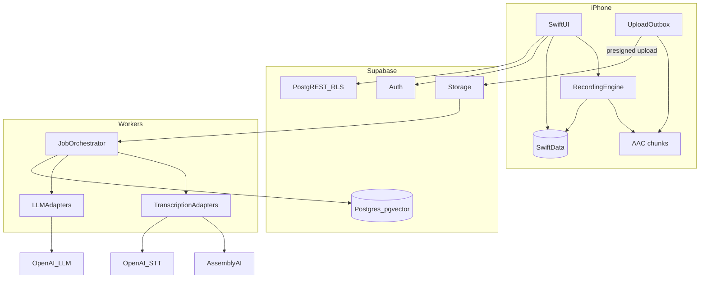

---

## 3. Cost estimates (planning)

Assumptions: AssemblyAI ~$0.23/hr with diarisation; extract/summary ~$0.005/session; Ask ~$0.003/question; blended ~18 recorded min/MAU/month (power-law).

| Metric | Estimate |
|---|---|
| Cost per recorded hour (STT+diar+extract) | **~$0.24–0.28** |
| Cost per AI question | **~$0.003** |
| COGS per MAU / month (blended) | **~$0.09** |
| 1K MAU variable COGS | **~$90** |
| 10K MAU variable COGS | **~$900** |
| 100K MAU variable COGS | **~$9K** (before power-user spikes — caps essential) |

Ad ARPMAU base alone is insufficient; **60 min/week + Recording Credits (1 credit = N min, default 5) + in-feed native (`native_feed_interval`) + `max_daily_rewards`** keeps free/no-subscription near break-even and tunable via remote config—without glued banners on value screens.

---

## 4. Biggest technical risks

1. Background recording reliability across interruptions/routes (hardware matrix).  
2. App Review scrutiny of `audio` background mode.  
3. Diarisation quality in noisy field audio (AU accents).  
4. Provider outages → need failover path.  
5. Cost spikes from power users without enforced quotas.  
6. iOS cannot capture Zoom system audio or Phone.app calls — product honesty.

---

## 5. Biggest product risks

1. “Good enough” competition from Apple Notes / Voice Memos.  
2. Consent / privacy category backlash.  
3. Weak differentiation if Ask AI citations are poor.  
4. Ad UX damaging premium feel.  
5. Wedge too broad → muddy onboarding.

---

## 6. Provider abstraction (must ship)

```swift
protocol TranscriptionProviding: Sendable {
  func startBatch(_ request: TranscriptionRequest) async throws -> ProviderJobHandle
  func fetchBatch(job: ProviderJobHandle) async throws -> TranscriptionJobState
  func normalize(rawPayload: Data, request: TranscriptionRequest) throws -> CanonicalTranscript
}

protocol LLMProviding: Sendable {
  func complete(request: LLMRequest) async throws -> LLMResponse
}
```

No business logic hardcoded to one vendor SDK in feature code.

---

## 7. Multiplatform readiness

- Shared `ConversationCore` package for models, API, outbox, flags.
- UI remains iPhone-focused; routes designed for future `NavigationSplitView`.
- Audio capture protocol-backed (`AudioCapturing`) for platform variants.

---

<a id="doc-mvp-scope"></a>

######## DOCUMENT: MVP_SCOPE.md ########

# MVP Scope — Afterna V1

## In scope

1. Authentication (Sign in with Apple + session)
2. Start / pause / stop audio recording
3. Reliable background + lock-screen recording (Live Activity)
4. Chunked local storage + upload/process pipeline
5. Batch transcription with timestamps
6. Speaker separation (provider diarisation) + rename speakers
7. AI summary, key points, action items, decisions
8. Entity extraction (people, companies, projects, dates/deadlines)
9. Conversation history library
10. Full-text + basic semantic search
11. Ask AI about one conversation (with citations)
12. Basic cross-conversation Ask AI (with citations)
13. Export / share (Markdown/text, system share sheet)
14. Delete conversation + account deletion
15. Settings + privacy controls (retention, keep-audio opt-in, consent notice)
16. Weekly free minutes + **Recording Credits** (rewarded) + **in-feed native** on Home/History (and occasional Search) every 4–6 rows
17. Remote config for usage/ads (`base_free_minutes`, `reward_minutes`, `max_daily_rewards`, `banner_enabled`, `native_feed_interval`, `banner_refresh_interval`, `ads_on_summary_enabled`, `ai_daily_limit`)
18. Hard rule: **no ads** on Recording, Live Activity, Processing, Transcript, Ask AI, Settings; Summary preferably none

## Explicitly out of V1

- Meeting bots / calendar auto-join
- Zoom / Teams / desktop capture
- Enterprise team admin / SSO
- CRM integrations
- Live streaming captions
- Knowledge graph product
- Complex billing / subscription paywall
- Social / feed features
- Always-on ambient recording
- Phone.app call recording claims
- Ads on the recording screen

## Quality bar for “done”

Compiles; tests for critical paths; loading/empty/error UX; accessibility basics; docs updated; no fake stubs presented as finished.

---

<a id="doc-roadmap"></a>

######## DOCUMENT: ROADMAP.md ########

# Implementation Roadmap — Afterna

## Phase 0 — Project foundation
- **Objective:** Xcode project, packages, CI skeleton, docs hygiene, remote-config client stub (`base_free_minutes`, `reward_minutes`, `max_daily_rewards`, `native_feed_interval`, banner/AI caps)
- **Deps:** none
- **Accept:** App launches on simulator; folders match architecture; config defaults load offline

## Phase 1 — Navigation + design system
- **Objective:** Tokens, core components, tab/stack navigation, empty states
- **Deps:** Phase 0
- **Accept:** All primary screens navigable with placeholder content

## Phase 2 — Recording engine
- **Objective:** AVAudioEngine chunked capture, interruptions, Live Activity
- **Deps:** Phase 1
- **Accept:** Background/lock recording on device; recover after crash

## Phase 3 — Local conversation storage
- **Objective:** SwiftData models, library list, local detail shell
- **Deps:** Phase 2
- **Accept:** Offline library persists across launches

## Phase 4 — Backend / authentication
- **Objective:** Supabase project, Sign in with Apple, RLS stubs
- **Deps:** Phase 0
- **Accept:** Sign in/out; authenticated API calls; Keychain tokens

## Phase 5 — Audio upload pipeline
- **Objective:** Presigned uploads, outbox, background URLSession
- **Deps:** Phases 2–4
- **Accept:** Airplane → online resume upload; idempotent complete

## Phase 6 — Transcription pipeline
- **Objective:** AssemblyAI adapter + OpenAI fallback + canonical transcript
- **Deps:** Phase 5
- **Accept:** End-to-end transcript with speakers/timestamps

## Phase 7 — AI summaries
- **Objective:** Extract summary/key points/decisions/actions/entities
- **Deps:** Phase 6
- **Accept:** Structured JSON persisted and shown in UI

## Phase 8 — Conversation detail UX
- **Objective:** Summary / Transcript / Actions / People tabs; polish
- **Deps:** Phases 3, 6, 7
- **Accept:** Premium native detail with all states

## Phase 9 — Ask AI (single conversation)
- **Objective:** RAG over one transcript; citations to timestamps
- **Deps:** Phases 6–7
- **Accept:** Answer + tappable “Based on mm:ss–mm:ss”

## Phase 10 — Cross-conversation memory / search
- **Objective:** Hybrid search + Ask across library
- **Deps:** Phase 9 + embeddings
- **Accept:** Query finds commitments across multiple sessions

## Phase 11 — Reliability / error handling
- **Objective:** Harden retries, banners, resume UX, disk/battery edges
- **Deps:** Phases 2–10
- **Accept:** Hardware stress matrix green for P0 cases

## Phase 12 — Privacy / export / delete
- **Objective:** Consent notice, audio purge default, export, account delete
- **Deps:** Phases 4, 8
- **Accept:** App Store account-deletion compliant

## Phase 13 — Analytics + monetisation instrumentation
- **Objective:** Privacy-safe analytics; cost metering; credit earn/spend events; remote-config exposure
- **Deps:** Phase 4
- **Accept:** Funnel events without raw transcript logging; zero ad impressions on recording screen in telemetry asserts

## Phase 14 — Testing
- **Objective:** Unit/integration/UI + audio stress suite
- **Deps:** Features complete
- **Accept:** CI green; device checklist signed off

## Phase 15 — App Store preparation
- **Objective:** Screenshots, privacy labels, review notes, TestFlight
- **Deps:** Phases 11–14
- **Accept:** Submission-ready build

Each phase during implementation must expand with: tasks, files affected, test plan, rollback notes.

---

<a id="doc-decisions"></a>

######## DOCUMENT: DECISIONS.md ########

# Architecture Decision Records

## ADR-001 — Working product name

- **Status:** Superseded — see ADR-012
- **Prior decision:** Working name Kept
- **Date:** 2026-08-07

## ADR-012 — Drop Kept; hold rename pending clearance

- **Status:** Superseded in part by ADR-013
- **Decision:** Do **not** brand as **Kept**.
- **Date:** 2026-08-07

## ADR-013 — Final shortlist diligence: none clear for global

- **Status:** Accepted (historical — shortlist killed)
- **Decision:** User shortlist **Said / Stillnote / Saidso / Clarion** all **fail** global due diligence.
- **Why (summary):**
  - **Stillnote** — exact App Store diary app (`id6781236577`) + stillnote.com parked + Stillnote LLC
  - **Saidso** — exact App Store blockchain social app + saidso.net; near-homophone SaySo news app
  - **Said** — dictionary word; said.com legacy; SAID Translations / SaidMe / Better Said swarm; unprotectable
  - **Clarion** — Faurecia Clarion car audio, SoftVelocity IDE, bioMérieux medical software, Clarion crime-alerts app
- **Superseded for brand pick by:** ADR-014
- **Date:** 2026-08-07

## ADR-014 — Brand pick: Afterna (pending domains + counsel)

- **Status:** Accepted (product brand intent) — **not yet** legal/domain freeze
- **Decision:** Lead product name is **Afterna**. Marketing frame: after the conversation, still yours. Spot diligence: no exact App Store title; `afterna.ai` + `afterna.app` DNS-empty at check (2026-08-07). Full matrix: [NAMING_PREMIUM_SHORTLIST.md](./NAMING_PREMIUM_SHORTLIST.md).
- **Project path:** `C:\Users\User\Afterna` when implementation starts · bundle `app.afterna.ios` · site `afterna.app` / `afterna.ai`
- **Preferred before bootstrap:** register both domains (+ attorney Class 9/42 AU)
- **Backups if registrar/TM fails:** Seduvia → Verasay → Vowrae → Hushrae
- **Date:** 2026-08-07

## ADR-002 — Initial wedge audience

- **Status:** Accepted
- **Decision:** Australian freelancers, sole traders, and field/appointment professionals (consultants, agents, inspectors, coaches) who need memory of in-person and phone-adjacent conversations.
- **Why:** Clear JTBD (“what did we agree?”), mobile-first gap vs Zoom bots, consent-friendly professional norm.
- **Date:** 2026-08-07

## ADR-003 — Monetisation: free + credits + native + remote caps

- **Status:** Accepted (supersedes earlier “+15 minutes per ad” wording)
- **Decision:** MVP is **100% free / no subscription**, with:
  - **60 free minutes/week** base allotment
  - **In-feed native ads** on Home/History (and occasional Search results)—inserted as a **sponsored native card every 4–6 conversation rows**, not a permanently glued banner
  - **Rewarded Recording Credits** (user-facing): watch ad → **+1 Credit**; internally **1 credit = N minutes** (default **5**), remotely configurable
  - Cap **max 6 rewarded ads/day** (stackable credits; prevents ad-farming hours of STT)
  - **Remote config from day one** for all usage/ad knobs (see ADR-011)
  - **Ad-free value surfaces:** Recording, Live Activity, Processing, Conversation Summary (prefer none), Transcript, Ask AI, Settings
- **Why:** Credits abstract dollar economics; in-feed native preserves premium/private feel vs glued banners; monetise browsing + resource limits, not the moment of consuming Afterna’s value.
- **Conflict resolved:** Product Research suggested $12–15/mo Pro; unit economics + CEO preference lock free + credits + remote caps.
- **Date:** 2026-08-07

## ADR-011 — Remote configuration for usage & ads (day one)

- **Status:** Accepted
- **Decision:** Ship a typed remote config overlay (backend `/v1/config` + disk cache) with at least:
  - `base_free_minutes` (weekly free pool; default 60)
  - `reward_minutes` (minutes per Recording Credit; default 5)
  - `max_daily_rewards` (default 6)
  - `banner_enabled` / native placement toggles (in-feed, not glued banner)
  - `native_feed_interval` (default 4–6; cards between sponsored inserts)
  - `banner_refresh_interval` (or list reuse policy)
  - `ai_daily_limit`
  - `ads_on_summary_enabled` (default **false**)
  - Plus existing feature flags (chunking, cellular upload, etc.)
- **Why:** Economics will move; must tune without shipping a binary. Client never hardcodes minute-per-credit economics in UI copy beyond “1 Credit.”
- **Date:** 2026-08-07

## ADR-004 — Backend: Supabase

- **Status:** Accepted
- **Decision:** Supabase for Auth, Postgres + pgvector, Storage, Realtime; workers on Cloudflare Queues or Fly for long ASR/LLM jobs.
- **Why:** Fastest path to Postgres/RAG/RLS without Firebase’s relational weakness.
- **Date:** 2026-08-07

## ADR-005 — Transcription: AssemblyAI primary, OpenAI fallback

- **Status:** Accepted
- **Decision:** Primary batch provider AssemblyAI Universal-3.5 Pro + diarisation (~$0.23/hr). Fallback OpenAI `gpt-4o-transcribe-diarize` / `gpt-transcribe`. Deepgram Nova-3 warm alternate for eval/streaming later.
- **Why:** Best batch cost/quality/diarisation for conversations; provider protocol keeps vendors swappable.
- **Date:** 2026-08-07

## ADR-006 — LLM: OpenAI primary with modular providers

- **Status:** Accepted
- **Decision:** OpenAI for embeddings (`text-embedding-3-small`) and default extract/Ask models (mini-class); Anthropic as config fallback. Protocol-based `LLMProvider`.
- **Why:** Simple ops; strong structured JSON; easy iOS-adjacent tooling. Keep Anthropic wired for quality A/B.
- **Date:** 2026-08-07

## ADR-007 — Local persistence: SwiftData + file audio

- **Status:** Accepted
- **Decision:** SwiftData for metadata; AAC chunks on disk; not GRDB dual-stack in V1.
- **Why:** iOS Architecture Manager recommendation; resolve AI doc’s GRDB suggestion as optional later if needed.
- **Conflict resolved:** AI/Backend sketches mentioned GRDB; CEO chooses SwiftData for greenfield SwiftUI app.
- **Date:** 2026-08-07

## ADR-008 — Audio retention: delete after successful transcription

- **Status:** Accepted
- **Decision:** Default delete raw audio after transcript verified + synced. User opt-in “Keep audio for playback.”
- **Why:** Privacy + unit economics; matches Granola-like trust posture without claiming legal compliance.
- **Date:** 2026-08-07

## ADR-009 — Capture mode: mic-based, not meeting bots

- **Status:** Accepted
- **Decision:** V1 is user-initiated mic recording only. No Zoom/Teams bots, no Phone.app call interception.
- **Why:** iOS cannot capture other apps’ system audio; bots are saturated and consent-toxic; wedge is in-person/field.
- **Date:** 2026-08-07

## ADR-010 — Search: hybrid FTS + pgvector, no knowledge graph in V1

- **Status:** Accepted
- **Decision:** Postgres full-text + pgvector hybrid search; structured entities tables; defer graph DB.
- **Why:** Simplest architecture that scales; entities cover “Project Phoenix” style queries.
- **Date:** 2026-08-07

---

<a id="doc-product-research"></a>

######## DOCUMENT: PRODUCT_RESEARCH.md ########

# Product Research Brief — Afterna (iPhone-first conversation memory)

**Document status:** Competitive research brief for PRODUCT_RESEARCH.md  
**Research date:** August 7, 2026  
**Product thesis:** An iPhone-native app that turns real-world conversations (meetings, interviews, lectures, inspections, appointments) into durable, searchable memory—inspired by Granola’s usefulness, but broader than desktop video meetings.

---

## 1. Executive summary

The AI meeting-notes category is crowded and **desktop/bot-centric**. Leaders (Otter, Fireflies, Fathom, Read, Granola, Zoom/Teams natives) optimize for scheduled video calls. Hardware (Plaud) and always-on wearables (Limitless—acquired/sunset for new buyers) address in-person capture but add device cost, subscriptions, and privacy optics.

**The open wedge:** professionals who live on iPhone and need trustworthy memory for **in-person and phone-first conversations**—where meeting bots don’t join, system-audio capture is blocked on iOS, Apple’s built-ins stop at transcript/summary, and Granola’s mobile app is a secondary recorder/viewer.

**Initial positioning (one wedge):**  
**Field-heavy solo professionals on iPhone** (consultants, inspectors, clinicians in private practice, journalists, real-estate agents, tutors) who need “record → structure → recall → follow-up” without a bot, without buying a pin, and without a Mac-first workflow.

---

## 2. Competitor matrix

Pricing shown in USD. Prefer vendor pages; secondary sources noted where official pages are incomplete or region-variable.

| Competitor | Primary mode | Capture model | Platforms | Consumer vs business | Entry paid price (typical) | Free tier | Privacy / consent posture | Mobile-first strength | Key weakness |
|---|---|---|---|---|---|---|---|---|---|
| **Granola** | AI-enhanced meeting notes | Bot-free device audio (desktop); mic on mobile | Mac, Windows, iOS (+ Android in some reviews) | Prosumer → team | **$14/user/mo** Business; Enterprise **$35+** | Free Basic (history capped ~30 days) | Training opt-out; bot-free reduces participant friction; SOC2 claimed; HIPAA unclear | Moderate (iOS good for in-person; weak for virtual calls on phone) | Desktop-first; iOS can’t capture Zoom/Meet/Teams system audio; no durable audio replay (audio often deleted post-transcript) |
| **Otter** | Meeting notetaker + chat | Calendar bot + in-app recording | Web, iOS, Android | SMB → enterprise | **$16.99/mo** Pro monthly; **$8.33–8.49/user/mo** annual; Business **~$20–30** | Free: **300 min/mo**, 30 min/conversation | Class-action consent/training litigation (2025–2026); bot fatigue | Strong apps, but experience is bot/calendar-centric | Minute shrinkflation, billing complaints, consent risk, accent/overlap accuracy issues |
| **Fireflies** | Conversation intelligence | Bot (+ Chrome bot-free option) | Web, desktop, iOS/Android | SMB → enterprise | **$10/seat/mo** Pro annual (**$18** monthly); Business **$19** annual (**$29** monthly); Enterprise **$39** annual | Free: unlimited transcription, **400 min** storage/team | SOC2/GDPR; HIPAA on Enterprise; BIPA suits reported | Secondary to bot workflow | Bot optics; AI credits for advanced features; storage gates free/Pro |
| **Fathom** | Free-first call notetaker | Bot; bot-free beta (Mac) | Desktop-focused; Zoom/Meet/Teams | Individual → sales teams | Free forever core; Premium **$16** annual / **$20** monthly; Team **$15** / **$19**; Business **$25** / **$34** | Very generous unlimited recordings/transcripts | Relatively trusted; CRM/coaching upsell | Weak for pure phone/in-person daily carry | Video-meeting native; advanced AI capped on free |
| **Plaud** | Hardware + app | Wearable/card recorder → cloud AI | iOS/Android + devices | Consumer pro → teams | Device **~$159–189**; Pro **$17.99/mo** or **$99.99/yr** (~$8.33/mo); Unlimited **$29.99/mo** or **$239.99/yr** (~$19.99–20/mo) | Starter **300 min/mo** with device | Claims ISO/SOC2/GDPR/HIPAA; cloud processing | Strong for in-person; needs hardware | Hardware + subscription TCO; minute caps; cloud dependency |
| **Limitless** | Always-on pendant memory | Wearable continuous capture | Pendant + app (legacy) | Consumer / power user | **No longer sold** (Meta acq. Dec 2025); existing users free Unlimited through ~2026 | N/A for new users | High privacy scrutiny; consent required; regional shutdowns (EU/UK etc.) | Was best ambient mobile story | Acquisition cliff; regulatory/regional risk; category trust damage |
| **Notion AI** | Workspace + meeting notes | In-app mic/system audio (desktop best) | Web, desktop, mobile | Knowledge-work teams | Full AI Meeting Notes on **Business ~$20/member/mo** annual | Limited AI trial on Free/Plus | Sub-processors for transcription; Enterprise ZDR options | Mobile can record mic; not a conversation OS | Gated to Business; manual `/meet` trigger; weak for unplanned field capture |
| **Apple Voice Memos** | System recorder | On-device mic | iOS/macOS | Consumer | Free (device) | Free | Strong privacy brand; on-device transcription | Excellent capture UX | Transcript ≠ structured memory; weak cross-conversation search/actions |
| **Apple Notes (+ Apple Intelligence)** | Notes + audio | Mic; call recordings → Notes | iOS | Consumer | Free (device / Apple Intelligence hardware) | Free | On-device AI summaries where available; call recording announces to parties | Best “already installed” path | Generic summaries; no domain templates, CRM, recall graph, or retention product |
| **Google Recorder** | On-device transcript | Mic; on-device ASR | **Pixel-only** | Consumer | Free | Free | Strong on-device privacy story | Best Android native analog | Not on iPhone; limited collaboration/export workflow |
| **Microsoft Teams transcription** | Platform native | Meeting recording/transcript | Teams ecosystem | Enterprise | Base M365/Teams; **Teams Premium ~$10/user/mo** for Intelligent Recap | Depends on license | Enterprise controls; E2EE can disable AI | Mobile exists inside Teams | Locked to Teams meetings; not a general life/field memory product |
| **Zoom AI Companion** | Platform native | Zoom meetings + expanding My Notes | Zoom Workplace | Prosumer → enterprise | Included with paid Workplace (Pro ~**$14–16/user/mo** band); standalone Companion ~**$10/mo**; ZoomMate from ~**$20** | Limited Basic AI | Enterprise admin controls | Improving; still Zoom-gravity | Weak outside Zoom; not a dedicated conversation memory system |
| **Krisp** | Noise cancel + notetaker | Bot-free desktop audio (+ mobile) | Desktop + mobile | Individual → enterprise | Core **$8/mo** annual (**$16** monthly); Advanced **$15** / **$30** | 7-day trial (no durable free meeting plan) | SOC2/GDPR; HIPAA enterprise; claims no model training | Secondary; noise cancel is the brand | Notes quality trails specialists; calendar-centric onboarding |
| **Read AI** | Meeting + engagement metrics | Bot / meeting join | Desktop + mobile | Teams / managers | Pro **$19.75/mo** (**$15** annual); Enterprise **$29.75** (**$22.50** annual) | Free: **5 meetings/mo** | Enterprise security tiers | Present but not phone-first | Meeting-platform gravity; coaching analytics over field memory |

### Sources (pricing & product claims)

- Granola pricing: https://www.granola.ai/pricing  
- Otter pricing: https://otter.ai/pricing  
- Fireflies pricing: https://fireflies.ai/pricing  
- Fathom pricing: https://www.fathom.ai/pricing  
- Plaud plan pricing: https://www.plaud.ai/pages/plaud-ai-plan-pricing  
- Limitless status: https://www.limitless.ai/  
- Notion AI Meeting Notes: https://www.notion.com/help/ai-meeting-notes  
- Krisp pricing: https://krisp.ai/pricing/  
- Read AI pricing: https://www.read.ai/plans-pricing  
- Teams Premium: https://www.microsoft.com/en-us/microsoft-teams/premium  
- Zoom AI Companion announcement: https://news.zoom.com/zoom-launches-ai-companion-3-0/  
- Apple Voice Memos transcription: https://support.apple.com/guide/iphone/view-a-transcription-iph00953a982/ios  
- Apple Notes audio/transcription: https://support.apple.com/guide/iphone/record-and-transcribe-audio-iphbe11247b5/ios  
- Google Recorder (Pixel): https://support.google.com/pixelphone/answer/9516618  
- Otter consent litigation coverage: https://www.npr.org/2025/08/15/g-s1-83087/otter-ai-transcription-class-action-lawsuit  

---

## 3. What users value (cross-competitor)

1. **Trustworthy capture without social friction** — bot-free or clearly consented recording; no surprise “Notetaker joined.”  
2. **Useful notes, not raw transcripts** — decisions, owners, next steps, domain-structured summaries (Granola/Plaud templates win hearts).  
3. **Recall across time** — “What did we agree last month?” / cross-meeting chat (Granola Chat, Otter/Fireflies Ask).  
4. **Speed to value** — record → notes in minutes; minimal setup.  
5. **Works where work actually happens** — video calls *and* in-person; phone calls; hallway; site visits.  
6. **Export into existing systems** — Notion, Slack, CRM, email follow-ups.  
7. **Privacy control** — retention settings, delete/export, no training on my data (increasingly table stakes).  
8. **Predictable pricing** — resentment when minutes are cut (Otter) or advanced AI is credit-metered (Fireflies).

---

## 4. Common complaints & UX pain points

| Theme | Evidence pattern | Implication for us |
|---|---|---|
| **Bot fatigue / consent** | Otter class actions; Fireflies BIPA suits; Reddit horror stories of auto-join | Prefer user-initiated, on-device or bot-free; built-in consent UX |
| **Minute / credit traps** | Otter Pro cut 6,000→1,200 min; Fireflies AI credits | Transparent limits; avoid bait-and-switch |
| **Billing & cancellation friction** | Otter BBB/Trustpilot patterns | Apple IAP clarity; easy cancel; honest renewals |
| **Accuracy cliffs** | Accents, overlap, jargon, noisy rooms | Domain vocabulary; speaker labeling; offline/noisy-field modes |
| **Desktop gravity** | Granola best on Mac; Fathom/Fireflies video-call native | iPhone-first workflows for non-laptop moments |
| **iOS sandbox** | No app system-audio from Zoom on iPhone | Own the in-person + Phone-call + mic-on-speakerphone niches |
| **Hardware TCO** | Plaud $159+ + $100–240/yr AI | Software-only path that feels as “set and forget” as a pin |
| **Acquisition / sunset risk** | Limitless → Meta; regional kills | Independence + data export as trust features |
| **Apple “good enough”** | Voice Memos/Notes/call recording free | Must beat Apple on structure, memory, actions—not raw transcription |

---

## 5. Target audiences

### Primary wedge (recommended)

**iPhone-carrying field & appointment professionals** who have many **non-Zoom conversations**:

- Independent consultants / coaches  
- Home inspectors, contractors, insurance adjusters  
- Real-estate agents  
- Journalists / podcasters (interview workflow)  
- Private-practice clinicians / therapists (privacy-sensitive; later HIPAA)  
- Tutors, educators, lecture note-takers  
- Recruiters doing in-person / phone screens  

**Jobs to be done**

1. Capture what was said without typing.  
2. Leave with structured notes + action items.  
3. Find a detail weeks later.  
4. Send a clean follow-up in one tap.

### Secondary (post-wedge)

- Startup founders who already love Granola on Mac but lose context on the go  
- Sales ICs who do mix of Zoom + site visits  
- Small professional firms (2–10) sharing a client conversation library  

### Explicit non-goals for v1

- Replacing Gong/Fireflies conversation intelligence for large sales orgs  
- Always-on ambient wearables  
- Enterprise SSO-first GTM  

---

## 6. Top user problems (ranked)

1. **Memory decay after real conversations** — details vanish after inspections, client walks, interviews.  
2. **Bot tools don’t cover the phone in your pocket** — in-person and cellular calls are underserved.  
3. **Consent anxiety** — fear of recording others / legal risk / awkward bots.  
4. **Transcript dump without structure** — Apple/Google give text; users still rewrite.  
5. **Fragmentation** — notes in Voice Memos, Notes, email, CRM, sticky notes.  
6. **Hard recall** — “Where did they say the warranty expires?”  
7. **Follow-up drag** — knowing what to send next is still manual.  
8. **Privacy distrust of cloud notetakers** after lawsuits and wearable backlash.

---

## 7. Feature gaps in the market

| Gap | Who comes closest | Still missing |
|---|---|---|
| iPhone-native conversation OS (not a meeting bot viewer) | Granola iOS, Plaud app, Apple Notes | End-to-end memory product with templates + recall + actions |
| Structured templates for non-meeting contexts | Plaud (10k+ templates) | Lightweight, beautiful Apple-native UX without hardware |
| Consent-first capture UX | Apple call recording announcement | General in-person consent flows + audit trail |
| Cross-conversation personal memory (consumer-grade) | Limitless (dying), Granola Chat | Portable, private, phone-first “ask my life/work” |
| Offline / poor-connectivity field capture | Google Recorder (Pixel) | iPhone offline record → later enhance |
| Actionability (tasks, follow-up drafts, calendar) | Zoom Companion, Otter workflows | Tight iOS Shortcuts / Reminders / Mail integration |
| Speaker + place + client entity linking | CRM bots (Fireflies/Fathom Business) | Lightweight personal CRM for solos without Salesforce |
| Trust differentiation post-lawsuit | Krisp “no training,” Granola bot-free | Clear defaults: no training, retention sliders, local-first options |

---

## 8. Differentiation opportunities (mobile-first)

1. **Own the “phone on the table” moment** — one-thumb start, Lock Screen / Dynamic Island / Live Activity, haptic stop, instant structured note.  
2. **Context packs** — Inspection, Interview, Appointment, Lecture, Sales Visit—not generic “meeting.”  
3. **Consent as product** — pre-session spoken/prompted notice; shareable consent receipt; jurisdiction hints.  
4. **Memory, not transcript** — entities (people, places, commitments), timeline, “ask across sessions.”  
5. **Apple-native craft** — Share Sheet, Shortcuts, Widgets, Focus filters, on-device where possible; iCloud or private cloud choice.  
6. **Beat hardware on friction** — no $159 pin; phone you already have.  
7. **Beat Apple on usefulness** — Writing Tools summary is not a follow-up email, punch-list, or client brief.  
8. **Bot-optional later** — if virtual meetings matter, add calendar bot *after* mobile wedge is solid—or partner—not as identity.

---

## 9. Onboarding, retention, pricing lessons

### Onboarding (what works)

- Time-to-first-note &lt; 60 seconds (record something immediately).  
- Template picker tied to persona (“I’m recording an inspection”).  
- Show the *structured* output before pitching subscription.  
- Avoid mandatory calendar OAuth on day one (Krisp/Fireflies-style friction).

### Retention drivers

- Habit loop: capture → review card → one-tap follow-up → archive.  
- Weekly “memory digest.”  
- Search that actually finds commitments.  
- Streak of saved hours (subtle, not gamified junk).

### Churn drivers to avoid

- Surprise minute exhaustion.  
- Notes trapped without export.  
- Privacy scare headlines.  
- Desktop-only features that make mobile feel like a thin client.

### Pricing recommendation (hypothesis)

| Tier | Price | Intent |
|---|---|---|
| Free | 3–5 sessions/mo or ~60–90 min | Prove quality |
| Pro | **$12–15/mo** or **$99–119/yr** | Unlimited personal memory; templates; ask-across |
| Pro+ | **$20–25/mo** | Longer retention, priority models, team share later |

Position under Plaud Unlimited TCO and near Granola Business ($14), with clearer consumer packaging than seat-based SaaS.

---

## 10. Transcription & technical limitations (market reality)

- **iOS cannot capture other apps’ system audio** → virtual meetings on iPhone require bot, screen-share hacks, or “speakerphone into mic” (quality loss).  
- **Overlapping speech & noise** degrade all vendors; field work needs enhancement + user correction UX.  
- **Speaker diarization** often generic (“Speaker 1”); renaming must be easy.  
- **Domain jargon** needs custom vocabulary.  
- **On-device vs cloud tradeoff:** privacy/latency vs model quality; hybrid (on-device draft, cloud enhance on Wi‑Fi) is a product advantage.  
- **Call recording:** Apple owns native Phone/FaceTime path with participant announcement; third parties are constrained—integrate with Notes/call artifacts rather than fight the OS.

---

## 11. Privacy concerns (category-level)

- Unauthorized bot recording & model training (Otter litigation).  
- Biometric/voiceprint claims (BIPA cases).  
- Always-on wearables social taboo (Limitless).  
- Cloud retention of sensitive client/medical/legal audio.  
- Cross-border processing & regional availability cliffs.

**Product principles**

1. Default: **do not train** on user audio/transcripts.  
2. User-controlled retention (e.g., 7 / 30 / 90 / forever).  
3. Easy export + hard delete.  
4. Explicit consent tooling before record.  
5. Clear in-product disclosure of processors.  
6. Roadmap: on-device transcription option; HIPAA only if wedge expands to clinics.

---

## 12. MVP recommendations

**Wedge:** Field & appointment professionals on iPhone.

### Must-have

1. One-tap record with Live Activity controls.  
2. High-quality transcript + **structured note** (summary, decisions, action items, open questions).  
3. **5–7 context templates** (Inspection, Client appointment, Interview, Lecture, Coaching session, Site visit, General).  
4. Library with full-text search + filters (person, tag, date, template).  
5. Ask-across-notes (personal RAG) for paid tier.  
6. Share: copy, PDF/Markdown, Mail draft follow-up.  
7. Consent prompt + optional spoken notice.  
8. Export/delete; no-training default.  
9. Apple Design: offline-capable capture; enhance when online.

### Explicitly cut from MVP

- Meeting bots / calendar auto-join  
- Wearable hardware  
- Team admin / SSO  
- CRM two-way sync  
- Android  
- Always-on ambient listening  

### Success metrics

- D1: ≥1 completed session with saved structured note  
- W1: ≥3 sessions  
- Paid conversion after value moment (first “ask” or first follow-up send)  
- Retention: 4-week retention among users with ≥5 sessions  

---

## 13. Post-MVP roadmap

**Phase 2 — Memory depth**

- People/org entities; link sessions to clients  
- Commitments tracker + Reminders/Calendar integration  
- Custom templates; industry packs  
- Widgets / Shortcuts / Action Button  

**Phase 3 — Collaboration**

- Secure share links; client-ready reports  
- Light team workspaces (shared client folders)  
- Notion/Slack/Zapier  

**Phase 4 — Capture expansion**

- Optional meeting bot for Zoom/Meet/Teams (secondary)  
- Import Apple call-recording notes / Voice Memos  
- Watch / Lock Screen ultra-capture  

**Phase 5 — Trust & verticals**

- Stronger on-device path  
- HIPAA/BAA only if GTM proves clinical demand  
- Org retention policies  

---

## 14. Product risks

| Risk | Severity | Mitigation |
|---|---|---|
| Apple Notes/Voice Memos “good enough” | High | Win on structure, recall, templates, follow-ups |
| Granola expands iOS aggressively | High | Out-execute on field templates + consent + memory UX |
| Plaud owns in-person with hardware | Medium | Zero-hardware convenience; comparable AI quality |
| Consent/legal landmines | High | Consent UX; jurisdiction education; no stealth recording |
| Transcription cost margins | High | Hybrid models; fair limits; annual plans |
| Category stigma from lawsuits/wearables | Medium | Privacy-forward brand; bot-free; local options |
| Meta/Big Tech commoditization | Medium | Niche workflow depth & craft |
| Scope creep into Gong-land | Medium | Hold the wedge; say no to enterprise CI early |

---

## 15. Final positioning recommendation

### Pick ONE initial wedge

**Wedge audience:** iPhone-first **field & appointment professionals** (inspectors, agents, consultants, interviewers) who need conversation memory for **in-person and phone-era work**—not another Zoom bot.

### Positioning statement

> **Your iPhone, as a private chief of staff for real conversations.**  
> Capture what was said in the room or on the call, turn it into clear notes and next steps, and find any commitment later—without a meeting bot, without a wearable, without a laptop.

### Why this wedge wins

- Underserved vs Otter/Fireflies/Fathom (video-meeting gravity).  
- Clearer than “everyone who has meetings.”  
- Differentiated from Granola (Mac/desktop note enhancement) and Plaud (hardware).  
- Defensible against Apple by being a **memory + action** product, not a recorder.  
- Natural expansion later into light teams and optional virtual-meeting capture.

### Category name (working)

**AI Conversation Memory** (not “AI meeting notetaker”).

---

## 16. App name directions (not final names)

Premium, Apple-native feel—short, calm, memorable:

1. **Ledger** direction — quiet accountability for what was said (*Ledger*, *Said Ledger*).  
2. **Harbor** direction — safe place conversations land (*Harbor*, *Fair Harbor*).  
3. **Quill** direction — crafted notes, human + AI (*Quill*, *Fieldquill*).  
4. **Afterglow** direction — the clarity after the conversation (*Afterglow*, *Afterword*).  
5. **Kinetic/Clarity** direction — motion-to-memory, crisp recall (*Stillpoint*, *Clarity Desk*—prefer single tokens like *Stillpoint* / *Clarion*).

Evaluation criteria: App Store distinctiveness, trademark clearance, .app/.com availability, no “AI” suffix, speaks to memory/trust more than transcription commodity.

---

## 17. Appendix: competitive role map

```
Desktop video meetings ────────── Otter, Fireflies, Fathom, Read, Zoom, Teams
Bot-free desktop notes ────────── Granola, Krisp, Notion AI
Hardware in-person ────────────── Plaud (Limitless legacy)
OS free utilities ─────────────── Apple Notes/Voice Memos, Google Recorder
OPEN SPACE ────────────────────── iPhone-native conversation memory for field/appointments
```

---

*End of brief. All prices and legal statuses are as researched on August 7, 2026, and should be re-verified before investor or store listing use.*

---

<a id="doc-ios-architecture"></a>

######## DOCUMENT: IOS_ARCHITECTURE.md ########

# iOS Architecture — Afterna

**Audience:** iOS Architecture Manager  
**Status:** CEO-approved (SwiftData over GRDB — see DECISIONS.md ADR-007)  
**Target:** iPhone-first (iOS 17+ baseline; adopt iOS 18/26 APIs where useful)  
**Principle:** Simple modern architecture over over-abstraction. Prefer Apple frameworks + thin app services.

---

## 1. Executive recommendation

| Concern | Recommendation | Why |
|---|---|---|
| UI | SwiftUI + `NavigationStack` | Stable, type-safe, deep-linkable |
| State | Swift Observation (`@Observable`) | Official, less boilerplate than Combine ViewModels |
| DI | Environment + `AppContainer` (manual) | Enough for production; skip heavy DI frameworks |
| Local DB | **SwiftData** for metadata | Clean SwiftUI/`@Query` integration |
| Audio blobs | **FileManager** on disk (not in DB) | Multi-hour AAC must not live in SQLite/SwiftData |
| Cloud sync | **Supabase backend** for audio + jobs | Large uploads, transcription, AI require a real API |
| Networking | `URLSession` (+ background upload session) | System-managed resume; no Alamofire required |
| Auth | Sign in with Apple → JWT in **Keychain** | Industry standard; secure at rest |
| Offline-first | Local write → outbox → upload when online | Recording must never depend on network |
| Feature flags | Typed local defaults + remote JSON overlay | Ship dark launches without overbuilding |
| Multiplatform | Shared `ConversationCore` package | iPhone now; iPad/`NavigationSplitView` / macOS later |

**Avoid for V1:** TCA/Coordinator hierarchies, Realm, dual Core Data + SwiftData, GRDB dual-stack, GraphQL, enterprise DI containers.

---

## 2. App shape (layers)

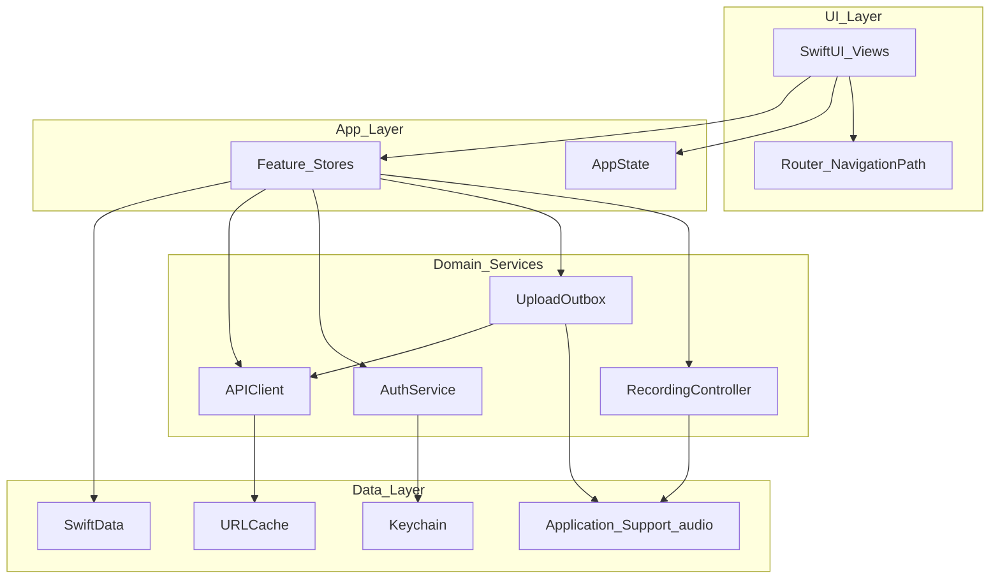

### Ownership rules

- **Views** render and send intents; they do not own network or file I/O.
- **Feature stores** own screen-facing state.
- **Services** are long-lived, injected once at launch, actor-isolated where concurrency matters.
- **SwiftData** stores metadata only (session id, title, duration, status, local paths, remote ids, error codes).
- **Audio files** live under `Application Support/Recordings/{sessionId}/…`.

---

## 3. SwiftUI navigation

1. One `NavigationStack` per tab (or single stack if no tabs).
2. Typed `Route` enum (`Hashable`, optionally `Codable`).
3. Thin `@Observable Router` holding `[Route]`.
4. Never mutate path inside `body`.
5. Sheets for auth, consent, minutes — not the navigation path.
6. iPad later: same routes in `NavigationSplitView`.

```swift
enum Route: Hashable, Codable {
  case session(UUID)
  case transcript(UUID)
  case settings
}

@Observable
final class Router {
  var path: [Route] = []
  func push(_ route: Route) { path.append(route) }
  func pop() { _ = path.popLast() }
  func popToRoot() { path.removeAll() }
  func replace(with routes: [Route]) { path = routes }
}
```

---

## 4. Dependency injection

`AppContainer` + SwiftUI Environment. Construct once in `@main`. Protocols only at test boundaries: `AudioCapturing`, `Uploading`, `TokenStore`, `Clock`.

- Prefer `actor` for `UploadOutbox`, `APIClient` token refresh, file writers.
- Keep UI stores `@MainActor`.

---

## 5. Local persistence

**SwiftData for metadata; FileManager for audio.**

```
Application Support/
  Recordings/{sessionId}/
    meta.json
    chunk-000.m4a
    chunk-001.m4a
  Outbox/
```

Store recording **paths** and byte sizes — never audio bytes in the DB.

---

## 6. Offline-first upload

1. Stop → finalize chunks → mark upload pending (works offline).
2. Request presigned URLs.
3. Background `URLSession` **file** upload (`uploadTask(with:fromFile:)`).
4. Complete → enqueue transcription.
5. Poll/push for ready; cache transcript locally.

Idempotency keys on all upload/complete calls. Recreate background session with same identifier after relaunch.

---

## 7. Auth & Keychain

- Sign in with Apple; short-lived access + rotating refresh token.
- Refresh token: `AfterFirstUnlockThisDeviceOnly` (background upload needs).
- Logout clears Keychain; App Store–compliant account deletion flow.

---

## 8. Feature flags

Typed flags + **usage/ad remote config** (day one): `base_free_minutes`, `reward_minutes`, `max_daily_rewards`, `banner_enabled`, `native_feed_interval`, `banner_refresh_interval`, `ads_on_summary_enabled`, `ai_daily_limit`, plus `chunkSeconds`, `enableBluetoothHQRecording`, `cellularUploadDefault`, `onDeviceVAD`, `maxRecordingHours`. Disk-cached JSON overlay + kill switches.

---

## 9. Module map

```
App/        RootView, AppContainer, Router
Features/   Library, Recording, Transcript, AskAI, Search, Settings, Auth
Core/       Models, Networking, Auth, Uploads, FeatureFlags, Keychain
Audio/      Isolated AVFoundation (see AUDIO_ARCHITECTURE.md)
Packages/   ConversationCore
```

---

## 10. Acceptance checklist

- [ ] Airplane mode: record → save → appears in library
- [ ] Kill during upload → requeues after relaunch
- [ ] Deep link opens conversation deterministically
- [ ] Logout clears tokens; local files policy explicit
- [ ] Disk-full path leaves recoverable chunks + clear UI

**Companion:** [AUDIO_ARCHITECTURE.md](./AUDIO_ARCHITECTURE.md) · [BACKEND_ARCHITECTURE.md](./BACKEND_ARCHITECTURE.md)

---

<a id="doc-audio-architecture"></a>

######## DOCUMENT: AUDIO_ARCHITECTURE.md ########

# Audio & Recording Architecture — Afterna

**Audience:** Audio & Recording Manager  
**Status:** CEO-approved baseline  
**Companion:** [IOS_ARCHITECTURE.md](./IOS_ARCHITECTURE.md)

---

## 1. Executive recommendation

| Topic | Recommendation |
|---|---|
| Capture API | **`AVAudioEngine`** (primary) for taps/VAD/metering |
| Session | `.playAndRecord` + `.spokenAudio` |
| Background | `UIBackgroundModes` → **`audio`** only (no voip hack) |
| Format | AAC mono `.m4a`, 64–96 kbps, 16–48 kHz |
| Long recordings (3h+) | Chunk every ~5 min; crash-safe sidecars |
| Bluetooth | `.allowBluetooth`; iOS 26+ `.bluetoothHighQualityRecording` |
| Indicators | System mic + in-app + **Live Activity** |
| Phone calls | Interruptions only — **cannot** capture Phone.app audio |

---

## 2. Hard impossibilities

| Claim | Reality |
|---|---|
| Record Phone/FaceTime system call mix | **Impossible** via public APIs |
| Silent recording | App Store violation (Guideline **2.5.14**) |
| Continue after force-quit | **Impossible**; only background uploads may continue |
| Start new recording purely from background | Highly constrained / often fails (`561145187`) |
| Use `voip` background mode as keep-alive | Review risk (Guideline **2.5.4**) — do not |
| Simulator for interruption/route validation | **Invalid** — hardware required |

Consent laws vary by jurisdiction — product shows awareness UX; do not claim legal compliance.

---

## 3. System architecture

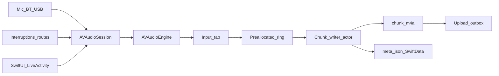

### Session baseline

```swift
try session.setCategory(
  .playAndRecord,
  mode: .spokenAudio,
  options: [.allowBluetooth, .defaultToSpeaker, .mixWithOthers]
)
// iOS 26+: also .bluetoothHighQualityRecording
try session.setActive(true)
```

Info.plist: `NSMicrophoneUsageDescription`, `UIBackgroundModes = audio`. No `voip`.

### Audio thread rules

Inside `installTap`: no file I/O, no locks, no allocations — copy into preallocated ring; signal writer actor.

---

## 4. Background, lock screen, Live Activity

What keeps you alive: `audio` background mode + **active** session continuously capturing.

- Lock screen continues if above hold; never hide system mic indication.
- Start Live Activity from **foreground** when recording begins.
- Pause policy: end chunk + paused state requiring foreground resume (safest).
- App Review note: document “start record → background → lock → continues with Live Activity.”

---

## 5. Interruptions & routes

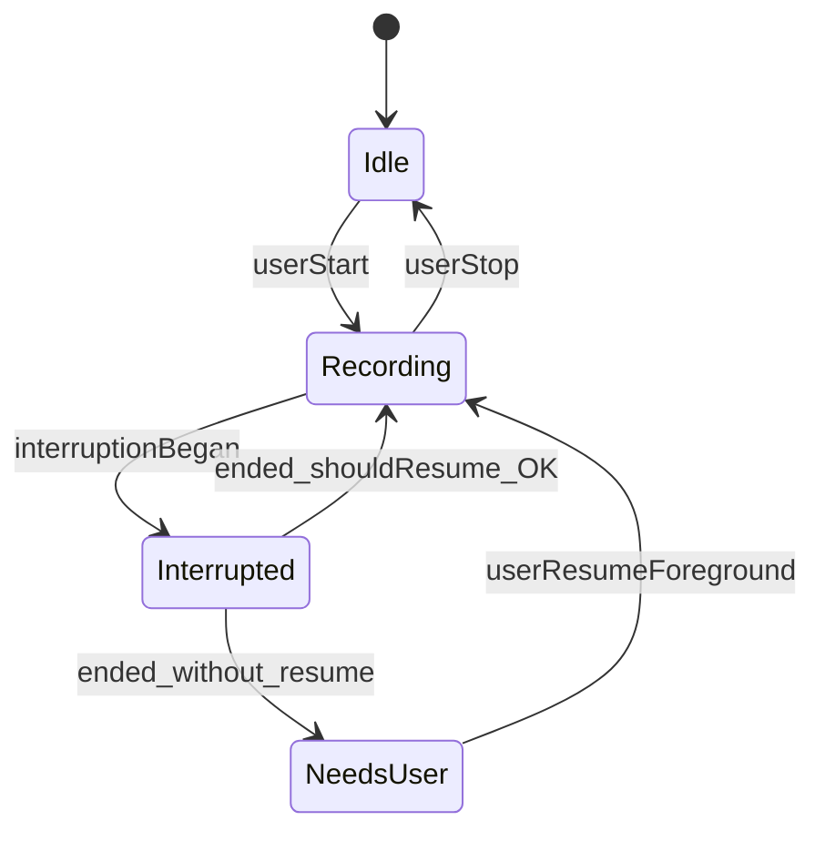

- Observe `interruptionNotification` and `routeChangeNotification`.
- Auto-resume only if `.shouldResume` and restart succeeds; else **Tap to resume**.
- Prefer reuse engine + reinstall taps; don’t recreate `AVAudioEngine()` mid-interruption.
- AirPods/BT drops: re-query `currentRoute`; never corrupt open chunk.
- **Never claim** “records your phone calls.”

---

## 6. Compression, VAD, battery

| Setting | Choice |
|---|---|
| Channels | Mono |
| Codec | AAC-LC `.m4a` |
| Bitrate | 64–96 kbps (~30–60 MB/hour) |
| Silence | Keep by default; optional user trim later |
| VAD | Lightweight RMS for meters; ML VAD optional behind flag |
| Battery | Expect ~8–15%/hour; measure on SE-class |

---

## 7. Long recordings & recovery

Chunk every ~5 minutes:

1. Finalize chunk (atomic rename).
2. Update `meta.json` + SwiftData.
3. Open next chunk immediately.
4. Optional: upload finished chunks while still recording.

| Failure | Recovery |
|---|---|
| Crash mid-record | Relaunch scans sidecars; recover chunks; prompt finalize/resume |
| Low disk | Warn ~500MB; auto-stop ~150MB; preserve chunks |
| Failed upload | Outbox retry + checksums; keep local until ACK |
| Force quit | Capture stops; uploads may continue via background URLSession |

---

## 8. Hardware test matrix (required)

Background 60+ min, lock screen, Phone interruption, Siri/alarm, AirPods connect/disconnect, wired unplug, Low Power Mode, disk fill, kill mid-record, kill mid-upload, 3h soak on SE-class.

---

## 9. Acceptance criteria

- [ ] Continues when backgrounded and locked
- [ ] Force quit stops capture; relaunch recovers files
- [ ] Phone call → defined Interrupted/NeedsUser state, no crash
- [ ] 3h produces valid playable audio without multi-minute dropouts
- [ ] Live Activity visible entire time mic is hot
- [ ] Marketing does not claim Phone.app call recording
- [ ] Upload retries are idempotent

---

<a id="doc-transcription-research"></a>

######## DOCUMENT: TRANSCRIPTION_RESEARCH.md ########

# Transcription Provider Research — Afterna

**Product context:** iPhone conversation memory app (multi-speaker, real rooms, AU/US/UK English first).  
**MVP mode preference:** **batch post-recording** (upload completed audio → async transcript). Prefer streaming only when live captions clearly justify cost and complexity.  
**Research window:** verified against public pricing/docs as of **August 2026**. Rates change; re-check source URLs before locking contracts.

---

## Executive recommendation

| Role | Provider / model | Why |
|---|---|---|
| **Primary (MVP)** | **AssemblyAI** — `universal-3-pro` (Universal-3.5 Pro) async + speaker diarization | Best batch price/quality for multi-speaker conversations; cheap diarization; word timestamps & punctuation; mature async job API; EU endpoint at same price |
| **Fallback** | **OpenAI** — `gpt-4o-transcribe-diarize` (speaker memory) / `gpt-transcribe` (plain text) | Different vendor failure domain; simple REST; strong general accuracy; known-speaker references; high operational reliability |
| **Strong alternate (eval)** | **Deepgram Nova-3** pre-recorded | Excellent noisy / far-field / accented speech marketing + benchmarks; keep if your AU café/office eval set beats AssemblyAI |
| **Long-term cost** | Tiered routing + on-device draft + (at scale) self-hosted Whisper | See [Cost optimisation](#long-term-cost-optimisation) |

**Do not use as primary for long-form conversation memory:** legacy **Apple `SFSpeechRecognizer`** (session/rate limits). Treat **Apple `SpeechAnalyzer` (iOS 26+)** as on-device privacy/offline assist, not cloud diarized memory.

---

## Decision criteria (weighted for this app)

1. **Multi-speaker + diarisation** — who said what is a product feature, not an add-on curiosity  
2. **Noisy rooms / far-field phone mic** — cafés, kitchens, cars  
3. **AU / US / UK accent robustness** — English variety first; other languages later  
4. **Punctuation + timestamps** — readable memory + seek/playback  
5. **Batch reliability** — fewer moving parts than live WebSocket on cellular  
6. **Cost per audio hour** at early volumes (tens–hundreds of hours/month)  
7. **API reliability / ops simplicity** — retries, webhooks, clear failure modes  
8. **Overlapping speech honesty** — all vendors degrade; prefer overlap-aware systems, never promise perfect separation

---

## Provider scorecard (MVP lens)

Ratings are qualitative (●●●●● best) for *this* product, not universal WER leaderboards.

| Provider | Accuracy (clear EN) | Noisy / far-field | AU/US/UK | Multi-spk / overlap | Punctuation | Timestamps | Diarisation | Languages | Batch | Streaming | Reliability | ~Cost/hr (batch + diar*) |
|---|---|---|---|---|---|---|---|---|---|---|---|---|
| **AssemblyAI U3.5 Pro** | ●●●●● | ●●●● | ●●●● | ●●●● | ●●●●● | ●●●●● | ●●●●● | ●●●● (U3.5) / ●●●●● (U2) | ●●●●● | ●●●● | ●●●●● | **~$0.23** |
| **Deepgram Nova-3** | ●●●●● | ●●●●● | ●●●●● | ●●●● | ●●●●● | ●●●●● | ●●●● | ●●●● | ●●●●● | ●●●●● | ●●●●● | **~$0.46–0.55**† |
| **OpenAI gpt-transcribe** | ●●●●● | ●●●● | ●●●● | ●● | ●●●● | Limited‡ | — | ●●●●● | ●●●● | Live separate | ●●●●● | **~$0.27** |
| **OpenAI gpt-4o-transcribe-diarize** | ●●●● | ●●●● | ●●●● | ●●●● | ●●●● | Segment | ●●●●● | ●●●● | ●●●● | File stream | ●●●●● | **~$0.36** |
| **OpenAI whisper-1** | ●●●● | ●●● | ●●●● | ●● | ●●● | ●●●●● word | — | ●●●●● | ●●●● | No | ●●●● | **~$0.36** |
| **Google STT V2 Chirp** | ●●●● | ●●●● | ●●●● | ●●● | ●●●● | ●●●● | ●●● | ●●●●● | ●●●●● | ●●●●● | ●●●●● | **~$0.96** (std) / **~$0.18** (dynamic batch, ≤24h) |
| **Apple SFSpeechRecognizer** | ●●● | ●●● | ●●●● (locale) | ●● | ●●● | Weak | — | ●●●● | Short only | Partial | ●●● (device) | **$0** (quota/limits) |
| **Apple SpeechAnalyzer (iOS 26+)** | ●●●●● (on-device) | ●●●● | ●●●● | ●● | ●●●● | ●●● | — | Growing | ●●●●● long-form | ●●●● | ●●●●● on-device | **$0** |
| **Self-hosted Whisper (+ diar)** | ●●●● | ●●● | ●●●● | ●●● (w/ pyannote) | Post | Post | DIY | ●●●●● | ●●●●● | Hard | You own it | **~$0.02–0.05** infra§ |
| **Gladia** (notable other) | ●●●● | ●●●● | ●●●● | ●●●●● async | ●●●●● | ●●●●● | ●●●●● async | ●●●●● | ●●●●● | ●●●● (no live diar) | ●●●● | **~$0.61** starter |

\* Approximate PAYG USD for **1 hour mono audio**, diarisation included where required for conversation memory.  
† Deepgram Nova-3 Monolingual pre-recorded **$0.0077/min ≈ $0.46/hr**; multilingual **$0.0092/min ≈ $0.55/hr**. Streaming currently has promotional lower rates — confirm live. Diarisation add-on listed **+$0.002/min** on streaming; verify whether pre-recorded includes diarisation in your account.  
‡ OpenAI: word-level `timestamp_granularities` documented for **`whisper-1`**; diarize model returns **segment** speaker/start/end via `diarized_json`.  
§ Infra only at high utilisation; excludes DevOps labour (see cost section).

---

## Detailed provider notes

### 1. AssemblyAI (recommended primary)

**Best fit:** Async post-recording of conversations with speaker labels.

| Dimension | Assessment |
|---|---|
| Accuracy | Universal-3.5 Pro is the current flagship; strong conversational English |
| Latency | Batch: typically seconds–low minutes depending on length/queue (not live) |
| Accents | Solid EN varieties; still run AU-specific eval clips |
| Noisy rooms | Good; not marketed as strongly as Nova-3 for extreme far-field |
| Overlap | Better than classic clustering-only stacks; still imperfect |
| Punctuation / formatting | First-class |
| Timestamps | Word-level supported |
| Diarisation | Async **+$0.02/hr** standard; experimental **+$0.065/hr** for hard audio |
| Languages | U3.5 Pro: focused multilingual / code-switch story; Universal-2: broader 99+ coverage at **$0.15/hr** |
| Streaming vs batch | Both; MVP should use **pre-recorded**. Streaming billed on **WebSocket open time** (idle counts) |
| Reliability | Mature job + webhook pattern; failed transcripts not charged (per their billing docs) |
| Cost | **$0.21/hr** + **$0.02** diar = **~$0.23/hr** |

**Sources:**  
- https://www.assemblyai.com/pricing  
- https://www.assemblyai.com/docs/billing-and-pricing  
- https://www.assemblyai.com/blog/speech-to-text-api-pricing  

**MVP config sketch:** `speech_models: ["universal-3-pro"]`, speaker diarization on, word timestamps on, language hints for `en_au` / `en_us` / `en_gb` when known, optional keyterms for contact names.

**Risks:** Streaming cost surprises if someone leaves sockets open; model defaults can differ free vs paid — always set model explicitly.

---

### 2. OpenAI transcription APIs (recommended fallback)

**Current models (2026):**

| Model | Role | Official estimate |
|---|---|---|
| `gpt-transcribe` | **Recommended** default for recorded speech | **$0.0045/min ≈ $0.27/hr** |
| `gpt-4o-transcribe` | Prior GPT-4o STT generation | **~$0.006/min ≈ $0.36/hr** |
| `gpt-4o-mini-transcribe` | Cheaper / lower quality | **~$0.003/min ≈ $0.18/hr** |
| `gpt-4o-transcribe-diarize` | Speaker labels (`diarized_json`) | Commonly **~$0.006/min ≈ $0.36/hr** (verify against current pricing page; not always listed as a separate row) |
| `whisper-1` | Legacy; word timestamps / SRT/VTT | **$0.006/min ≈ $0.36/hr** |
| `gpt-live-transcribe` / realtime whisper | Live streaming | **$0.017/min ≈ $1.02/hr** |

**Sources:**  
- https://developers.openai.com/api/docs/pricing  
- https://openai.com/api/pricing/  
- https://developers.openai.com/api/docs/guides/speech-to-text  
- https://developers.openai.com/api/docs/models/gpt-4o-transcribe  

| Dimension | Assessment |
|---|---|
| Accuracy | Excellent general STT; gpt-transcribe is the current recommended file model |
| Latency | Fast file turnaround; not a true live caption product at batch prices |
| Accents / noise | Strong vs classic Whisper; still validate on phone-mic AU audio |
| Diarisation | Dedicated `gpt-4o-transcribe-diarize`; optional known-speaker reference clips (up to 4) — valuable for “remember who this is” |
| Timestamps | Diarize → segment times; **word timestamps → whisper-1** |
| Limits | **25 MB** upload; longer audio needs chunking (`chunking_strategy` required for diarize >30s) |
| Streaming | Live models are **~3–4×** batch cost — avoid for MVP |
| Reliability | Extremely common dependency; clear rate tiers |

**Use as fallback when:** AssemblyAI outage / elevated error rate / quality regression on a clip family.  
**Do not expect:** One model that simultaneously gives best WER + word timestamps + diarisation + cheapest price.

---

### 3. Deepgram (Nova-3) — strong alternate / streaming leader

| Dimension | Assessment |
|---|---|
| Accuracy | Nova-3 claims large WER gains vs prior gens; strong on accents, noise, crosstalk (vendor benchmarks) |
| Latency | Excellent streaming story (Flux / Nova); batch also fast |
| Diarisation | Supported; streaming add-on **+$0.0020/min** on published pricing |
| Formatting | Smart formatting included |
| Languages | Nova-3 multilingual + code-switch story; ~45+ languages depending on model |
| Cost (official page) | Nova-3 Mono PAYG: stream **$0.0048/min**, pre-recorded **$0.0077/min**; Multi: **$0.0058 / $0.0092**. Note: **streaming currently cheaper than batch** (promo called out) |
| Credits | **$200** free credit (Pay As You Go) |

**Sources:**  
- https://deepgram.com/pricing  
- https://deepgram.com/learn/introducing-nova-3-speech-to-text-api  
- https://deepgram.com/learn/model-comparison-when-to-use-nova-2-vs-nova-3-for-devs  

**When to promote to primary:** If blinded evals on *your* iPhone room recordings (especially AU + overlap) beat AssemblyAI by a clear margin, or you later ship live captions.

---

### 4. Google Cloud Speech-to-Text V2 (Chirp / Chirp 3)

| Dimension | Assessment |
|---|---|
| Accuracy | Chirp / Chirp 3 competitive multilingual ASR; diarisation + denoiser called out in release notes |
| Cost | Standard recognition **$0.016/min ≈ $0.96/hr** (0–500k min/mo); Dynamic Batch **$0.003/min ≈ $0.18/hr** with lower urgency (results within ~24h) |
| Free tier | **60 min/month** (V1 table; confirm V2 account defaults) |
| Fit | Strong if already on GCP; **expensive for interactive memory sync** at standard rates |

**Sources:**  
- https://cloud.google.com/speech-to-text/pricing  
- https://docs.cloud.google.com/speech-to-text/docs/release-notes  

**Role:** Optional **archival / reprocess** path via Dynamic Batch, not MVP primary.

---

### 5. Apple Speech frameworks (honest limits)

#### Legacy: `SFSpeechRecognizer`

- Designed for **short-form** dictation / queries, not hour-long conversation memory.  
- Practical constraints widely documented: **~1 minute per recognition request**, **~1,000 requests/device/hour**.  
- Default path often uses **Apple servers** (privacy + network); `requiresOnDeviceRecognition` needs downloaded locale models and is not universally available.  
- **No production-grade speaker diarisation.**  
- Punctuation improved (`addsPunctuation`) but output quality ≠ modern cloud STT for meetings.  
- **Verdict:** Fine for voice search / short notes; **unsuitable as primary long-form cloud/offline memory engine.**

#### Modern: `SpeechAnalyzer` + `SpeechTranscriber` (iOS 26+, WWDC 2025)

- On-device, **long-form** capable (Notes / Voice Memos class workloads).  
- Better distant-mic / conversation acoustic modelling than legacy API.  
- **No server fallback** — if the device can’t run it, you’re stuck.  
- Asset download / locale management required (`AssetInventory`).  
- **Still no first-party speaker diarisation** for “Speaker A/B” memory graphs.  
- **Verdict:** Excellent **privacy draft**, offline UX, or low-cost pre-transcript; **not a full substitute** for cloud diarised conversation memory until Apple ships speaker separation (or you add a local diarisation stack).

**Sources:**  
- https://developer.apple.com/videos/play/wwdc2025/277/  
- Apple Speech / SFSpeechRecognizer documentation  
- Industry write-ups summarizing iOS 26 SpeechAnalyzer vs SFSpeechRecognizer (cross-check against Apple docs before shipping)

---

### 6. Self-hosted Whisper (faster-whisper / WhisperKit)

| Dimension | Assessment |
|---|---|
| Accuracy | `large-v3` / turbo variants competitive on clean audio; noisy multi-speaker needs extra models |
| Diarisation | **Not built-in** — typically **pyannote** / Sortformer / similar (extra GPU + ops) |
| On-device iOS | **WhisperKit** is a viable local path for draft transcripts (battery/thermal tradeoffs) |
| Cost | GPU infra often cited ~**$0.02–0.05/audio-hr** at high utilisation; **DevOps labour** often dominates until thousands of hours/month |
| Reliability | You own queues, GPUs, scaling, model updates, abuse |

**Role:** Long-term optimisation / privacy-sensitive enterprise tier — **not MVP**.

---

### 7. Other strong vendors (brief)

| Vendor | Why consider | Why not MVP primary |
|---|---|---|
| **Gladia** | Async diarisation strength; 100+ languages; bundled features | Starter async **~$0.61/hr** (higher than AssemblyAI); live diarisation not available |
| **AWS Transcribe** | Enterprise AWS shops | Overlap/diarisation generally weaker vs leaders; pricing/complexity |
| **Rev AI / Speechmatics** | Specialty accuracy niches | Usually not cheapest; evaluate only if evals win |
| **Soniox** | Emerging real-time + diarisation claims | Smaller ecosystem; validate SLA |

**Gladia source:** https://www.gladia.io/pricing  

---

## Streaming vs batch (MVP recommendation)

| Mode | Pros | Cons | MVP? |
|---|---|---|---|
| **Batch post-recording** | Reliable on flaky LTE/Wi‑Fi; simpler billing; better diarisation (full audio context); easier retries | User waits for “memory ready” | **Yes — default** |
| **Streaming live captions** | Instant feedback; engagement | WebSocket ops; higher cost; idle billing traps; worse/harder diarisation; battery + background audio complexity on iOS | **Phase 2+** only if product requires live UI |

**Rule:** Record locally → compress (AAC/m4a or Opus) → upload → primary provider async job → normalize → store. Optionally show Apple on-device partial text while upload runs.

---

## Cost scenarios (illustrative)

Assumptions: mono audio, conversation memory needs diarisation where available.

| Monthly audio | AssemblyAI U3.5 Pro + diar (~$0.23/hr) | OpenAI diarize (~$0.36/hr) | Deepgram Nova-3 mono prerecorded (~$0.46/hr) | Google Chirp std (~$0.96/hr) |
|---|---|---|---|---|
| 50 hr | ~$12 | ~$18 | ~$23 | ~$48 |
| 200 hr | ~$46 | ~$72 | ~$92 | ~$192 |
| 1,000 hr | ~$230 | ~$360 | ~$460 | ~$960 |
| 5,000 hr | ~$1,150 | ~$1,800 | ~$2,300 | ~$4,800 |

At **5,000+ hr/mo**, revisit Growth commits (Deepgram/Gladia), Google Dynamic Batch for cold storage reprocess, and self-hosted Whisper+diar pipelines.

---

## Long-term cost optimisation

1. **Stay batch-first** — avoid $0.45–$1+/hr streaming until live UI is required.  
2. **Tier models by job class**  
   - Multi-speaker conversation → AssemblyAI U3.5 Pro + diar (or OpenAI diarize)  
   - Single-speaker voice notes → `gpt-4o-mini-transcribe` or AssemblyAI Universal-2  
   - Archival re-transcribe → Google Dynamic Batch / cheaper model  
3. **On-device draft (iOS 26+ SpeechAnalyzer / WhisperKit)** — reduce “retry because user is impatient” cloud calls; never treat as final diarised truth.  
4. **Aggressive VAD / silence trim** before upload — don’t pay for 20 minutes of empty room.  
5. **Provider commits** only after volume is stable (Deepgram Growth, Gladia Growth, GCP committed use).  
6. **Self-host** when volume + privacy justify GPU + SRE (rough industry break-even often **hundreds–thousands of hours/month** once labour is counted — measure your own).  
7. **Cache & idempotency** — never double-bill the same recording UUID.  
8. **Eval-gated routing** — periodically score AU noisy clips; auto-failover if primary WER/DER drifts.

---

## Suggested evaluation protocol (before locking primary)

Record **≥30 clips** on iPhone in real conditions:

- AU / US / UK speakers  
- Quiet room, café noise, TV in background, car  
- 2-speaker and 3+ speaker, with intentional overlap  
- 5–45 minute lengths  

Score: WER (or human edit distance), DER / speaker confusion, punctuation readability, time-to-transcript p50/p95, $/hr, failure rate.

Promote Deepgram (or OpenAI) to primary **only if** they win this eval, not vendor blogs.

---

## Recommendation summary

1. **Primary:** AssemblyAI Universal-3.5 Pro **async** + standard diarisation.  
2. **Fallback:** OpenAI `gpt-4o-transcribe-diarize` (conversations) / `gpt-transcribe` (single speaker).  
3. **Keep warm:** Deepgram Nova-3 for noisy-room bake-off and future streaming.  
4. **Apple:** SpeechAnalyzer for on-device assist; SFSpeechRecognizer only for short dictation legacy support.  
5. **MVP transport:** batch post-recording behind a swappable provider protocol (see `TRANSCRIPTION_ARCHITECTURE.md`).

---

<a id="doc-transcription-architecture"></a>

######## DOCUMENT: TRANSCRIPTION_ARCHITECTURE.md ########

# Transcription Architecture — Afterna

**Companion doc:** `TRANSCRIPTION_RESEARCH.md`  
**Goal:** Production-ready, swappable transcription for an iPhone conversation memory app — **batch post-recording first**, streaming optional later.

---

## Design principles

1. **Provider-agnostic domain model** — app code never imports AssemblyAI/OpenAI/Deepgram types outside adapter modules.  
2. **Batch is the MVP happy path** — record → upload → job → normalize → persist.  
3. **Failover is a product feature** — primary failure or SLA breach routes to fallback without UI rewrite.  
4. **Idempotent jobs** — same `recordingId` never double-bills.  
5. **Normalize early** — store one canonical transcript schema regardless of vendor.  
6. **On-device is assistive** — Apple Speech / WhisperKit may draft; cloud (or future local diarisation) owns “memory truth” for multi-speaker.

---

## High-level flow (MVP)

```
┌─────────────┐   mic + file    ┌──────────────────┐
│  iOS App    │ ──────────────► │ Local Recording  │
│  (SwiftUI)  │                 │ Store (encrypted)│
└──────┬──────┘                 └────────┬─────────┘
       │                                 │
       │ optional on-device draft         │ compress + checksum
       ▼                                 ▼
┌──────────────────┐            ┌────────────────────────┐
│ AppleSpeechDraft │            │ Upload to App Backend  │
│ (SpeechAnalyzer /│            │ (presigned URL / API)  │
│  SFSpeech*)      │            └───────────┬────────────┘
└──────────────────┘                        │
                                            ▼
                               ┌────────────────────────────┐
                               │ Transcription Orchestrator │
                               │  - pick provider           │
                               │  - enqueue job             │
                               │  - retry / failover        │
                               └───────────┬────────────────┘
                         ┌─────────────────┼─────────────────┐
                         ▼                 ▼                 ▼
                  ┌────────────┐   ┌────────────┐   ┌────────────┐
                  │ AssemblyAI │   │   OpenAI   │   │  Deepgram  │
                  │  Adapter   │   │  Adapter   │   │  Adapter   │
                  └──────┬─────┘   └──────┬─────┘   └──────┬─────┘
                         └─────────────────┼─────────────────┘
                                           ▼
                               ┌────────────────────────────┐
                               │ Canonical Transcript Store │
                               │ + speaker map + embeddings │
                               └──────────────┬─────────────┘
                                              ▼
                                         Push / sync
                                              ▼
                                         iOS Memory UI
```

**Recommendation:** Run the orchestrator on a **small backend** (not only on-device). Keeps API keys off the phone, enables webhooks, retries when the app is killed, and centralizes failover.

---

## Recommended provider roles

| Role | Provider | Model / mode |
|---|---|---|
| Primary | AssemblyAI | `universal-3-pro` async + diarization |
| Fallback | OpenAI | `gpt-4o-transcribe-diarize` (multi-speaker) / `gpt-transcribe` (solo) |
| Alternate / future stream | Deepgram | Nova-3 pre-recorded (MVP eval); streaming later |
| On-device draft | Apple | `SpeechAnalyzer` (iOS 26+) / limited `SFSpeechRecognizer` |

See research doc for pricing and capability tradeoffs.

---

## Canonical domain model

Normalize every vendor response into these types (Swift shown; mirror in backend TypeScript/Go as needed).

```swift
import Foundation

/// Stable app-level identity for a captured conversation.
struct RecordingID: Hashable, Codable, Sendable {
    let uuid: UUID
}

enum TranscriptLanguage: String, Codable, Sendable {
    case enAU = "en_au"
    case enUS = "en_us"
    case enGB = "en_gb"
    case auto
    case other
}

struct TranscriptionRequest: Sendable {
    let recordingId: RecordingID
    /// HTTPS URL or signed object storage reference the provider/backend can fetch.
    let audioURL: URL
    let duration: Duration
    let languageHint: TranscriptLanguage
    let expectedSpeakerCount: Int?          // 2 for typical 1:1 memory
    let knownSpeakerHints: [KnownSpeakerHint]
    let vocabularyBoost: [String]           // names, places, product terms
    let requireDiarization: Bool
    let requireWordTimestamps: Bool
    let clientChecksum: String              // sha256 of local file for idempotency
}

struct KnownSpeakerHint: Sendable {
    let speakerId: String                   // app person id
    let displayName: String
    /// Optional short reference clip URL for providers that support enrollment (e.g. OpenAI diarize).
    let referenceAudioURL: URL?
}

struct TranscriptSegment: Codable, Sendable, Identifiable {
    let id: UUID
    let speakerLabel: String                // "A", "B" or provider "speaker_0"
    let speakerPersonId: String?            // resolved app identity if known
    let text: String
    let startMs: Int
    let endMs: Int
    let confidence: Double?
}

struct TranscriptWord: Codable, Sendable {
    let text: String
    let startMs: Int
    let endMs: Int
    let speakerLabel: String?
    let confidence: Double?
}

struct CanonicalTranscript: Codable, Sendable {
    let recordingId: RecordingID
    let provider: TranscriptionProviderID
    let model: String
    let language: String
    let fullText: String
    let segments: [TranscriptSegment]
    let words: [TranscriptWord]             // empty if provider couldn't supply
    let durationMs: Int
    let createdAt: Date
    let rawArtifactURI: String?             // stored vendor JSON for debug/replay
}

enum TranscriptionJobState: Codable, Sendable {
    case queued
    case uploading
    case processing
    case succeeded(CanonicalTranscript)
    case failed(TranscriptionError)
    case cancelled
}

enum TranscriptionProviderID: String, Codable, Sendable, CaseIterable {
    case assemblyAI
    case openAI
    case deepgram
    case google
    case appleOnDevice
    case whisperSelfHosted
}

struct TranscriptionError: Error, Codable, Sendable {
    enum Code: String, Codable, Sendable {
        case unsupportedFeature
        case invalidAudio
        case providerUnavailable
        case rateLimited
        case timeout
        case auth
        case permanentFailure
        case cancelled
    }
    let code: Code
    let message: String
    let retryable: Bool
    let provider: TranscriptionProviderID?
}
```

---

## Swift protocol concept (swappable providers)

### Core protocol

```swift
import Foundation

/// Capability flags so the orchestrator can skip incompatible providers
/// without try/catch archaeology.
struct TranscriptionCapabilities: Sendable {
    var supportsBatch: Bool
    var supportsStreaming: Bool
    var supportsDiarization: Bool
    var supportsWordTimestamps: Bool
    var supportsKnownSpeakerEnrollment: Bool
    var maxUploadBytes: Int?
    var languages: Set<String>
}

protocol TranscriptionProviding: Sendable {
    var id: TranscriptionProviderID { get }
    var capabilities: TranscriptionCapabilities { get }

    /// Submit async batch job. Returns opaque provider job id.
    func startBatch(_ request: TranscriptionRequest) async throws -> ProviderJobHandle

    /// Poll or await completion. Prefer webhook-driven updates on the server;
    /// clients may still poll a status endpoint.
    func fetchBatch(job: ProviderJobHandle) async throws -> TranscriptionJobState

    /// Cancel if the provider supports it (best-effort).
    func cancel(job: ProviderJobHandle) async throws

    /// Map vendor payload → canonical model (also used when replaying webhooks).
    func normalize(rawPayload: Data, request: TranscriptionRequest) throws -> CanonicalTranscript
}

struct ProviderJobHandle: Codable, Sendable, Hashable {
    let provider: TranscriptionProviderID
    let externalJobId: String
    let recordingId: RecordingID
}
```

### Optional streaming (Phase 2+)

```swift
protocol StreamingTranscriptionProviding: TranscriptionProviding {
    func stream(
        _ request: StreamingTranscriptionRequest
    ) -> AsyncThrowingStream<StreamingTranscriptEvent, Error>
}

enum StreamingTranscriptEvent: Sendable {
    case partial(text: String, speakerLabel: String?)
    case finalSegment(TranscriptSegment)
    case speechStarted
    case speechEnded
    case providerInfo(String)
}
```

**MVP:** implement only `TranscriptionProviding`. Keep streaming protocol ready but unused so cellular + background audio complexity doesn’t block launch.

---

## Orchestrator (failover + policy)

```swift
protocol TranscriptionOrchestrating: Sendable {
    func submit(_ request: TranscriptionRequest) async throws -> ProviderJobHandle
    func status(for recordingId: RecordingID) async throws -> TranscriptionJobState
}

struct ProviderPolicy: Sendable {
    var primary: TranscriptionProviderID
    var fallback: TranscriptionProviderID
    var alternate: TranscriptionProviderID?

    /// Route solo voice memos to cheaper models.
    var singleSpeakerProvider: TranscriptionProviderID?
}

actor TranscriptionOrchestrator: TranscriptionOrchestrating {
    private let providers: [TranscriptionProviderID: any TranscriptionProviding]
    private let policy: ProviderPolicy
    private let store: TranscriptJobStore
    private let maxAttempts = 3

    func submit(_ request: TranscriptionRequest) async throws -> ProviderJobHandle {
        if let existing = await store.existingSuccessfulJob(checksum: request.clientChecksum) {
            return existing
        }

        let order = providerOrder(for: request)
        var lastError: TranscriptionError?

        for providerID in order {
            guard let provider = providers[providerID] else { continue }
            guard provider.capabilities.supportsBatch else { continue }
            if request.requireDiarization && !provider.capabilities.supportsDiarization { continue }
            if request.requireWordTimestamps && !provider.capabilities.supportsWordTimestamps {
                // Soft requirement: still allowed; words[] may be empty.
            }

            do {
                let handle = try await provider.startBatch(request)
                await store.remember(handle: handle, request: request, attempt: 1)
                return handle
            } catch let error as TranscriptionError where error.retryable {
                lastError = error
                continue
            } catch {
                lastError = TranscriptionError(
                    code: .permanentFailure,
                    message: String(describing: error),
                    retryable: false,
                    provider: providerID
                )
                continue
            }
        }

        throw lastError ?? TranscriptionError(
            code: .providerUnavailable,
            message: "All providers failed",
            retryable: true,
            provider: nil
        )
    }

    private func providerOrder(for request: TranscriptionRequest) -> [TranscriptionProviderID] {
        if request.requireDiarization == false,
           let cheap = policy.singleSpeakerProvider {
            return [cheap, policy.primary, policy.fallback]
        }
        return [policy.primary, policy.fallback, policy.alternate].compactMap { $0 }
    }

    func status(for recordingId: RecordingID) async throws -> TranscriptionJobState {
        guard let handle = await store.handle(for: recordingId) else {
            return .failed(TranscriptionError(
                code: .invalidAudio,
                message: "Unknown recording",
                retryable: false,
                provider: nil
            ))
        }
        guard let provider = providers[handle.provider] else {
            return .failed(TranscriptionError(
                code: .providerUnavailable,
                message: "Provider missing",
                retryable: true,
                provider: handle.provider
            ))
        }

        let state = try await provider.fetchBatch(job: handle)

        if case .failed(let err) = state, err.retryable {
            return try await failover(from: handle, error: err)
        }
        if case .succeeded(let transcript) = state {
            await store.persist(transcript)
        }
        return state
    }

    private func failover(
        from failed: ProviderJobHandle,
        error: TranscriptionError
    ) async throws -> TranscriptionJobState {
        // Re-load original request from store; start next provider in policy order.
        // Implementation omitted for brevity — must be idempotent and audited.
        _ = error
        _ = failed
        return .failed(error)
    }
}
```

### Failover rules (production)

| Condition | Action |
|---|---|
| HTTP 429 / 503 / timeout | Retry same provider with exponential backoff (3×), then fallback |
| HTTP 401/403 | Alert ops; do **not** burn fallback quota blindly |
| `unsupportedFeature` | Skip to next provider that advertises the capability |
| WER/DER quality gate fail (async eval) | Soft-failover for that recording; alert if rate > threshold |
| Provider status page red | Temporarily demote primary for N minutes |

---

## Adapter sketch

### AssemblyAI (primary)

```swift
struct AssemblyAITranscriptionProvider: TranscriptionProviding {
    let id = TranscriptionProviderID.assemblyAI
    let apiKey: String
    let baseURL = URL(string: "https://api.assemblyai.com")!

    var capabilities: TranscriptionCapabilities {
        .init(
            supportsBatch: true,
            supportsStreaming: true,
            supportsDiarization: true,
            supportsWordTimestamps: true,
            supportsKnownSpeakerEnrollment: false,
            maxUploadBytes: nil,
            languages: ["en", "en_au", "en_us", "en_gb"] // extend as needed
        )
    }

    func startBatch(_ request: TranscriptionRequest) async throws -> ProviderJobHandle {
        // 1) Ensure audio is reachable (upload to AssemblyAI or pass publicly fetchable URL)
        // 2) POST /v2/transcript with:
        //    speech_models: ["universal-3-pro"]
        //    speaker_labels: true
        //    language_code / language_detection
        //    word_boost / keyterms as available
        // 3) Return job id
        fatalError("Implement with URLSession / async HTTP client")
    }

    func fetchBatch(job: ProviderJobHandle) async throws -> TranscriptionJobState {
        fatalError("Poll GET /v2/transcript/:id or handle webhook")
    }

    func cancel(job: ProviderJobHandle) async throws { /* best-effort */ }

    func normalize(rawPayload: Data, request: TranscriptionRequest) throws -> CanonicalTranscript {
        fatalError("Map utterances[] → TranscriptSegment, words[] → TranscriptWord")
    }
}
```

### OpenAI (fallback)

```swift
struct OpenAITranscriptionProvider: TranscriptionProviding {
    let id = TranscriptionProviderID.openAI
    let apiKey: String

    var capabilities: TranscriptionCapabilities {
        .init(
            supportsBatch: true,
            supportsStreaming: true, // live models — expensive; gate behind feature flag
            supportsDiarization: true, // via gpt-4o-transcribe-diarize
            supportsWordTimestamps: true, // via whisper-1 path; diarize is segment-level
            supportsKnownSpeakerEnrollment: true,
            maxUploadBytes: 25 * 1024 * 1024,
            languages: ["*"]
        )
    }

    func startBatch(_ request: TranscriptionRequest) async throws -> ProviderJobHandle {
        // If duration/file > 25MB: server-side chunk + stitch before/within provider rules.
        // Diarize: model=gpt-4o-transcribe-diarize, response_format=diarized_json,
        //          chunking_strategy=auto for audio > 30s
        // Solo: model=gpt-transcribe
        fatalError("Implement multipart /v1/audio/transcriptions")
    }

    func fetchBatch(job: ProviderJobHandle) async throws -> TranscriptionJobState {
        // OpenAI file transcription is often synchronous HTTP;
        // wrap as immediate success job or internal queue item.
        fatalError("Implement")
    }

    func cancel(job: ProviderJobHandle) async throws {}

    func normalize(rawPayload: Data, request: TranscriptionRequest) throws -> CanonicalTranscript {
        fatalError("Map diarized segments {speaker,start,end,text}")
    }
}
```

### Apple on-device (draft only)

```swift
struct AppleOnDeviceTranscriptionProvider: TranscriptionProviding {
    let id = TranscriptionProviderID.appleOnDevice

    var capabilities: TranscriptionCapabilities {
        .init(
            supportsBatch: true,          // file analysis session
            supportsStreaming: true,      // buffer streaming into analyzer
            supportsDiarization: false,   // honest limitation
            supportsWordTimestamps: true, // where API exposes timing
            supportsKnownSpeakerEnrollment: false,
            maxUploadBytes: nil,
            languages: ["device-dependent"]
        )
    }

    func startBatch(_ request: TranscriptionRequest) async throws -> ProviderJobHandle {
        // iOS 26+: SpeechAnalyzer + SpeechTranscriber over local file
        // Older iOS: SFSpeechURLRecognitionRequest with hard duration limits —
        //            chunk artificially AND mark quality as "draft"
        fatalError("Implement on-device path")
    }

    // ...
}
```

**Important:** If `requireDiarization == true`, orchestrator must **not** select Apple as primary/fallback for final memory.

---

## Backend job machine (recommended)

Even with Swift protocols on-device for drafts, production jobs should be server-driven:

```
recording.uploaded
    → job.queued
    → job.provider_submitted (primary)
    → job.provider_running
    → job.normalized
    → job.speaker_resolved
    → job.ready
       ↘ job.failover_submitted
       ↘ job.failed_terminal
```

**Webhook endpoint:** `/webhooks/transcription/{provider}`  
Verify signatures, load `recordingId` from metadata, call `provider.normalize`, persist, push APNs / sync.

**Idempotency key:** `sha256(audio) + featureFlags` (diarization on/off, model tier).

---

## Audio pipeline (iPhone)

1. **Capture:** `AVAudioEngine` / `AVAudioRecorder`, mono 16 kHz+ (48 kHz record → downsample server-side OK).  
2. **Store encrypted** at rest on device.  
3. **VAD / silence trim** (optional, conservative) to cut billable silence.  
4. **Compress:** AAC `.m4a` or Opus — target quality for speech, not music.  
5. **Checksum** before upload.  
6. **Upload** via resumable/presigned PUT (background `URLSession`).  
7. **Show states:** Recording → Uploading → Transcribing → Ready (draft text may appear earlier from Apple).  
8. **Retention:** User policy for local audio vs cloud audio vs transcript-only.

---

## Feature mapping cheat sheet

| Need | AssemblyAI | OpenAI | Deepgram | Apple |
|---|---|---|---|---|
| Batch MVP | ✅ | ✅ | ✅ | Draft only |
| Diarisation | ✅ cheap add-on | ✅ diarize model | ✅ | ❌ |
| Word timestamps | ✅ | whisper-1 / limited on gpt-* | ✅ | Partial |
| Known speakers | Limited | ✅ reference clips | Limited | ❌ |
| Punctuation | ✅ | ✅ | ✅ smart format | Partial |
| Live captions | Phase 2 | Expensive live models | Excellent | On-device possible |
| Long-form offline | ❌ (cloud) | ❌ | ❌ | ✅ SpeechAnalyzer iOS 26+ |

---

## Configuration

Use a remote config / env matrix so you can flip primary without shipping an app binary:

```json
{
  "transcription": {
    "mode": "batch",
    "primary": "assemblyAI",
    "fallback": "openAI",
    "alternate": "deepgram",
    "singleSpeaker": "openAI",
    "models": {
      "assemblyAI": "universal-3-pro",
      "openAI_multi": "gpt-4o-transcribe-diarize",
      "openAI_solo": "gpt-transcribe",
      "deepgram": "nova-3"
    },
    "features": {
      "requireDiarization": true,
      "requireWordTimestamps": true,
      "onDeviceDraft": true
    },
    "sla": {
      "failoverAfterSeconds": 120,
      "maxProviderAttempts": 3
    }
  }
}
```

---

## Security & privacy

- **Never ship provider API keys in the iOS client** for cloud STT.  
- Encrypt audio in transit (TLS) and at rest (device + object storage KMS).  
- Prefer providers with clear retention controls; disable training opt-in where required.  
- Offer **on-device-only mode** (Apple draft / future local stack) with honest UX: no reliable speaker labels.  
- Log provider job ids + checksums; avoid logging raw audio or full transcripts in plaintext ops logs.  
- GDPR: AssemblyAI EU endpoint / Deepgram EU endpoint / regional GCP as needed — pick one residency story and stick to it.

---

## Testing strategy

| Layer | What |
|---|---|
| Contract tests | Each adapter: fixture vendor JSON → `CanonicalTranscript` snapshot |
| Integration | Sandbox API keys; 30–60s clips; assert diarisation labels exist |
| Eval harness | Offline AU/US/UK noisy corpus; score WER/DER; gate provider promotion |
| Chaos | Kill primary (mock 503); ensure fallback completes same `recordingId` once |
| Cost | Meter per-recording `$` estimate from duration × rate card |

---

## MVP build order

1. Domain types + `TranscriptionProviding` + in-memory fake provider  
2. Backend upload + AssemblyAI adapter + webhook normalize  
3. OpenAI diarize fallback path  
4. iOS upload UX + job status sync  
5. Optional Apple on-device draft (iOS 26+ first)  
6. Deepgram adapter behind config for A/B eval  
7. Only then: streaming captions (Deepgram or AssemblyAI realtime)

---

## Non-goals (MVP)

- Perfect overlapping-speech separation  
- Real-time multi-speaker labels on-device via Apple APIs  
- Self-hosted GPU Whisper as the default path  
- Paying streaming rates for post-hoc memory generation  

---

## Summary

Ship a **batch orchestrator** with a **Swift `TranscriptionProviding` protocol**, **AssemblyAI primary**, **OpenAI fallback**, canonical transcript storage, and honest treatment of **Apple Speech** as draft/offline assist. Keep Deepgram wired as a config-swappable alternate for noisy-room evals and a future streaming mode — without letting streaming complexity define the MVP.

---

<a id="doc-ai-architecture"></a>

######## DOCUMENT: AI_ARCHITECTURE.md ########

# AI Architecture — Afterna

**Product:** iPhone AI conversation memory app  
**Scope:** Per-conversation and cross-conversation intelligence, RAG, modular LLM providers, cost model  
**Companion docs:** [MEMORY_SEARCH_ARCHITECTURE.md](./MEMORY_SEARCH_ARCHITECTURE.md) · [BACKEND_ARCHITECTURE.md](./BACKEND_ARCHITECTURE.md)

---

## 1. Goals & constraints

| Goal | Constraint |
|------|------------|
| Extract structured memory from conversations | On-device first; cloud for heavy LLM + embeddings |
| Ask AI over one chat or all chats | Citations must point to transcript timestamps |
| Predictable cost at scale | Delete raw audio after successful transcription when policy allows |
| Swap LLM vendors without rewrite | Provider interface + typed prompts |

**Non-goals (V1):** Real-time streaming coaching during calls; fine-tuned private models; multi-modal vision of slides/screens.

---

## 2. Recommended AI pipeline

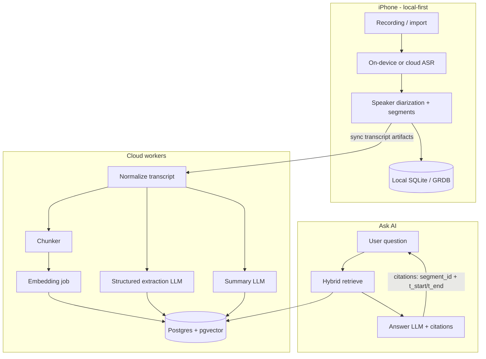

### Pipeline stages

1. **Capture** — Audio stays on device (or ephemeral upload) until transcription succeeds.
2. **Transcribe + diarize** — Prefer Apple Speech / Whisper-class cloud for quality; store `transcript_segments` with `t_start_ms`, `t_end_ms`, `speaker_id`, `text`.
3. **Audio disposal** — After transcript checksum verified and synced (or confirmed local-only), delete raw audio by default. User setting: “Keep audio for playback.”
4. **Normalize** — Punctuation cleanup, language detect, merge micro-segments (<400ms gaps, same speaker).
5. **Chunk** — See §4; write `embedding_chunks` linked to segment ranges.
6. **Embed** — Batch embeddings; store vectors in pgvector.
7. **Extract** — Single structured JSON pass (or two-pass for long meetings): summary, key points, decisions, action items, deadlines, entities.
8. **Ask AI** — Hybrid retrieve → rerank (optional) → grounded generation with mandatory citations.

---

## 3. Extraction schema (LLM output contract)

All extraction jobs return validated JSON (Zod / JSON Schema). Reject + retry on schema failure (max 2).

```json
{
  "summary": "2–5 sentence overview",
  "key_points": ["...", "..."],
  "decisions": [
    { "text": "...", "decided_by": "optional", "segment_ids": ["uuid"], "t_start_ms": 0, "t_end_ms": 0 }
  ],
  "action_items": [
    {
      "text": "...",
      "assignee": "optional person name",
      "due_date": "YYYY-MM-DD or null",
      "confidence": 0.0,
      "segment_ids": ["uuid"],
      "t_start_ms": 0,
      "t_end_ms": 0
    }
  ],
  "deadlines": [
    { "text": "...", "date": "YYYY-MM-DD", "segment_ids": ["uuid"] }
  ],
  "entities": [
    {
      "name": "Acme Corp",
      "type": "company|person|project|topic|place|other",
      "aliases": [],
      "mentions": [{ "segment_id": "uuid", "t_start_ms": 0, "t_end_ms": 0 }]
    }
  ]
}
```

**Prompt policy**

- System: “Extract only what is explicitly supported by the transcript. Prefer null over invention. Attach segment_ids for every decision/action/deadline.”
- Temperature: 0.1–0.3 for extraction; 0.2–0.5 for Ask AI.
- Long transcripts: map-reduce — chunk summaries → merge pass for global summary + deduped action items.

---

## 4. RAG design

### 4.1 Chunking

| Param | V1 recommendation |
|-------|-------------------|
| Unit | Time-aware speaker turns, not raw tokens only |
| Target size | 400–800 tokens ≈ 45–90s of speech |
| Overlap | 1 prior turn or ~15s / 80 tokens |
| Hard max | 1,200 tokens; split mid-turn only if needed |
| Metadata on chunk | `conversation_id`, `segment_id_range`, `t_start_ms`, `t_end_ms`, `speaker_ids[]`, `folder_ids[]`, `entity_ids[]` |

**Why time-aware turns:** Citations and “jump to moment” UX require stable `(t_start, t_end)` anchors; pure token windows break speaker continuity.

### 4.2 Embeddings

| Choice | Recommendation |
|--------|----------------|
| V1 model | `text-embedding-3-small` (OpenAI) or `voyage-3-lite` — 1536-d or 1024-d |
| Storage | `vector(1536)` + HNSW index in Postgres/pgvector |
| Normalization | L2-normalize at write time if using inner product |
| Re-embed | Version column `embedding_model`; background reindex on model bump |

### 4.3 Retrieval (per conversation & cross-conversation)

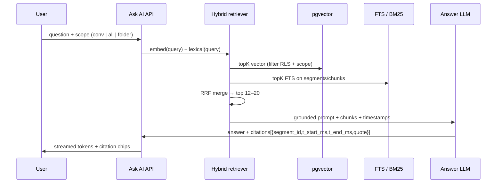

**Scopes**

- **Per conversation:** filter `conversation_id = $id`.
- **Cross-conversation:** filter by user (+ optional folder/tag/date range/entity).
- **Ask AI guardrails:** refuse if retrieval empty; never invent timestamps; quote ≤ 25 words per citation.

**Optional V1.1:** lightweight cross-encoder rerank on top 30 → top 10 (adds latency/cost; skip until quality metrics demand it).

### 4.4 Citation contract

Every answer must include:

```ts
type Citation = {
  conversation_id: string;
  segment_id: string;
  t_start_ms: number;
  t_end_ms: number;
  speaker_label?: string;
  quote: string; // verbatim span from segment
};
```

Client taps citation → seek transcript (audio only if retained).

---

## 5. Modular LLM providers

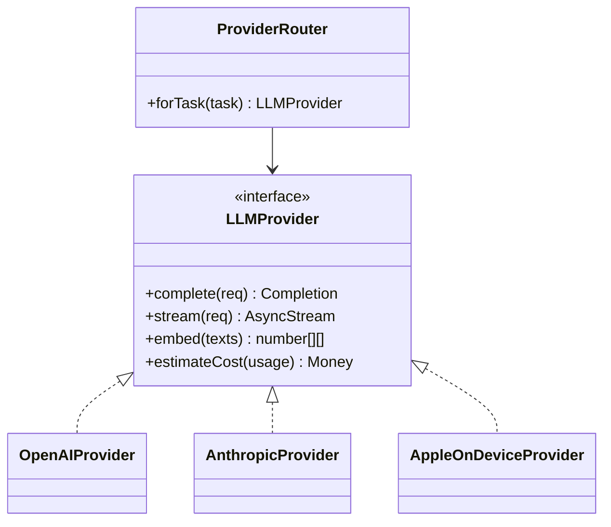

### Task → model routing (V1 defaults)

| Task | Default | Fallback | Notes |
|------|---------|----------|-------|
| ASR | Whisper large-v3 / Deepgram nova-2 / Apple Speech | Alternate ASR | Pick by language + cost |
| Embedding | OpenAI text-embedding-3-small | Voyage | Fixed dim in DB |
| Extraction / summary | Claude Sonnet or GPT-4.1-mini | Other | Structured JSON mode |
| Ask AI (short) | GPT-4.1-mini / Claude Haiku-class | — | Fast, cheap |
| Ask AI (hard / long context) | Sonnet / GPT-4.1 | — | Escalation flag |
| On-device redact / classify | Apple Foundation Models (when available) | Heuristics | PII pre-filter before cloud |

**Config:** `ai_provider_config` table + env secrets; per-tenant override later. All prompts versioned (`prompt_version`) and logged with token usage on `ai_queries` / `ai_jobs`.

---

## 6. Job types & idempotency

| Job | Trigger | Idempotency key | Output tables |
|-----|---------|-----------------|---------------|
| `transcribe` | upload/local complete | `recording_id` | segments |
| `extract` | transcript ready | `conversation_id:extract:vN` | summaries, action_items, entities |
| `embed` | segments ready | `conversation_id:embed:model` | embeddings |
| `ask` | user request | request_id (not cached by default) | ai_queries |
| `reindex` | model bump | batch cursor | embeddings |

Workers: Cloudflare Queues / Supabase + queue worker / Fly machine — see backend doc. Retries: exponential backoff; poison queue after 5.

---

## 7. Cost model

### 7.1 Assumptions (state explicitly)

| Assumption | Value |
|------------|-------|
| Avg conversation length | **30 minutes** |
| Words / minute | 140 → **~4,200 words ≈ 5,600 tokens** transcript |
| ASR cost | **$0.006 / min** (blended Whisper/Deepgram-class) |
| Embedding | **$0.02 / 1M tokens**; chunk overhead ×1.2 → ~6.7K tokens / conv |
| Extraction+summary prompt | ~6K in + 1.2K out |
| Extraction model blended | **$0.40 / 1M in**, **$1.60 / 1M out** (mini/haiku-class) |
| Ask AI: retrieve 8 chunks × ~600 tok = 4.8K + question 200 + system 400 ≈ **5.5K in**; answer **400 out** |
| Ask model blended | **$0.40 / 1M in**, **$1.60 / 1M out** |
| Asks / active user / month | **20** |
| Conversations / active user / month | **12** (≈ 6 hr audio) |
| “Active user” | Used app ≥1 day in month |
| Infra overhead (DB, workers, egress) | Modeled separately in backend doc; AI table below is **model+ASR only** |

### 7.2 Unit costs (AI + ASR)

| Unit | Formula | Est. cost |
|------|---------|-----------|
| **Per summary** (1 × 30-min conv: ASR + embed + extract) | ASR $0.18 + embed ≈ $0.00013 + LLM ≈ $0.0043 | **≈ $0.185** |
| **Per summary (LLM+embed only, ASR already paid)** | embed + extract | **≈ $0.0045** |
| **Per Ask AI question** | 5.5K in + 0.4K out | **≈ $0.0028** |
| **Per active user / month** | 12×$0.185 + 20×$0.0028 | **≈ $2.28** |

> If Apple on-device ASR is used for a large share, ASR drops toward $0 and **per-summary ≈ $0.005**, **per AU/mo ≈ $0.12** (LLM+embed only). Keep cloud ASR as quality/language fallback.

### 7.3 Scale table (model + ASR, monthly)

| Active users | Convos / mo | Asks / mo | ASR + LLM + embed | Notes |
|--------------|-------------|-----------|-------------------|-------|
| **1,000** | 12K | 20K | **≈ $2.3K** | Early stage |
| **10,000** | 120K | 200K | **≈ $23K** | Negotiate ASR; cache embeddings |
| **100,000** | 1.2M | 2M | **≈ $228K** | Aggressive on-device ASR + mini models; reserved capacity |

**Sensitivity**

| Lever | Effect |
|-------|--------|
| Cut avg length 30→15 min | ~50% ASR + ~40% LLM |
| 50% on-device ASR | ~$0.09 / summary all-in |
| Escalate 10% of Ask AI to premium model (10× output price) | +~$0.003 / ask blended → small vs ASR |
| Map-reduce on 90-min meetings | Extraction LLM ×1.5–2 |

**Product metering suggestion:** bill users on “hours transcribed” + “Ask AI credits”; your COGS floor ≈ $0.37/hr ASR + ~$0.01/hr post-process at mini rates.

---

## 8. Quality, safety, observability

| Area | V1 practice |
|------|-------------|
| Grounding | Citations required; highlight unsupported claims in eval harness |
| PII | Optional redact emails/phones before cloud; encrypt at rest |
| Eval set | 50 golden transcripts; track action-item F1, citation precision |
| Logging | `ai_queries`: tokens, latency, provider, prompt_version, retrieval_ids |
| Rate limits | Per-user daily Ask AI + monthly transcription minutes |
| Prompt injection | Treat transcript as untrusted data; delimit; ignore “system” instructions inside transcript |

---

## 9. Concrete V1 recommendations

1. **Ship:** chunked RAG + structured extraction; citations to segment timestamps.  
2. **Providers:** OpenAI or Anthropic for LLM; OpenAI/Voyage embeddings; pluggable ASR.  
3. **Defer:** knowledge-graph reasoning, custom fine-tunes, always-on premium models.  
4. **Cost control:** delete audio by default; prefer mini models; on-device ASR where quality OK; cache conversation-level summary in DB (don’t re-summarize on every open).  
5. **Cross-conversation Ask AI:** same RAG path with user-scoped filters — no separate “agent memory” store beyond entities + chunks (see memory doc).

---

## 10. Open decisions (product)

- Default audio retention: delete vs 7-day grace.  
- Whether extraction runs fully on-device for short notes (&lt;5 min) when Apple FM APIs suffice.  
- Premium tier: longer retention, premium Ask AI model, keep-audio.

---

<a id="doc-memory-search-architecture"></a>

######## DOCUMENT: MEMORY_SEARCH_ARCHITECTURE.md ########

# Memory & Search Architecture — Afterna

**Product:** iPhone AI conversation memory app  
**Scope:** Entity memory, hybrid search, scaling path, knowledge graph V1 decision  
**Companion docs:** [AI_ARCHITECTURE.md](./AI_ARCHITECTURE.md) · [BACKEND_ARCHITECTURE.md](./BACKEND_ARCHITECTURE.md)

---

## 1. What “memory” means here

Users care about **people, companies, projects, topics, dates, and commitments** — not a free-form chatbot brain.

| Memory type | Source | User-facing |
|-------------|--------|-------------|
| **Episodic** | Transcript segments + timestamps | “What did we say about X on Tuesday?” |
| **Structured** | LLM extraction → action items, decisions, deadlines | To-do lists, commitment reminders |
| **Entity** | Extracted mentions + light resolution | Person/company/project pages |
| **Organizational** | Folders, tags, pins | Browse & filter |

V1 stores memory as **rows + vectors + FTS**, not as a graph query engine.

---

## 2. Entity model (V1)

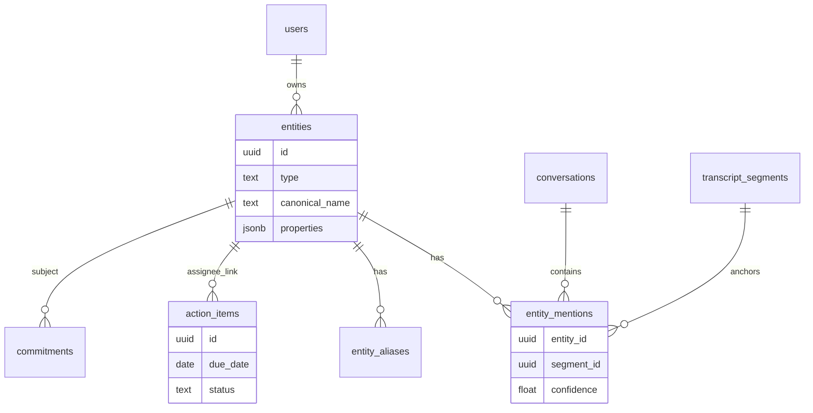

### Types

| Type | Examples | Properties (jsonb) |
|------|----------|-------------------|
| `person` | “Sarah Chen”, “Mom” | `role`, `email?`, `relationship?` |
| `company` | “Acme”, “Notion” | `domain?` |
| `project` | “Q3 launch”, “Website redesign” | `status?` |
| `topic` | “pricing”, “school pickup” | — |
| `date_ref` | normalized from speech | `resolved_date` |
| `commitment` | often modeled as `action_items` | assignee, due, status |

**Commitments:** Prefer first-class `action_items` (+ optional `decisions`) over a separate commitment entity type. Surface them on entity pages via assignee/mention links.

### Resolution (keep it simple)

1. Exact / alias match within user scope (case-fold, punctuation-strip).  
2. Fuzzy match (pg_trgm) for near-duplicates; suggest merge in UI.  
3. LLM linking only during extraction (“same as existing entity_id?”) with top-20 candidate names in prompt — **no** global clustering job in V1.  
4. User can merge/rename/split entities; merges rewrite FKs + aliases.

---

## 3. Hybrid search (simplest architecture that scales)

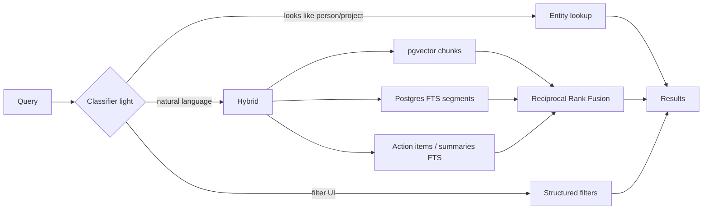

### Query paths

| Path | Mechanism | When |
|------|-----------|------|
| **Lexical** | `tsvector` on `transcript_segments.text`, summaries, action_items | Keywords, names, rare terms |
| **Vector** | pgvector on `embedding_chunks` | Paraphrase, topical |
| **Structured** | SQL filters: date range, folder, tag, speaker, entity_id, open action items | Facets / “Sarah’s open tasks” |
| **Fusion** | RRF (k=60) over lexical + vector lists | Default Ask AI + search tab |

### Ranking signals (V1, cheap)

- RRF score  
- Recency boost (`updated_at` / conversation `started_at`)  
- Optional: folder pin boost  
- **No** learning-to-rank in V1

### Result types (unified search UI)

```ts
type SearchHit =
  | { kind: "segment"; segment_id; t_start_ms; snippet; conversation_id }
  | { kind: "conversation"; conversation_id; title; summary_snippet }
  | { kind: "action_item"; action_item_id; text; due_date }
  | { kind: "entity"; entity_id; name; type; mention_count };
```

Ask AI uses the same retrieval substrate but returns a generated answer + citations ([AI_ARCHITECTURE.md](./AI_ARCHITECTURE.md)).

---

## 4. Local-first + cloud sync for memory

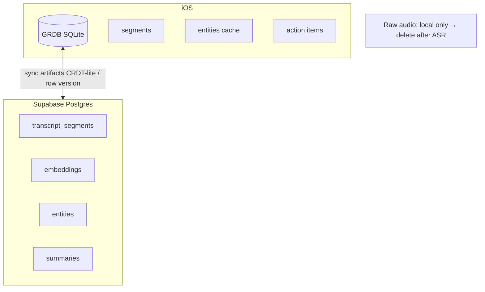

| Artifact | Local | Cloud | Notes |
|----------|-------|-------|-------|
| Raw audio | Yes (ephemeral) | Optional short-lived upload | Delete after successful transcription |
| Transcript segments | Yes | Yes | Source of truth after sync |
| Summaries / action items / entities | Yes (cache) | Yes | Cloud wins on conflict with `updated_at` + device clock skew rules |
| Embeddings | No (optional) | Yes | Too heavy; Ask AI hits API |
| Search index | FTS local for offline | FTS + vector cloud | Offline: local FTS only |

**Conflict policy (V1):** Last-write-wins on user edits (titles, action status, entity merges); server-generated extractions are immutable versions (`summary_version`).

---

## 5. Do we need a knowledge graph for V1?

### Decision: **No graph database / no KG engine in V1**

| Need | V1 approach | When to revisit |
|------|-------------|-----------------|
| “All meetings with Acme” | `entity_mentions` + SQL | — |
| “Tasks assigned to Sarah” | `action_items.assignee_entity_id` | — |
| “Related projects” | Co-occurrence count query | If users ask for multi-hop |
| Multi-hop (“Who introduced me to the lawyer working on Project X?”) | Not supported well | KG or heavier agentic retrieval |
| Ontology / RDF | Out of scope | Enterprise |

**Why not Neo4j/etc. in V1**

- Same answers from relational joins + entities for 90% of mobile UX.  
- Operational cost and sync complexity dominate benefit before ~product-market fit.  
- pgvector + FTS + entity tables already form a **soft graph** (nodes=entities, edges=mentions/co-occurrence).

**V1.5 “soft graph” (still Postgres)**

```sql
-- materialized later if needed
entity_cooccurrence(user_id, entity_a, entity_b, conversation_count, last_seen_at)
```

**V2 KG trigger:** Ship only if eval shows multi-hop questions are a top-3 user need and SQL co-occurrence fails quality bar.

---

## 6. Scaling path (simplest → next)

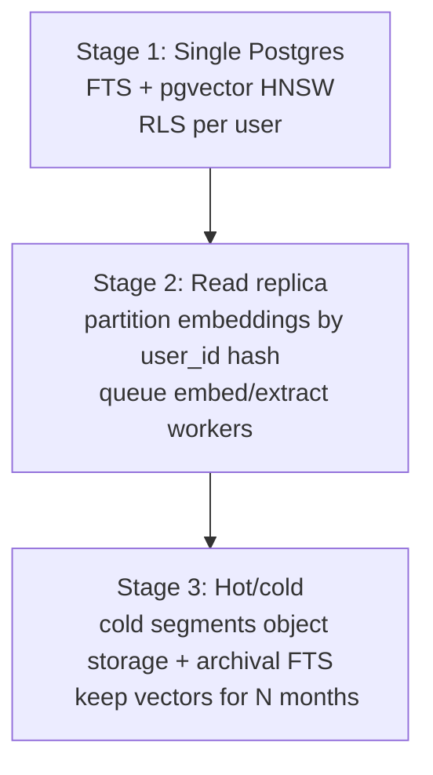

| Stage | Users (order of mag.) | Architecture |
|-------|----------------------|--------------|
| **1** | → ~50K AU | Supabase/Postgres, one primary, HNSW, `tsvector` GIN |
| **2** | ~50K–500K | Separate worker fleet; replica for search; batch embed; connection pooling (PgBouncer) |
| **3** | 500K+ | Shard-by-user or tenant; cold storage for old transcripts; optional OpenSearch only if FTS pressure proven |

**Avoid early:** Elasticsearch/OpenSearch + separate vector DB (Pinecone/Weaviate) **until** Postgres metrics say so. One system for sync, RLS, and RAG keeps the mobile backend small.

### Indexing guidelines

- HNSW on `embedding_chunks.embedding` with `WHERE user_id = ...` via restrictive queries (always include `user_id` predicate).  
- Partial indexes for `action_items` where `status = 'open'`.  
- GIN on `to_tsvector('english', text)` — add language configs when you expand locales.  
- Cap chunk count per conversation; don’t embed every 2-second micro-utterance.

---

## 7. Privacy & deletion

| Event | Behavior |
|-------|----------|
| Delete conversation | Cascade segments, chunks, embeddings, mentions, summaries; recompute entity mention counts |
| Delete entity | Soft-delete or merge; don’t delete transcript text |
| Account delete | Hard delete all user rows within SLA (e.g. 30 days); wipe queues |
| Audio | Default delete post-ASR; tombstone `audio_deleted_at` |

Search must never resurface deleted conversations (RLS + hard delete).

---

## 8. Concrete V1 recommendations

1. **Memory = entities + action_items + decisions + dated segments**, not a KG product.  
2. **Search = hybrid RRF** (Postgres FTS + pgvector) + structured filters.  
3. **Entity resolution = aliases + trgm + user merge**; light LLM assist at extract time only.  
4. **Offline = local FTS + cached summaries/actions**; cloud for semantic Ask AI.  
5. **Scale = vertical Postgres first**; postpone separate search/vector vendors.  
6. **Skip Neo4j/KG for V1**; add `entity_cooccurrence` if relationship UX needs it.

---

## 9. Success metrics

| Metric | Target (directional) |
|--------|----------------------|
| Search success rate (tap result within 30s) | >70% |
| Ask AI citation precision (human spot-check) | >85% |
| Action-item useful rate (not dismissed as junk) | >60% |
| Entity merge conflict rate | Low enough that users aren’t cleaning weekly |
| p95 search latency (cloud) | <400ms hybrid retrieve (ex-LLM) |

---

<a id="doc-backend-architecture"></a>

######## DOCUMENT: BACKEND_ARCHITECTURE.md ########

# Backend Architecture & Database Schema — Afterna

**Product:** iPhone AI conversation memory app  
**Scope:** Platform evaluation, recommended stack, sync model, billing-ready design, full Postgres schema  
**Companion docs:** [AI_ARCHITECTURE.md](./AI_ARCHITECTURE.md) · [MEMORY_SEARCH_ARCHITECTURE.md](./MEMORY_SEARCH_ARCHITECTURE.md)

---

## Part A — Backend architecture

### 1. Product constraints that drive the stack

- **Local-first iOS** with cloud sync of **processed artifacts** (transcripts, summaries, entities, action items).  
- **Delete raw audio** after successful transcription when practical.  
- **PostgreSQL + pgvector** preferred.  
- Auth, object storage (ephemeral audio), background jobs, **billing-ready**.  
- Modular LLM providers; cost visibility per job.

---

### 2. Platform evaluation

| Platform | Auth | Postgres / vectors | Storage | Jobs / queues | iOS fit | Billing path | Ops burden | V1 fit |
|----------|------|--------------------|---------|---------------|---------|--------------|------------|--------|
| **Supabase** | Excellent (GoTrue) | **Native Postgres + pgvector** | S3-compatible | Edge Functions + Queues / cron; or external workers | Swift clients mature | Stripe via Edge + webhooks; RevenueCat on device | Low | **Best default** |
| **Firebase** | Excellent | Firestore (NoSQL); vectors awkward | Excellent | Cloud Functions | Excellent | RevenueCat friendly | Low | Weak for relational RAG/FTS |
| **Cloudflare** | Workers + external IdP / Supabase Auth | D1/Hyperdrive → Postgres; Vectorize optional | R2 | Queues + Workers | DIY | Stripe Workers | Med | Strong **workers** companion |
| **AWS** | Cognito | RDS Postgres + pgvector | S3 | SQS + Lambda/ECS | DIY | Stripe or AWS Billing | High | Overkill early |
| **GCP** | Firebase Auth | Cloud SQL pgvector | GCS | Cloud Tasks / PubSub | DIY | Stripe | High | Overkill early |
| **Fly.io** | DIY | Fly Postgres + pgvector | Tigris/S3 | Machines + Redis queue | DIY | Stripe | Med | Good for **custom API** |
| **Railway** | DIY | Managed Postgres | DIY S3 | Services + cron | DIY | Stripe | Low–med | Fine prototype; less “batteries” |
| **Render** | DIY | Managed Postgres | DIY | Background workers | DIY | Stripe | Low–med | Similar to Railway |

#### Verdict

| Layer | Choice | Why |
|-------|--------|-----|
| **Primary BaaS** | **Supabase** | Postgres + pgvector + RLS + Auth + Realtime + Storage matches local-first sync and RAG |
| **Workers (optional Day 1 or soon)** | **Cloudflare Workers + Queues** *or* **Fly.io** machine | Long-running ASR/LLM jobs beyond Edge limits |
| **Mobile billing** | **RevenueCat** + App Store IAP | Standard iOS; map entitlements → `subscriptions` / quotas in Supabase |
| **Avoid as system of record** | Firebase Firestore | Painful hybrid search + relational memory |
| **Defer** | Full AWS/GCP | Adopt when compliance/enterprise demands escape hatch |

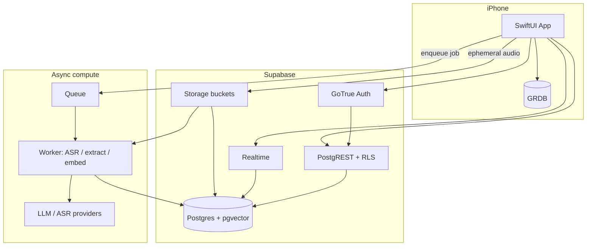

---

### 3. Recommended architecture (concrete)

#### 3.1 Responsibilities

| Component | Responsibility |
|-----------|----------------|
| **iOS + GRDB** | Capture audio, optional on-device ASR, offline transcript/FTS, optimistic UI, sync queue |
| **Supabase Auth** | Sign in with Apple (required), optional email/magic link |
| **Supabase Postgres** | System of record for all artifacts; RLS by `user_id` |
| **Supabase Storage** | `audio-inbox` bucket: TTL lifecycle (e.g. 24–72h); worker deletes object after ASR OK |
| **Job runner** | Transcribe → extract → embed pipeline; writes progress to `ai_jobs` |
| **RevenueCat** | Entitlements: `free` / `pro` minutes & Ask AI credits |

#### 3.2 Audio lifecycle

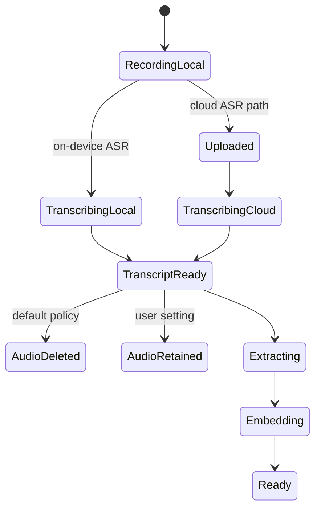

1. Write audio to app sandbox.  
2. Prefer on-device transcription when quality/language OK.  
3. Else upload to `audio-inbox/{user_id}/{recording_id}.m4a` with short-lived signed URL.  
4. Worker verifies duration/size, runs ASR + diarization, inserts `transcript_segments`.  
5. Mark `recordings.transcription_status = 'succeeded'`, checksum transcript.  
6. **Delete** Storage object + local file unless `keep_audio = true`.  
7. Enqueue extract + embed.

#### 3.3 Sync model

- **Push:** iOS upserts user-editable fields (titles, folders, tags, action status, entity merges).  
- **Pull:** Realtime + periodic fetch for server-produced rows (summaries, embeddings metadata, job status).  
- **Cursor:** `updated_at` + `id` keyset pagination per table.  
- **Embeddings** stay server-side; clients store `has_embeddings` flag only.

#### 3.4 Auth & security

- Sign in with Apple → Supabase user.  
- RLS on every user table: `auth.uid() = user_id`.  
- Service role only in workers.  
- No LLM API keys on device.  
- Column encryption optional for transcript text at rest (app-level) for stricter privacy SKU later.

#### 3.5 Jobs

| Job | Queue message | Timeout | Idempotency |
|-----|---------------|---------|-------------|
| `transcribe` | `recording_id` | 30–60 min audio dependent | unique `recording_id` |
| `extract` | `conversation_id`, `prompt_version` | 5–15 min | `(conversation_id, prompt_version)` |
| `embed` | `conversation_id`, `model` | 5–15 min | `(conversation_id, model)` |
| `purge_audio` | `recording_id` | 1 min | safe repeat |

Store all attempts in `ai_jobs` with `status`, `tokens_*`, `cost_usd_estimate`, `error`.

#### 3.6 Billing-ready (not necessarily billed Day 1)

| Concept | Implementation |
|---------|----------------|
| Customer | `users` + RevenueCat `app_user_id` |
| Entitlement | `subscriptions` mirror (product_id, expires_at, status) |
| Metering | `usage_monthly(user_id, yyyymm, transcription_seconds, ask_ai_count, llm_cost_usd)` |
| Quotas | Enforced in Edge Function / worker before enqueue |
| Webhooks | RevenueCat → upsert `subscriptions` |

Free tier example: 60 min ASR / mo + 30 Ask AI; Pro: 600 min + unlimited Ask (fair-use).

#### 3.7 Infra cost sketch (non-LLM)

Assumptions: artifacts only (no long-term audio); ~50 KB transcript + summary text / conv; ~200 chunks × 6 KB vector row overhead ≈ small; **~2–5 MB / user / year** hot data if audio deleted.

| Active users | Supabase-ish DB + storage + egress | Workers compute | Notes |
|--------------|------------------------------------|-----------------|-------|
| 1K | **~$25–80/mo** | **~$20–50/mo** | Pro plan territory |
| 10K | **~$200–600/mo** | **~$150–400/mo** | Watch Realtime + MAU |
| 100K | **~$2K–8K/mo** | **~$1.5K–5K/mo** | Likely Fly/AWS workers + larger Postgres |

AI/ASR COGS dominate (see AI doc: ~$2.3 / AU/mo with cloud ASR).

---

### 4. Alternatives if Supabase is blocked

| Constraint | Fallback |
|------------|----------|
| Need EU isolation / custom VPC | Fly.io API + Postgres (pgvector) + Tigris/S3 + Clerk or Auth.js |
| Already all-in Cloudflare | R2 + Queues + Hyperdrive to Postgres (still keep Postgres) |
| Must use Firebase Auth only | Firebase Auth + Postgres (Supabase or Cloud SQL); don’t use Firestore as memory store |

---

## Part B — Database schema

Postgres 15+ with extensions:

```sql
create extension if not exists "pgcrypto";
create extension if not exists "vector";
create extension if not exists "pg_trgm";
```

### 1. ER overview

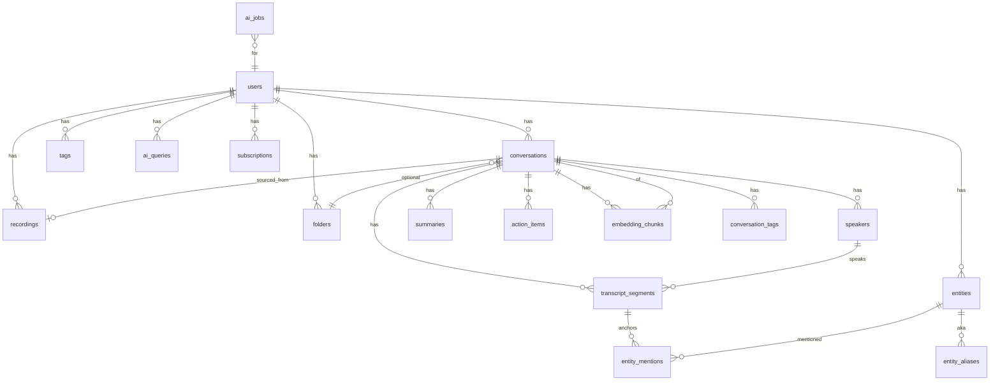

### 2. DDL (V1)

```sql
-- ========== users & billing ==========
create table public.users (
  id uuid primary key references auth.users (id) on delete cascade,
  display_name text,
  locale text default 'en',
  keep_audio_default boolean not null default false,
  revenuecat_app_user_id text unique,
  created_at timestamptz not null default now(),
  updated_at timestamptz not null default now()
);

create table public.subscriptions (
  id uuid primary key default gen_random_uuid(),
  user_id uuid not null references public.users (id) on delete cascade,
  provider text not null default 'revenuecat', -- revenuecat|stripe
  product_id text not null,
  status text not null check (status in ('active','canceled','expired','trialing','grace')),
  starts_at timestamptz,
  expires_at timestamptz,
  raw jsonb not null default '{}',
  updated_at timestamptz not null default now(),
  unique (user_id, provider)
);

create table public.usage_monthly (
  user_id uuid not null references public.users (id) on delete cascade,
  year_month int not null, -- YYYYMM
  transcription_seconds int not null default 0,
  ask_ai_count int not null default 0,
  llm_cost_usd numeric(12,6) not null default 0,
  asr_cost_usd numeric(12,6) not null default 0,
  primary key (user_id, year_month)
);

-- ========== taxonomy ==========
create table public.folders (
  id uuid primary key default gen_random_uuid(),
  user_id uuid not null references public.users (id) on delete cascade,
  name text not null,
  parent_id uuid references public.folders (id) on delete set null,
  created_at timestamptz not null default now(),
  unique (user_id, name, parent_id)
);

create table public.tags (
  id uuid primary key default gen_random_uuid(),
  user_id uuid not null references public.users (id) on delete cascade,
  name text not null,
  created_at timestamptz not null default now(),
  unique (user_id, name)
);

-- ========== recordings & conversations ==========
create table public.recordings (
  id uuid primary key default gen_random_uuid(),
  user_id uuid not null references public.users (id) on delete cascade,
  local_path text,
  storage_path text,              -- null once purged
  duration_ms int,
  mime_type text,
  byte_size bigint,
  checksum sha256 bytea,
  keep_audio boolean not null default false,
  transcription_status text not null default 'pending'
    check (transcription_status in ('pending','processing','succeeded','failed')),
  audio_deleted_at timestamptz,
  captured_at timestamptz not null default now(),
  created_at timestamptz not null default now(),
  updated_at timestamptz not null default now()
);

create table public.conversations (
  id uuid primary key default gen_random_uuid(),
  user_id uuid not null references public.users (id) on delete cascade,
  recording_id uuid references public.recordings (id) on delete set null,
  folder_id uuid references public.folders (id) on delete set null,
  title text,
  language text,
  started_at timestamptz,
  ended_at timestamptz,
  status text not null default 'processing'
    check (status in ('processing','ready','failed','archived')),
  source text not null default 'recording'
    check (source in ('recording','import','manual_notes')),
  created_at timestamptz not null default now(),
  updated_at timestamptz not null default now()
);

create table public.conversation_tags (
  conversation_id uuid not null references public.conversations (id) on delete cascade,
  tag_id uuid not null references public.tags (id) on delete cascade,
  primary key (conversation_id, tag_id)
);

create table public.speakers (
  id uuid primary key default gen_random_uuid(),
  conversation_id uuid not null references public.conversations (id) on delete cascade,
  user_id uuid not null references public.users (id) on delete cascade,
  label text not null,              -- "Speaker 0", "Alex"
  entity_id uuid,                   -- optional link to person entity
  is_user boolean not null default false,
  created_at timestamptz not null default now()
);

create table public.transcript_segments (
  id uuid primary key default gen_random_uuid(),
  conversation_id uuid not null references public.conversations (id) on delete cascade,
  user_id uuid not null references public.users (id) on delete cascade,
  speaker_id uuid references public.speakers (id) on delete set null,
  idx int not null,                 -- order in conversation
  t_start_ms int not null,
  t_end_ms int not null,
  text text not null,
  confidence real,
  created_at timestamptz not null default now(),
  unique (conversation_id, idx)
);

-- FTS
alter table public.transcript_segments
  add column text_tsv tsvector
  generated always as (to_tsvector('english', coalesce(text, ''))) stored;

create index transcript_segments_tsv_idx
  on public.transcript_segments using gin (text_tsv);
create index transcript_segments_conv_time_idx
  on public.transcript_segments (conversation_id, t_start_ms);
create index transcript_segments_user_idx
  on public.transcript_segments (user_id);

-- ========== AI artifacts ==========
create table public.summaries (
  id uuid primary key default gen_random_uuid(),
  conversation_id uuid not null references public.conversations (id) on delete cascade,
  user_id uuid not null references public.users (id) on delete cascade,
  prompt_version text not null,
  summary text not null,
  key_points jsonb not null default '[]',
  decisions jsonb not null default '[]',
  deadlines jsonb not null default '[]',
  model text not null,
  token_input int,
  token_output int,
  cost_usd_estimate numeric(12,6),
  created_at timestamptz not null default now(),
  unique (conversation_id, prompt_version)
);

create table public.action_items (
  id uuid primary key default gen_random_uuid(),
  conversation_id uuid not null references public.conversations (id) on delete cascade,
  user_id uuid not null references public.users (id) on delete cascade,
  text text not null,
  assignee_text text,
  assignee_entity_id uuid,          -- FK added after entities
  due_date date,
  status text not null default 'open'
    check (status in ('open','done','dismissed')),
  confidence real,
  source_segment_ids uuid[] not null default '{}',
  t_start_ms int,
  t_end_ms int,
  created_at timestamptz not null default now(),
  updated_at timestamptz not null default now()
);

create index action_items_open_idx
  on public.action_items (user_id, due_date)
  where status = 'open';

create table public.entities (
  id uuid primary key default gen_random_uuid(),
  user_id uuid not null references public.users (id) on delete cascade,
  type text not null
    check (type in ('person','company','project','topic','place','other')),
  canonical_name text not null,
  properties jsonb not null default '{}',
  mention_count int not null default 0,
  created_at timestamptz not null default now(),
  updated_at timestamptz not null default now(),
  unique (user_id, type, canonical_name)
);

create index entities_name_trgm_idx
  on public.entities using gin (canonical_name gin_trgm_ops);

alter table public.speakers
  add constraint speakers_entity_fk
  foreign key (entity_id) references public.entities (id) on delete set null;

alter table public.action_items
  add constraint action_items_assignee_fk
  foreign key (assignee_entity_id) references public.entities (id) on delete set null;

create table public.entity_aliases (
  id uuid primary key default gen_random_uuid(),
  entity_id uuid not null references public.entities (id) on delete cascade,
  user_id uuid not null references public.users (id) on delete cascade,
  alias text not null,
  unique (user_id, alias)
);

create table public.entity_mentions (
  id uuid primary key default gen_random_uuid(),
  entity_id uuid not null references public.entities (id) on delete cascade,
  conversation_id uuid not null references public.conversations (id) on delete cascade,
  segment_id uuid not null references public.transcript_segments (id) on delete cascade,
  user_id uuid not null references public.users (id) on delete cascade,
  confidence real,
  created_at timestamptz not null default now()
);

create index entity_mentions_entity_idx on public.entity_mentions (entity_id, conversation_id);

-- ========== embeddings / RAG ==========
-- Use 1536 for OpenAI text-embedding-3-small; change dim if model changes (new column/table version).
create table public.embedding_chunks (
  id uuid primary key default gen_random_uuid(),
  conversation_id uuid not null references public.conversations (id) on delete cascade,
  user_id uuid not null references public.users (id) on delete cascade,
  chunk_idx int not null,
  t_start_ms int not null,
  t_end_ms int not null,
  segment_id_start uuid references public.transcript_segments (id) on delete set null,
  segment_id_end uuid references public.transcript_segments (id) on delete set null,
  text text not null,
  embedding vector(1536) not null,
  embedding_model text not null,
  created_at timestamptz not null default now(),
  unique (conversation_id, embedding_model, chunk_idx)
);

create index embedding_chunks_user_hnsw_idx
  on public.embedding_chunks
  using hnsw (embedding vector_cosine_ops);

create index embedding_chunks_user_conv_idx
  on public.embedding_chunks (user_id, conversation_id);

-- ========== Ask AI + jobs ==========
create table public.ai_queries (
  id uuid primary key default gen_random_uuid(),
  user_id uuid not null references public.users (id) on delete cascade,
  scope text not null check (scope in ('conversation','all','folder')),
  conversation_id uuid references public.conversations (id) on delete set null,
  folder_id uuid references public.folders (id) on delete set null,
  question text not null,
  answer text,
  citations jsonb not null default '[]',
  retrieved_chunk_ids uuid[] not null default '{}',
  model text,
  prompt_version text,
  token_input int,
  token_output int,
  cost_usd_estimate numeric(12,6),
  latency_ms int,
  created_at timestamptz not null default now()
);

create table public.ai_jobs (
  id uuid primary key default gen_random_uuid(),
  user_id uuid not null references public.users (id) on delete cascade,
  job_type text not null
    check (job_type in ('transcribe','extract','embed','purge_audio','reindex')),
  status text not null default 'queued'
    check (status in ('queued','running','succeeded','failed','dead')),
  recording_id uuid references public.recordings (id) on delete cascade,
  conversation_id uuid references public.conversations (id) on delete cascade,
  idempotency_key text not null,
  attempts int not null default 0,
  provider text,
  model text,
  token_input int,
  token_output int,
  cost_usd_estimate numeric(12,6),
  error text,
  payload jsonb not null default '{}',
  created_at timestamptz not null default now(),
  started_at timestamptz,
  finished_at timestamptz,
  unique (idempotency_key)
);

create index ai_jobs_status_idx on public.ai_jobs (status, created_at);
```

### 3. RLS sketch

```sql
alter table public.conversations enable row level security;

create policy conversations_owner on public.conversations
  for all using (auth.uid() = user_id)
  with check (auth.uid() = user_id);

-- Repeat pattern for: recordings, speakers, transcript_segments, summaries,
-- action_items, entities, entity_aliases, entity_mentions, embedding_chunks,
-- ai_queries, folders, tags, conversation_tags, usage_monthly, subscriptions.
-- ai_jobs: select for owner; insert/update via service role only.
```

### 4. Sync / client tables (optional mirror)

iOS GRDB can mirror a subset: `conversations`, `transcript_segments`, `summaries`, `action_items`, `entities`, `folders`, `tags`, `speakers`, `recordings` (metadata only). Omit `embedding` vectors locally.

Suggested client columns: `dirty`, `deleted_at`, `server_updated_at` for outbox sync.

---

## Part C — Concrete recommendations checklist

1. **Build on Supabase (Auth + Postgres + pgvector + Storage + RLS).**  
2. **Run ASR/LLM workers** on Cloudflare Queues or Fly.io with service role.  
3. **RevenueCat** for IAP; mirror entitlements; meter in `usage_monthly`.  
4. **Delete audio by default** after successful transcription; `keep_audio` opt-in.  
5. **Schema above** covers users / recordings / conversations / speakers / transcript_segments / summaries / action_items / entities / embeddings / ai_queries / folders / tags (+ jobs, subscriptions, usage).  
6. **No Neo4j in V1**; entity tables + hybrid search suffice ([MEMORY_SEARCH_ARCHITECTURE.md](./MEMORY_SEARCH_ARCHITECTURE.md)).  
7. **Escape hatch:** same schema on RDS/Cloud SQL later without rewriting the domain model.

---

## Appendix — Example hybrid retrieve SQL

```sql
-- Vector branch (cosine distance); always filter user_id
select id, conversation_id, t_start_ms, t_end_ms, text,
       embedding <=> $query_embedding as dist
from embedding_chunks
where user_id = $user_id
  and ($conversation_id::uuid is null or conversation_id = $conversation_id)
order by embedding <=> $query_embedding
limit 20;

-- Lexical branch
select id, conversation_id, t_start_ms, t_end_ms, text,
       ts_rank(text_tsv, plainto_tsquery('english', $q)) as rank
from transcript_segments
where user_id = $user_id
  and text_tsv @@ plainto_tsquery('english', $q)
order by rank desc
limit 20;

-- Fuse with RRF in the worker/Edge layer (by id / segment id).
```

---

<a id="doc-privacy-security"></a>

######## DOCUMENT: PRIVACY_SECURITY.md ########

# PRIVACY_SECURITY.md
## Afterna — Privacy & Security Policy Spec

**Status:** Product/engineering guidance (not legal advice)  
**Market posture:** Australian-leaning English-speaking launch; privacy-aware globally  
**Last updated:** 2026-08-07

> **Disclaimer:** This document is an internal product and engineering brief. It does **not** claim legal compliance with the Australian Privacy Act, GDPR, CCPA/CPRA, App Store rules, or state/territory recording laws. Engage qualified counsel before launch, especially for recording consent UX copy, privacy policy text, and data-processing agreements with transcription/LLM providers.

---

## 1. Product data model (what we touch)

| Data class | Examples | Sensitivity | Default retention |
|---|---|---|---|
| Raw audio | Mic captures, temporary buffers | Very high | Prefer **delete after successful transcription** |
| Transcripts | Text of conversations | High | User-controlled; soft-delete + hard purge |
| AI memory artefacts | Summaries, entities, “remember this”, embeddings | High | Same as transcripts unless user opts out |
| Account metadata | Email/Sign in with Apple, device IDs | Medium | While account active |
| Usage analytics | Feature events, crash logs | Low–medium | Aggregated / short TTL |
| Ad identifiers | IDFA (only if ATT authorised) | Medium | Per ATT + ad SDK policy |

**Design principle:** The durable product is **searchable memory text**, not a permanent audio archive.

---

## 2. Regulatory relevance (high-level)

### 2.1 Australian Privacy Act 1988 (APPs)

**Relevance:** High if you collect personal information about individuals in Australia (including app users and potentially identifiable third parties captured in recordings/transcripts).

**Product implications (not compliance claims):**
- Publish a clear, plain-English privacy policy (collection, purposes, overseas disclosure, retention, access/correction, complaints).
- Minimise collection: do not keep raw audio longer than needed for transcription quality/retry.
- Be transparent about **overseas processing** (typical STT/LLM APCs are US/EU).
- Support access, correction, and deletion pathways that a real user can complete without emailing support for weeks.
- If you become an APP entity under the Act’s thresholds/definitions, APP obligations apply more formally—confirm with counsel as you scale.

**Third-party conversations:** Transcripts may contain personal information about people who are not the account holder. Treat that as a first-class privacy risk: consent UX, short retention, no social graphing by default, no training on user content by default.

### 2.2 GDPR / UK GDPR

**Relevance:** Medium–high for EU/UK users and any EU-hosted processing; treat as a design target even if AU-first.

**Product implications:**
- Lawful basis candidates (counsel to choose): **consent** for mic/recording and optional features; **contract** for core account service; **legitimate interests** only with documented balancing where appropriate.
- Rights UX: access, deletion, portability (export), restriction, objection to certain processing.
- DPIA recommended before launch (special-category risk if health/voice biometrics appear; avoid building voiceprints unless essential).
- SCCs / transfer mechanisms for non-EEA processors; prefer providers with DPA + clear retention + no-training defaults.
- Soft opt-in for marketing; hard consent for ads tracking (ATT + GDPR consent layering if you expand to EU).

### 2.3 CCPA / CPRA (California)

**Relevance:** Medium if California residents use the app or you “sell”/“share” personal information for cross-context behavioural advertising.

**Product implications:**
- “Do Not Sell or Share My Personal Information” if ad SDKs create share/sale semantics.
- Disclose categories collected/sold/shared; honour deletion and known-agent requests.
- Prefer **contextual / non-tracking ads** + ATT opt-in only after value is proven—reduces CCPA surface and improves privacy brand.

### 2.4 Cross-framework product stance

| Stance | Default |
|---|---|
| Data minimisation | On |
| Audio after transcription | Delete by default |
| Provider model training on user content | Off / contractually prohibited |
| Cross-app tracking ads | Off until ATT + clear value |
| Local-first / E2EE ambition | Phase 2+ (see §6) |
| Privacy as brand | Primary differentiator vs generic “AI note” apps |

---

## 3. Australian recording consent — awareness only (not legal advice)

Australia does **not** have a single uniform “one-party vs two-party” rule for private conversations. Rules are primarily **state/territory surveillance devices legislation**, plus federal telecom interception rules for communications in transit.

### 3.1 High-level public summaries (verify with counsel)

Sources commonly summarise roughly as follows (laws change; exceptions exist; disclosure/use may be separately restricted):

| Jurisdiction (typical summary) | Often characterised as |
|---|---|
| Victoria, Queensland, Northern Territory | Participant (“one-party”) recording more commonly permitted |
| NSW, SA, WA, Tasmania, ACT | Often characterised as requiring broader / all-party consent, with jurisdiction-specific exceptions |

**Important caveats for product:**
- Phone call interception rules differ from in-person listening-device rules.
- Even where recording a conversation you are in may be permitted, **sharing, publishing, or uploading** that recording/transcript can be separately restricted.
- Cross-border / multi-state conversations and workplaces add complexity.
- This is **not** a legal determination. Do not ship jurisdiction-specific legal guarantees in UI.

### 3.2 Product UX requirement (conservative global default)

Because the app may be used across AU states and internationally, adopt a **consent-aware recording flow** as product policy:

1. **Pre-record interstitial** (first record + periodically):  
   “Recording laws vary by location. Only record if you’re allowed to—and tell others when appropriate.”
2. **Optional “announce recording” prompt** before each session (default ON for new users).
3. **In-session visible recording state** (see UX_SPEC): orange system mic indicator + strong in-app “Recording” affordance.
4. **No silent background recording** that starts without an explicit user gesture.
5. **No auto-upload of others’ voices** into social, share, or training pipelines.
6. Store a lightweight **consent acknowledgement timestamp** (product audit), not a fake “legal compliance certificate.”

Suggested `NSMicrophoneUsageDescription` (localise; keep honest):

> “Microphone access lets you capture conversations to create private transcripts and searchable memories. Audio is processed to text, then deleted by default.”

---

## 4. App Store privacy requirements

### 4.1 Privacy Nutrition Labels (App Store Connect)

Declare **actual** collection by the app **and** third-party SDKs (STT, LLM, analytics, ads, crash). Relevant categories for this product typically include:

- **Audio Data** (User Content) — if audio leaves the device or is stored, even briefly
- **Other User Content** — free-form transcripts / notes
- **Contact Info** — if account email collected
- **Identifiers** — User ID, Device ID; IDFA only if tracking
- **Usage Data / Diagnostics** — analytics, crashes
- **Product Interaction** — feature usage

For each: purpose (App Functionality, Analytics, Third-Party Advertising, etc.), linked-to-identity vs not, used for tracking vs not.

**Consistency rule:** Labels ↔ Privacy Manifests ↔ privacy policy ↔ runtime behaviour. Mismatches are a common rejection/enforcement cause.

### 4.2 Privacy Manifests & Required Reason APIs

- Ship `PrivacyInfo.xcprivacy` for the app; prefer SDKs that ship manifests.
- Justify Required Reason APIs if used (UserDefaults, file timestamps, etc.).
- Prefer privacy-preserving analytics (e.g. no IDFA; aggregate events).

### 4.3 App Tracking Transparency (ATT)

- Required before accessing IDFA / tracking across apps & sites.
- Do **not** ask ATT on first launch. Ask only after the user understands value, and only if you enable tracking ads.
- Prefer non-tracking ad units first (see UNIT_ECONOMICS.md).

### 4.4 Microphone & recording UX (Apple expectations)

- `NSMicrophoneUsageDescription` required; meaningful string.
- Request mic **just-in-time** at first record tap, after a short educational screen.
- While recording: system orange mic indicator; **also** clear in-app recording UI.
- Background recording only with `audio` background mode, active session, and user-initiated start; show Live Activity / prominent ongoing state.
- Denied mic: graceful empty state with Settings deep link—never crash or silent-fail loops.

---

## 5. Consent warnings & user education (copy principles)

| Moment | Goal | Tone |
|---|---|---|
| First-run privacy card | Set trust; audio→text→delete default | Calm, specific |
| Pre-mic system prompt context | Explain why mic | One sentence + benefit |
| Before multi-party capture | Consent awareness | Non-legalistic, responsible |
| Export / share | Warn that transcripts may include others | Clear |
| Ads / ATT | Separate from mic consent | Never bundle permissions |
| Provider outage | No silent retry forever with retained audio | Transparent |

**Do not claim:** “100% private,” “military-grade,” “GDPR compliant,” “legal to record anywhere.”

**Do claim (if true):** “Audio deleted after transcription by default,” “You can export/delete your memories,” “We don’t sell your transcripts.”

---

## 6. Encryption & security controls

### 6.1 Transport & at rest

| Layer | Requirement |
|---|---|
| TLS | TLS 1.2+ for all network; certificate pinning optional Phase 2 |
| Device storage | iOS Data Protection (Complete / Protected Unless Open) for audio buffers & DB |
| Keychain | Tokens, refresh keys only in Keychain |
| Server DB | Encryption at rest (provider default AES-256+); app-level field encryption for transcripts Phase 2 |
| Backups | Exclude ephemeral audio from iCloud backups; user opt-in for encrypted memory sync later |

### 6.2 Architecture preferences (security-aligned)

1. **Ephemeral audio pipeline:** record → encrypt-at-rest on device → upload over TLS → transcribe → confirm → **server + device audio purge**.
2. **Retry window:** keep audio only for a bounded retry TTL (e.g. 24h) if transcription fails; then purge or ask user.
3. **Least privilege APIs:** STT provider gets audio; LLM gets transcript chunks—not continuous raw mic stream unless streaming STT is chosen.
4. **No training clause** in vendor DPAs; prefer zero-retention STT where available.
5. **Auth:** Sign in with Apple first; optional passcode/Face ID lock for app open.
6. **Threat model docs:** account takeover, device theft, malicious insider at vendor, subpoena—document retention limits as risk reduction.

### 6.3 Phase roadmap

| Phase | Security posture |
|---|---|
| MVP | TLS + Data Protection + delete-audio-after-STT + account delete/export |
| 1.1 | App lock, export ZIP, purge jobs with audit logs |
| 2.0 | Client-side encryption for transcripts (provider processes under short-lived keys or on-device STT where quality allows) |

---

## 7. Deletion, export, and user control

### 7.1 User-facing controls

- Delete single memory / conversation
- Delete all data
- Delete account (cascading purge)
- Export: JSON + Markdown (+ optional CSV entities); include transcripts, summaries, timestamps; **exclude audio by default** (audio usually already gone)
- Pause AI processing / “local drafts only” mode if offline capture exists

### 7.2 Operational SLAs (product targets)

| Action | Target |
|---|---|
| Soft delete in app | Immediate |
| Hard delete from primary DB | ≤ 30 days (aim ≤ 72 hours) |
| Object storage / audio | ≤ 24 hours after success; failed jobs ≤ retry TTL then purge |
| Vendor copies | Contractual deletion; verify via DPA + periodic vendor review |
| Export generation | ≤ 24 hours; preferably instant for <N MB |

### 7.3 “Right to be forgotten” practicalities

Embeddings, search indexes, caches, logs, and backups must be in the purge design—not only the UI row. Log redaction for support tooling.

---

## 8. Audio retention policy (default)

**Policy name:** *Transcript-first, audio-ephemeral*

1. **Default:** Delete raw audio on device and server after transcription succeeds and transcript is durable.
2. **User override (optional later):** “Keep audio for 7 days” for accuracy disputes—off by default; clear storage cost & privacy cost.
3. **Failed transcription:** Retain encrypted audio up to **24 hours** with visible “Retry / Delete” UI; auto-purge after TTL.
4. **No audio in marketing, model eval, or human review** without explicit opt-in.
5. **Caching:** No CDN caching of audio objects; short-lived signed URLs only.
6. **Support access:** Support cannot download user audio by default (should rarely exist).

---

## 9. Provider data retention risks

| Risk | Why it matters | Mitigations |
|---|---|---|
| STT vendor retains audio | Shadow copy outside your purge | Zero-retention / short-retention plans; DPA; prefer providers with explicit delete APIs |
| LLM vendor trains on prompts | Memories enter foundation models | Enterprise/no-train tiers; strip PII where feasible; minimise prompt size |
| Subprocessors | Audio routed through unknown regions | Vendor subprocessors list; region pinning if offered |
| Logs & traces | Transcripts in error logs | Structured logging with redaction; disable body logging in prod |
| Ads SDKs | Broad device signal collection | Delay ads; choose privacy-forward mediation; ATT gating |
| Analytics | Re-identifiable free text | Never send raw transcripts to analytics |
| Employee access | Insider risk | Role-based access, audit logs, no standing access to content |
| Legal compulsion | Warrants/subpoenas | Minimisation + short retention reduces blast radius; transparency report later |

**Vendor selection checklist:** DPA, SOC2/ISO, retention controls, no-train default, deletion API, AU/EU residency options, subprocessors, incident SLA, App Store privacy questionnaire support.

---

## 10. Security engineering requirements (MVP checklist)

- [ ] Mic permission just-in-time + denial UX
- [ ] Consent awareness screen (non-legal)
- [ ] Recording indicator (system + in-app + Live Activity if background)
- [ ] Encrypted ephemeral audio; purge after STT
- [ ] Accurate Privacy Nutrition Labels + manifests
- [ ] Privacy policy + in-app “Data & Privacy” settings
- [ ] Export + delete account
- [ ] Secrets not in client; short-lived upload tokens
- [ ] Rate limits & abuse controls on transcription minutes
- [ ] Dependency scanning / Xcode privacy report before submit
- [ ] Incident response runbook (audio leak = Sev-1)

---

## 11. Open questions for counsel / DPO

1. Whether APP entity status applies at launch scale.
2. Lawful bases and consent wording for multi-party conversations.
3. Whether voice data could be treated as biometric in any feature design.
4. Cross-border transfer mechanism for primary STT/LLM vendors.
5. Ad “sale/share” analysis under CPRA if mediation is introduced.
6. Children’s use: age gate / 17+ App Store rating posture.

---

## 12. Source anchors used for this brief

- Apple — [App Privacy Details](https://developer.apple.com/app-store/app-privacy-details/)
- Apple — Microphone usage description / privacy-sensitive data guidance
- Public AU commentary on state/territory listening-device consent differences (e.g. legal firm explainers)—**verify before relying**

---

<a id="doc-ux-spec"></a>

######## DOCUMENT: UX_SPEC.md ########

# UX_SPEC.md
## Afterna — UX Specification

**Quality bar:** Apple Notes / Journal / Things 3 / Bear / Linear / Granola  
**Platform:** iPhone-first (iOS 17+ target)  
**Tone:** Calm, precise, private. Not “AI chatbot chrome.”

---

## 1. Product north star

Help someone **capture a real conversation once**, then **find what mattered later**—without feeling surveilled, gimmicky, or overwhelmed.

**One sentence promise:**  
*Private conversation memory that turns talk into something you can trust and search.*

**Brand test:** If you remove the nav, the first screen still feels like *this* product—quiet paper/ink atmosphere, one clear capture control, memory as the hero—not a generic AI dashboard.

---

## 2. Design principles

1. **Capture is sacred** — Recording UX is faster and clearer than browsing.
2. **Memory over feed** — Home is a living memory surface, not a chat log of an assistant.
3. **Privacy visible** — “Audio deleted after transcription” is a product feature, not a footer.
4. **One job per screen** — No stats strips, promo chips, or feature galleries in the hero.
5. **Apple-native motion** — Purposeful transitions; no bounce-spam or generative glitter.
6. **Soft monetisation** — Ads never interrupt an active recording; rewards feel optional and fair.
7. **Australian-leaning English** — Clear, warm, unpretentious (not US startup hype, not legalese).

---

## 3. Information architecture

```
Tab bar (3)
├── Memories          # Home / library
├── Capture           # Dedicated record mode (centre emphasis)
└── Search            # Global search + filters

Modal / push stacks
├── Memory Detail
├── Recording Session (full-screen)
├── Processing / Transcript Review
├── Settings → Data & Privacy / Credits & Minutes / Appearance
├── First-run Privacy & Consent
└── Recording Credits sheet (rewarded ad)
```

Optional later: Collections/Notebooks, People, Places—**not MVP**.

---

## 4. Core screens

### 4.1 First-run (3 beats max)

1. **Brand + promise** — Product name large; one line; atmospheric full-bleed backdrop (paper grain / soft coastal dusk light—not purple AI nebula).
2. **How it works** — Record → transcript → searchable memory; audio deleted by default.
3. **Consent awareness** — Recording laws vary; tell others when appropriate; Continue.

Mic permission is **not** requested here—wait for first Capture.

### 4.2 Memories (Home)

**Purpose:** Browse and reopen past conversations.

- Large title: product name or “Memories”
- Primary list: date groupings (Today / Yesterday / This Week) with title + 1-line excerpt
- Subtle left accent or timestamp typography—not cards-in-cards
- Empty state: single illustration-quality still (notebook + mic metaphor), one CTA “Capture a conversation”
- Pull to refresh only if sync exists; otherwise omit
- No banners above the fold on day one

### 4.3 Capture (centre tab)

**Purpose:** Start recording with zero ambiguity.

- Near-full-bleed calm surface
- Giant record control (not a floating AI orb)
- Secondary: “Voice note” vs “Conversation” if needed—default Conversation
- Privacy line under control: “Audio is deleted after transcription”
- Free minutes + credit balance as quiet text, not a progress ring of doom
- Tap Record → brief education if first time → system mic prompt → Recording Session

### 4.4 Recording Session (full-screen)

**Purpose:** Make recording state unmistakable and interruption-safe.

**Visible always:**
- Pulsing but restrained record indicator + elapsed time
- Waveform or level meter (thin, Notes-like—not equalizer club visualiser)
- Pause / Resume / Finish
- Lock screen / Live Activity parity: “Recording · 12:04”

**Behaviour:**
- Screen can dim; recording continues
- Phone call / Siri interruption → clear paused state + “Tap to resume”
- Finish → Processing screen (not chat)
- Accidental leave: confirm “Stop and save?” 

**Never during recording:** interstitial ads, ATT prompts, rating prompts, upsell sheets.

### 4.5 Processing / Transcript Review

**Purpose:** Trust the pipeline.

States: Uploading → Transcribing → Summarising → Ready  
Each state has plain language + cancel where safe.

Review screen:
- Editable title (auto from summary)
- Transcript with light structure (paragraphs; speaker labels if diarisation on)
- Summary block above transcript (short)
- Actions: Save · Retry · Delete audio now · Delete all
- Show purge confirmation: “Audio removed”

### 4.6 Memory Detail

**Purpose:** Read and recall.

- Title, date/time, duration
- Summary
- Transcript
- “Ask this memory” (optional MVP+: constrained Q&A on *this* item only—not a general chatbot home)
- Share sheet exports text; warn if others’ voices may be included
- Delete

### 4.7 Search

**Purpose:** Find a phrase, person mention, or theme.

- Instant search field
- Recent searches
- Results: title + highlighted snippet + date
- Empty: helpful examples (“try ‘invoice’, ‘flight’, ‘Mum said’”)

### 4.8 Settings

Groups:
- **Account** — Sign in with Apple, App Lock (Face ID)
- **Capture** — Announce reminder toggle, keep-audio override (off)
- **Credits & Minutes** — free pool remaining, credit balance, earn credit, daily reward remaining
- **Data & Privacy** — policy, export, delete account, providers list (human-readable)
- **Appearance** — Light / Dark / System; text size respects Dynamic Type
- **About**

### 4.9 Recording Credits / Rewarded Ad sheet

- Soft limit reached: sheet, not hard wall mid-recording if already started
- Copy pattern:
  - “You've used your free recording time.”
  - “Watch an ad to earn 1 Recording Credit”
  - Primary CTA: **Watch Ad · +1 Credit**
- Do **not** surface dollar economics or “+N minutes” as the hero (minutes-per-credit is internal / remote `reward_minutes`)
- Show remaining daily reward allowance quietly (e.g. “3 of 6 available today”)
- Remaining free daily/weekly allotment clarity
- Never shame; never fake urgency timers

---

## 5. Recording state UX (detail)

| State | UI | Haptics | System |
|---|---|---|---|
| Idle | Record CTA | Light on tap | — |
| Requesting mic | Inline explanation | — | System dialog |
| Mic denied | Settings CTA | Warning | — |
| Recording | Red/ink accent time + meter | Soft heartbeat optional every 60s (off by default) | Orange mic dot |
| Paused | Amber pause badge | — | — |
| Interrupted | Banner + Resume | Rigid | Handle AVAudioSession |
| Finishing | Disable double-finish | Success | — |
| Background | Live Activity | — | audio background mode |
| Failed upload | Retry / Keep offline / Delete | Error | Bounded audio TTL |

**Accessibility:** VoiceOver labels for all controls; Reduce Motion disables waveform pulse; high-contrast mode supported.

---

## 6. Motion language (ship 2–3 intentional motions)

1. **Capture bloom** — Record button expands into full-screen session (matched geometry).
2. **Ink settle** — New memory row fades/slides into Memories with paper-like ease.
3. **Purge breath** — After audio delete, a brief status line settles to “Audio removed” (no confetti).

Avoid: parallax overload, shimmer skeletons forever, generative particle backgrounds.

---

## 7. Content & microcopy (AU-leaning)

- Prefer “memories”, “conversations”, “transcript” over “synergies”, “copilot”, “agents”
- Errors: “Couldn’t transcribe this one. Retry or delete the audio.”
- Privacy: “We keep the text you need. We don’t keep the recording by default.”
- Ads: “Earn more minutes” not “Go Premium to unlock your brain”

---

## 8. Monetisation UX constraints

1. **No ads** on Recording, Live Activity, Processing, Transcript, Ask AI, Settings.
2. **Conversation Summary:** preferably none at launch (`ads_on_summary_enabled=false`).
3. **Home/History:** in-feed **sponsored native card** every 4–6 conversation rows (`native_feed_interval`)—part of the feed, not a glued banner.
4. **Search results:** occasional in-feed native (same or sparser interval).
5. Rewarded ads only from Credits sheet when out of free minutes/credits.
6. Remote config drives all placement/interval/caps.
4. Soft limit: finish in-progress recording even if minutes hit zero mid-way; apply limit at next start.
5. Subscriptions: **not** in MVP UX (see UNIT_ECONOMICS).

---

## 9. MVP screen checklist

- [ ] First-run (3 steps)
- [ ] Memories list + empty state
- [ ] Capture tab
- [ ] Recording Session + interruption recovery
- [ ] Processing + Review
- [ ] Memory Detail
- [ ] Search
- [ ] Settings (privacy, minutes, app lock)
- [ ] Soft limit + Recording Credits sheet (+1 Credit)
- [ ] Zero ads asserted on active recording UI
- [ ] Export / delete account flows

---

## 10. Explicit non-goals (MVP)

- Multi-player shared notebooks
- Always-on ambient wearable mode
- General-purpose AI chat tab
- Gamified streaks / XP
- Heavy onboarding feature tour

---

<a id="doc-design-system"></a>

######## DOCUMENT: DESIGN_SYSTEM.md ########

# DESIGN_SYSTEM.md
## Afterna — Design System

**Inspiration:** Apple Notes, Journal, Things, Bear, Linear, Granola  
**Anti-inspiration:** Generic purple AI gradients, cream+terracotta “LLM brochure”, neon dark-mode SaaS

---

## 1. Visual direction

**Name of the look:** *Coastal Ink*

Quiet daylight surfaces, charcoal ink type, a single eucalyptus/sea-glass accent for primary actions, and paper-grain atmosphere. Feels like a well-made notebook app that happens to use AI—not an AI wrapper that happens to have a list.

**Mood board keywords:** paper, ink, harbour light, quiet confidence, tactile, private.

---

## 2. Colour tokens

Use semantic tokens; support Light / Dark / High Contrast.

### 2.1 Light (default)

| Token | Hex | Role |
|---|---|---|
| `--bg-base` | `#F3F1EC` | Warm stone page (not cream cliché #F4F1EA clone—slightly greyer) |
| `--bg-elevated` | `#FFFDF9` | Sheets, grouped content |
| `--bg-recessed` | `#E7E4DD` | Inset wells, search field fill |
| `--ink-primary` | `#1C1B19` | Primary text |
| `--ink-secondary` | `#5E5A54` | Secondary text |
| `--ink-tertiary` | `#8A847C` | Meta / timestamps |
| `--line-subtle` | `#D5D0C7` | Hairlines (use sparingly) |
| `--accent` | `#2F6F68` | Eucalyptus — primary actions |
| `--accent-pressed` | `#255851` | Pressed |
| `--accent-soft` | `#D9E8E5` | Selected rows / chips (rare) |
| `--record` | `#C23B2A` | Recording / destructive emphasis |
| `--record-soft` | `#F3D4CF` | Recording background wash |
| `--warning` | `#B76E1B` | Interruptions / pause |
| `--success` | `#2F6F68` | Align with accent; avoid neon green |
| `--focus-ring` | `#2F6F68` @ 40% | Accessibility focus |

### 2.2 Dark

| Token | Hex | Role |
|---|---|---|
| `--bg-base` | `#121411` | Deep olive-black (not pure #000 void) |
| `--bg-elevated` | `#1C1F1B` | Cards/sheets if needed |
| `--bg-recessed` | `#0E100E` | Insets |
| `--ink-primary` | `#F2EFE8` | Text |
| `--ink-secondary` | `#B8B3AA` | Secondary |
| `--ink-tertiary` | `#8A857C` | Meta |
| `--line-subtle` | `#2A2E29` | Hairlines |
| `--accent` | `#6FBBB2` | Lighter eucalyptus |
| `--record` | `#E35A48` | Recording |

### 2.3 Atmosphere (not flat fill)

- Soft vertical gradient on Capture: `--bg-base` → slightly cooler `#E8EEEB`
- Optional 3–5% noise/grain overlay (CGPattern or asset), Disable with Reduce Transparency
- Memory detail: subtle top wash only—no photo collage hero

**Avoid:** purple/indigo gradients, glow shadows, glassmorphism stacks, rainbow AI avatars.

---

## 3. Typography

**Do not use** Inter, Roboto, Arial, system default as the brand voice.

| Role | iOS choice | Fallback | Notes |
|---|---|---|---|
| Display / Brand | **New York** (serif) | Georgia | Product name, large titles on Capture |
| UI / Body | **SF Pro Text** | System | Lists, settings, transcript body |
| Mono / Timecode | **SF Mono** | Menlo | Elapsed recording time |

### Type scale (approx @ default Dynamic Type)

| Style | Size / weight | Use |
|---|---|---|
| `display.l` | New York 40 Regular | Brand on first-run / Capture |
| `title.l` | SF Pro 34 Bold (Large Title) | Memories |
| `title.m` | SF Pro 22 Semibold | Memory titles |
| `body.l` | SF Pro 17 Regular | Transcript |
| `body.m` | SF Pro 15 Regular | Excerpts |
| `meta` | SF Pro 13 Regular | Dates, privacy lines |
| `timecode` | SF Mono 28 Medium | Recording clock |

Respect Dynamic Type; truncate titles to 2 lines in lists.

---

## 4. Layout & spacing

| Token | Value |
|---|---|
| `--space-1` | 4 |
| `--space-2` | 8 |
| `--space-3` | 12 |
| `--space-4` | 16 |
| `--space-5` | 24 |
| `--space-6` | 32 |
| `--space-7` | 48 |
| `--radius-s` | 8 |
| `--radius-m` | 12 |
| `--radius-l` | 20 |
| `--radius-pill` | Avoid for primary chrome |

**Margins:** 20pt horizontal standard (16pt on SE-class).  
**Lists:** Prefer plain inset grouped lists (Notes-like), not heavy card grids.  
**Hero rule:** Capture screen is one composition: brand/wordmark, one line, record control, privacy line.

---

## 5. Elevation & borders

- Default: **no cards**. Separation via spacing + typography hierarchy.
- Sheets: iOS standard material; avoid custom multi-shadow stacks.
- If a container is needed for interaction (e.g. minutes sheet), use `--bg-elevated` + 1px `--line-subtle`, radius-m.
- Shadows only for the record button’s resting state: soft 8pt y-offset, 12% black—never neon glow.

---

## 6. Iconography

- SF Symbols, weight Regular/Semibold matching text
- Prefer: `mic.fill`, `waveform`, `magnifyingglass`, `lock.fill`, `square.and.arrow.up`, `trash`
- Custom product mark: simple ink monogram (abstract notebook fold / sound bar)—single colour
- No emoji in UI chrome

---

## 7. Components

### 7.1 RecordButton

- Size: 72–88pt hit target
- Idle: filled `--accent` or ink with mic glyph in inverse
- Recording: morphs to square-in-circle stop, `--record`
- Motion: matched geometry to session
- Accessibility: “Start recording” / “Stop recording”

### 7.2 MemoryRow

- Title (1–2 lines) + excerpt (1 line) + relative date
- Swipe: Delete / Pin (pin optional MVP)
- No left icon clutter; optional thin date column on iPad later

### 7.3 RecordingMeter

- 24–32pt height capsule of bars or continuous path
- Colour: `--record` at low opacity
- Freeze on Reduce Motion → static bar

### 7.4 StatusPill (rare)

- Only for Recording / Paused / Interrupted
- Not for marketing badges

### 7.5 PrivacyCaption

- `meta` style, `--ink-secondary`
- Standard string near capture & processing

### 7.6 PrimaryButton / SecondaryButton

- Primary: filled `--accent`, label inverse, height 50, radius-m
- Secondary: plain text or bordered `--line-subtle`
- Destructive: `--record` text button

### 7.7 SearchField

- Recessed well, SF magnifying glass, no heavy shadow

### 7.8 CreditsSheet

- Standard sheet detent
- Copy: free time used → earn **1 Recording Credit** → CTA **Watch Ad · +1 Credit**
- Show credit balance + quiet daily reward remaining
- No secondary native stacked above the CTA
- Never shown over active recording UI

### 7.8b SponsoredNativeCard (in-feed)

- Same row rhythm as `MemoryRow` (not a banner strip)
- Quiet “Sponsored” label; no loud sticker/badge chrome
- Inserted every `native_feed_interval` (4–6) conversation cards in Home/History and occasionally Search
- Must not appear in Conversation Detail (Summary / Transcript / Ask AI)

### 7.9 EmptyState

- One illustration, one sentence, one CTA
- No feature grids

### 7.10 Tab Bar

- 3 tabs; centre Capture can use slightly larger symbol
- Blur material standard; no custom neon selected glow

---

## 8. Imagery

- Prefer photographic stills of **real contexts**: café table notebook, walking path, desk by a window—AU-plausible light
- Full-bleed only on first-run / marketing; in-app Capture uses atmospheric gradient + grain, not stock “AI face”
- No floating sticker overlays on heroes

---

## 9. Dark mode & accessibility

- Ship dark mode from day one (system follow)
- Contrast: body text ≥ WCAG AA against surfaces
- Hit targets ≥ 44pt
- VoiceOver order: title → primary action → secondary
- Differentiate record state by shape + text, not colour alone
- Support Bold Text / Increase Contrast

---

## 10. Motion tokens

| Token | Curve | Duration |
|---|---|---|
| `--motion-quick` | `easeOut` | 180ms |
| `--motion-standard` | `spring(0.9, 0.8)` | ~320ms |
| `--motion-emphasis` | matched geometry | 420ms |

Prefer SwiftUI/`UIView` springs consistent with iOS.

---

## 11. Ad surfaces (if enabled)

- Visual style must match app materials—no loud network defaults if customisable
- Frequency capped; never on Capture/Recording/Processing
- Label “Ad” in `meta` style

---

## 12. Do / Don’t

| Do | Don’t |
|---|---|
| One accent colour used sparingly | Purple AI gradients |
| Serif brand moments | All-Inter startup look |
| Plain lists | Card grids everywhere |
| Honest privacy lines | Fake “encrypted vault” badges without substance |
| Quiet confidence | Streaks, XP, rocket emojis |
| Soft limits | Hard paywalls mid-recording |

---

<a id="doc-unit-economics"></a>

######## DOCUMENT: UNIT_ECONOMICS.md ########

# UNIT_ECONOMICS.md
## Afterna — Monetisation & Unit Economics

**Goal:** Prefer a **free, ad-supported** app. Test whether ads can cover transcription + AI costs. Recommend subscriptions **only if** ads + soft limits cannot reach sustainability.

**Currency:** USD unless noted  
**Launch geo mix assumption:** AU-heavy Tier-1 English (AU/UK/CA/US)  
**Last updated:** 2026-08-07

---

## 1. Cost model (COGS)

### 1.1 Transcription (STT)

Public 2025–2026 API ranges (batch English):

| Tier | Indicative $/min | Notes |
|---|---|---|
| Budget | $0.0025–$0.003 | e.g. AssemblyAI Universal-2 / OpenAI gpt-4o-mini-transcribe class |
| Mid | $0.004–$0.008 | Deepgram Nova-class / higher STT tiers |
| Planning default | **$0.004 / min** | Includes headroom for diarisation & retries |

### 1.2 AI summarisation / memory extract

| Approach | Indicative cost |
|---|---|
| Short summary per session (small model) | ~$0.001–$0.01 per session |
| Planning default | **$0.005 / session** + **$0.0005 / transcript-minute** for longer context |

**Blended variable COGS (planning):**

\[
\text{COGS/min} \approx 0.004 + 0.0005 = \mathbf{\$0.0045/\ min}
\]
plus **$0.005 / session** fixed AI.

For a 12-minute session ≈ \(12 \times 0.0045 + 0.005 = \$0.059\).

### 1.3 Other variable costs (smaller)

| Item | Planning |
|---|---|
| Storage (text only) | ~$0.001–$0.01 / MAU / month |
| Bandwidth / signed uploads | bundled into COGS margin |
| Crash/analytics | ignore in MVP COGS |
| Support | opex, not COGS |

**Audio retention:** deleting audio after STT keeps storage near-zero—critical for unit economics *and* privacy.

---

## 2. Revenue model inputs (ads)

### 2.1 Indicative eCPM ranges (Tier-1 / AU-relevant)

Synthesised from public 2025–2026 publisher benchmarks (wide variance by mediation, seasonality, ATT):

| Format | Indicative eCPM (AU / Tier-1 iOS) | Notes |
|---|---|---|
| Banner / native | **$0.20–$1.50** | High volume, low UX fit |
| Interstitial | **$6–$14** | Retention risk if frequent |
| Rewarded video | **$10–$25** (sometimes higher) | Best UX fit for “earn minutes” |
| AU rewarded (blended cites) | ~**$13–$20** | Mistplay-style country tables ~$13.8 blended RV |
| AU interstitial (blended cites) | ~**$7–$10** | Lower than US iOS peaks |

**Planning eCPMs (conservative AU-leaning iOS):**

| Format | Base | Upside |
|---|---|---|
| Rewarded | **$14** | $20 |
| Interstitial | **$8** | $12 |
| Native | **$0.80** | $1.50 |

**ATT reality:** Without tracking, eCPMs often fall **20–40%**. Model Base as post-ATT-blended.

### 2.2 Ad UX inventory (privacy-compatible)

Allowed:
- Rewarded video for extra minutes (user-initiated)
- Sparse native in Memories list (1 per ~8–12 rows)
- Optional interstitial on **app open** max 1 / session after day 3 (never before first value)

Forbidden for economics *and* brand:
- Ads during recording/processing
- Forced interstitial every memory open

---

## 3. Usage distributions (realistic)

Conversation memory apps are **power-law**: most users try once; a minority record weekly.

### 3.1 Monthly recorded minutes per MAU

| Segment | % of MAU | Minutes / month | Sessions / month | Avg session |
|---|---|---|---|---|
| Dormant | 55% | 0 | 0 | — |
| Light | 25% | 8 | 2 | 4 min |
| Core | 15% | 45 | 4 | ~11 min |
| Power | 5% | 180 | 10 | 18 min |

**Blended minutes / MAU / month:**

\[
0.55(0)+0.25(8)+0.15(45)+0.05(180) = 2 + 6.75 + 9 = \mathbf{17.75\ min}
\]

**Blended sessions / MAU / month:** \(0.25\times2 + 0.15\times4 + 0.05\times10 = 0.5+0.6+0.5 = \mathbf{1.6}\)

Use **18 min** and **1.6 sessions** as planning defaults.

### 3.2 Implied COGS / MAU / month

\[
18 \times 0.0045 + 1.6 \times 0.005 = 0.081 + 0.008 = \mathbf{\sim\$0.09\ COGS/MAU}
\]

Stress (heavy product-market fit): 40 min/MAU → ~**$0.20** COGS/MAU.  
Viral student weeks can spike; need soft caps.

---

## 4. Can unlimited free + ads work?

### 4.1 Ad engagement assumptions

| Metric | Conservative | Base | Optimistic |
|---|---|---|---|
| Rewarded plays / MAU / month | 0.3 | 0.8 | 1.5 |
| Interstitials / MAU / month | 0.5 | 1.5 | 3.0 |
| Native impressions / MAU / month | 8 | 20 | 40 |
| Rewarded eCPM | $12 | $14 | $20 |
| Interstitial eCPM | $6 | $8 | $12 |
| Native eCPM | $0.50 | $0.80 | $1.20 |

**ARPMAU (ad revenue per MAU):**

\[
\text{ARPMAU} = \frac{\text{impressions}}{1000} \times \text{eCPM}
\]

**Base ARPMAU:**

| Format | Calc | $ |
|---|---|---|
| Rewarded | 0.8/1000 × 14 | 0.0112 |
| Interstitial | 1.5/1000 × 8 | 0.0120 |
| Native | 20/1000 × 0.80 | 0.0160 |
| **Total** | | **≈ $0.039** |

**Conservative ARPMAU ≈ $0.015**  
**Optimistic ARPMAU ≈ $0.090**

### 4.2 Verdict on unlimited free

| Scenario | ARPMAU | COGS/MAU | Contribution |
|---|---|---|---|
| Conservative | $0.015 | $0.09 | **−$0.075** |
| Base | $0.039 | $0.09 | **−$0.051** |
| Optimistic ads + light usage (12 min) | $0.09 | $0.06 | **+$0.03** |
| Optimistic ads + base usage | $0.09 | $0.09 | **~$0** |

**Conclusion:** Pure **unlimited free transcription for all MAU is not reliably fundable on ads alone** at realistic conversation-memory usage, especially once power users appear.  
Ads *can* fund a generous free tier if minutes are capped and rewarded top-ups convert.

Subscriptions are **not** required—**soft free minutes + Recording Credits + persistent native + remote caps** is the primary design.

---

## 5. Recommended monetisation design (no subscription MVP)

**CEO wording (canonical):**  
**Free + 60 min/week + in-feed native ads + rewarded recording credits + configurable usage caps**  
(Native = sponsored cards in the library/search feed every N rows—not a glued banner. Value screens stay ad-free.)

### 5.1 Free allotment

| Grant | Amount | Config key | Rationale |
|---|---|---|---|
| Weekly free pool | **60 min / week** | `base_free_minutes` | Covers typical light/core users |
| Recording Credit | **1 credit = 5 min** (default) | `reward_minutes` | User thinks in credits, not dollars |
| Max rewarded ads / day | **6** | `max_daily_rewards` | Caps STT dump via ad farming (≤30 min/day @ default) |

Expected mean consumption ~18 min/month ≪ 60/week → **most users never hit the cap**.  
Caps exist to stop the 5% power cohort from destroying margins.

### 5.2 Recording Credits (preferred UX)

When free time is exhausted (and no credit balance):

> You've used your free recording time.  
> Watch an ad to earn 1 Recording Credit  
> **Watch Ad · +1 Credit**

Internally:

| Concept | Behaviour |
|---|---|
| Credit balance | Integer; stackable up to daily reward earn cap |
| Redemption | Starting a recording consumes minutes from free pool first, then from credit-backed minutes |
| Display | Show **credits** + remaining free minutes; never show “$ economics” |
| Remote change | Changing `reward_minutes` from 5→3 updates value of future (and optionally unredeemed) credits without UI redesign |

### 5.3 Soft limits

1. Warning at 80% of weekly free minutes (and when credit balance is 0).
2. At 100% free + 0 credits: allow finishing an **active** recording; block **new** recordings until user earns a credit or week resets.
3. Offer rewarded sheet: **+1 Recording Credit** (not “+15 minutes” in copy).
4. Enforce `max_daily_rewards` (default 6) server-side + client-side.

### 5.4 Ad placement map (trust-critical / premium)

| Surface | Ads? | Format / rule |
|---|---|---|
| Home / History | ✅ | **In-feed native card** after every **4–6** conversation rows (config: `native_feed_interval`) |
| Search results | ✅ | Occasional in-feed native (same interval policy or sparser) |
| Recording | ❌ | Absolutely none |
| Live Activity | ❌ | None |
| Processing | ❌ | None (upload/transcribe/summarise) |
| Conversation Summary | ❌ | Preferably none initially (`ads_on_summary_enabled=false`) |
| Transcript | ❌ | None |
| Ask AI | ❌ | None |
| Out of recording minutes | ✅ | Rewarded → +1 Recording Credit |
| Settings | ❌ | None |

**Design rule:** Native must look like part of the feed (sponsored card), never a permanently glued bottom/top banner. Monetise **browsing/library + resource limits**, not value consumption.

Interstitials: deferred; if ever used, max 1/day after day 3 and never on record/process/detail.

### 5.5 Remote configuration (day one — mandatory)

| Key | Default | Purpose |
|---|---|---|
| `base_free_minutes` | 60 | Weekly free pool |
| `reward_minutes` | 5 | Minutes per Recording Credit |
| `max_daily_rewards` | 6 | Max rewarded ads / day |
| `banner_enabled` | true | In-feed native kill switch (misnamed historically; means native ads on) |
| `native_feed_interval` | 5 | Conversation cards between sponsored inserts (range 4–6) |
| `banner_refresh_interval` | list-policy | Refresh/reuse cadence for feed cards |
| `ads_on_summary_enabled` | false | Keep Summary ad-free at launch |
| `ai_daily_limit` | e.g. 20 | Ask AI daily cap |

If 5-minute credits lose money, set `reward_minutes` to 3 server-side—no App Store update.

### 5.6 When (and only when) to consider subscription

Introduce an **optional** “Supporter / Unlimited” IAP **only if** after 8–12 weeks:

- Rewarded fill rate < 70%, or
- Power-user COGS > 25% of gross revenue, or
- Users request ad-free *and* ads already maxed without covering COGS

Price test then: **$4.99/month** AU—not before. Not the default pitch.

---

## 6. Scale scenarios (1K / 10K / 100K / 1M MAU)

Assumptions per scenario unless noted: **18 min/MAU**, **$0.0045/min + $0.005/session**, Base ads ARPMAU **$0.039**, weekly soft cap in place (COGS restrained to ~same blend).

### 6.1 Monthly P&L sketch (variable only)

| MAU | Minutes | STT+AI COGS | Ad revenue (Base) | Variable margin |
|---|---|---|---|---|
| 1,000 | 18k | ~$90 | ~$39 | **−$51** |
| 10,000 | 180k | ~$900 | ~$390 | **−$510** |
| 100,000 | 1.8M | ~$9,000 | ~$3,900 | **−$5,100** |
| 1,000,000 | 18M | ~$90,000 | ~$39,000 | **−$51,000** |

**Interpretation:** Base ads without behaviour change lose money at every scale.

### 6.2 With soft caps + credits + persistent native (Target model)

Levers:
- Cap + `max_daily_rewards=6` bounds power-user STT dump (≤30 rewarded min/day @ 5 min/credit)
- Cap reduces power-user minutes ~28% overall → COGS/MAU **$0.065**
- Rewarded ~2.0 plays/MAU @ $16 eCPM → $0.032 (credits UX should lift conversion vs opaque “+minutes”)
- In-feed native ~20–30 impr/MAU @ $0.80–$1.20 → ~$0.020–0.036 (library browsing inventory; not glued banner)
- Optional interstitial kept off initially  
→ **ARPMAU ≈ $0.055–0.075**, COGS ≈ $0.065 → **near break-even**; tune `native_feed_interval` + `reward_minutes` via remote config

| MAU | COGS | Revenue (mid) | Variable margin |
|---|---|---|---|
| 1K | $65 | $70 | **+$5** |
| 10K | $650 | $700 | **+$50** |
| 100K | $6.5k | $7.0k | **+$0.5k** |
| 1M | $65k | $70k | **+$5k** |

Still thin—must add opex discipline—but **substantially more plausible** than rewarded-only because native is always-on inventory and credits + daily reward caps control COGS without a subscription.

### 6.3 Stress: uncapped viral power users

If 5% of 100K MAU each burn 400 min/month uncapped:

- Extra minutes ≈ 0.05 × 100k × 400 = 2M min  
- Extra COGS ≈ $9k → blows the Target model  
→ **Soft caps are mandatory**, not optional polish.

### 6.4 Optimistic “ads cover unlimited light users”

If product stays diary-like (≤12 min/MAU) **and** ARPMAU hits $0.09:

- COGS ≈ $0.06 → healthy  
- Unlimited free for light users possible; still soft-cap power tier (fair use 120 min/week).

---

## 7. Scenario narratives

### Scenario A — Launch AU (months 0–3)

- MAU 1–5K, eCPM learning, low fill  
- Expect negative variable margin  
- Fund with runway; instrument cost per session  
- Ship 60 min/week + Recording Credits + native + remote config early

### Scenario B — Product-market fit (10–100K)

- Improve mediation; rewarded as primary  
- Negotiate STT volume pricing toward $0.0025–$0.003/min  
- If COGS/min drops 30% and ARPMAU → $0.07, unlimited *light* use becomes plausible

### Scenario C — Scale (100K–1M)

- Multi-geo dilutes eCPM if expanding beyond Tier-1  
- Keep AU/US/UK as monetisation core  
- Consider on-device / self-hosted STT for power users later  
- Subscription only as optional ad-remove + fair-use lift

### Scenario D — Ads fail (fill <50% or brand harm)

1. Tighten free pool to 30 min/week  
2. Raise rewarded reward friction carefully  
3. Last resort: $3.99–$4.99 optional unlock  
**Do not** lead with subscription paywall.

---

## 8. Unit economics KPIs to instrument

| KPI | Target |
|---|---|
| COGS / active recorder | < $0.15 / month |
| ARPMAU | > COGS/MAU within  decile of Tier-1 |
| Rewarded play rate among capped users | > 35% |
| Cap hit rate | 5–12% of WAU |
| D1/D7 retention after first rewarded | No worse than −2pp vs control |
| Cost per transcribed minute (blended) | Track weekly |
| Audio storage $ | ≈ 0 (purge working) |

---

## 9. Decision matrix

| Question | Answer |
|---|---|
| Prefer free + ads? | **Yes** |
| Can unlimited free work day one? | **No (not safely)** |
| Best design? | **60 min/week + Recording Credits + persistent native + remote caps** |
| Subscriptions MVP? | **No** |
| Subscriptions later? | Only if Target model fails after optimisation |
| Ads on recording / detail value screens? | **Never** (Summary prefer none; Transcript/Ask AI none) |
| Native format? | **In-feed sponsored card every 4–6 rows** (not glued banner) |

---

## 10. Source anchors

- Mobile eCPM benchmarks (Mistplay, AdReact, Adapty/industry posts, 2025–2026) — treat as ranges, not guarantees  
- STT pricing public pages / comparisons (OpenAI / Deepgram / AssemblyAI class, 2026)

---

<a id="doc-test-strategy"></a>

######## DOCUMENT: TEST_STRATEGY.md ########

# TEST_STRATEGY.md
## Afterna — Quality Engineering Strategy

**Quality bar:** Recording never silently fails; privacy promises are testable; soft limits never corrupt a session mid-capture.

---

## 1. Test principles

1. **Audio path is Sev-1** — Treat recording/interruption bugs like payment bugs.
2. **Privacy as acceptance criteria** — “Audio deleted after transcription” must be automated.
3. **Real devices over simulators** for mic, background, calls, Bluetooth.
4. **Providers will fail** — Chaos tests for STT/LLM/timeouts are release gates.
5. **Monetisation must not break trust** — Ads never appear on Recording/Processing.

---

## 2. Test layers

| Layer | Scope | Tools (examples) |
|---|---|---|
| Unit | Redaction, minute accounting, state machines | XCTest |
| Integration | Upload → STT → purge pipeline | Local fakes + contract tests |
| UI | Capture, permissions, soft limit sheets | XCUITest |
| Device lab | Calls, route changes, background | Physical iPhones |
| Soak / stress | Long recordings, storage pressure | Overnight device runs |
| Privacy | Retention, export, delete account | Integration + manual audit |
| Growth/ASO | Screenshot flows, first-run | Snapshot tests |

---

## 3. Critical state machine under test

`Idle → RequestingPermission → Recording ⇄ Paused → Finishing → Uploading → Transcribing → Summarising → Ready`  
Parallel: `Interrupted`, `MicDenied`, `ProviderFailed`, `RetryWindow`, `Purged`.

Every transition needs unit tests; illegal transitions must be impossible.

---

## 4. Audio & recording test matrix

### 4.1 Happy path

| Case | Expect |
|---|---|
| 15s conversation | Transcript saved; audio gone |
| 12 min conversation | Completes; memory searchable |
| Pause/resume ×3 | Continuous timeline or clear segments |
| Lock screen during record | Continues; Live Activity accurate |
| Switch apps during record | Continues with `audio` background mode |

### 4.2 Interruptions (must pass on device)

| Interruption | Expect |
|---|---|
| Incoming phone call | Recording pauses; post-call resume prompt |
| Outgoing call | Same |
| Siri activation | Pause or recoverable stop; no corrupt file |
| Alarm / Timer | Recover session |
| Headphones unplug | Route change; keep recording or clean pause |
| Bluetooth connect mid-session | No crash; audible continuity or explicit pause |
| Another app takes audio session | Interrupted UI; user can resume/finish |
| Low Power Mode | Still records; maybe warn on thermal |

### 4.3 Permission & privacy UX

| Case | Expect |
|---|---|
| First mic prompt accept | Starts recording |
| Deny | Settings CTA; no crash loops |
| Deny then allow in Settings | Recovers on next foreground |
| Restricted mic (MDM) | Clear unsupported state |
| ATT deny (if used) | Ads degrade gracefully; capture unaffected |

### 4.4 Duration & stress

| Case | Expect |
|---|---|
| 60 min continuous | File integrity; battery note acceptable |
| 90–120 min | Either supported or hard-stop with save |
| Storage almost full | Preflight warning; no silent fail |
| Rapid start/stop 50× | No zombie sessions / orphan audio |
| Kill app while recording | On relaunch: recover or offer salvage |
| Airplane mode finish | Queued upload; audio TTL respected |
| Offline 24h+ | Purge or user prompt per policy |

### 4.5 Audio quality conditions

| Case | Notes |
|---|---|
| Café noise | STT may degrade; app still completes |
| Two speakers overlapping | Diarisation best-effort |
| AU accents / Māori / Indian English names | Golden transcript set |
| Near-silent room | Warn “low audio levels” |
| Wind / walking | No crash; user-visible quality caveat |

Maintain a **golden audio corpus** (licensed/internal) with expected transcript snippets.

---

## 5. Provider failure tests

Use fault injection against STT/LLM/upload.

| Failure | Expect |
|---|---|
| Upload 401/403 | Re-auth; no data loss |
| Upload 500 × N | Exponential backoff; then user Retry |
| STT timeout | Retry; show status |
| STT 429 rate limit | Respect Retry-After; soft UX |
| STT empty transcript | “No speech detected”; offer delete |
| LLM summary fail | Save transcript without summary; non-blocking |
| Partial network drop mid-upload | Resume or restart chunk safely |
| Provider returns other user’s data | Impossible by contract tests (ID binding) |
| Malformed JSON | Safe error; no crash |
| Clock skew | Signed URL refresh |

**Chaos gate:** 10% injected 500s in staging must not orphan audio beyond TTL without UI.

---

## 6. Privacy & security tests

| Case | Expect |
|---|---|
| Post-success purge | Audio absent on device + server (API assert) |
| Failed job TTL | Auto-delete after configured window |
| Export | Contains transcripts; no audio by default |
| Delete memory | Search index + embeddings gone |
| Delete account | Cascade within SLA; subsequent auth fails |
| Analytics payloads | No raw transcript/PII fields |
| Screenshot in app switcher | Hide sensitive transcript if flagged |
| App Lock | Face ID gate on foreground |
| Backup exclusion | Ephemeral audio not in iCloud backup |
| Logging | Prod logs redacted |

Add **privacy CI job**: grep analytics events for forbidden keys.

---

## 7. Monetisation / credits tests

| Case | Expect |
|---|---|
| Under free pool | Record starts |
| At free pool + 0 credits mid-recording | Finishes successfully; next start blocked until credit earned or week reset |
| Rewarded complete | **+1 Recording Credit** once (no double-credit); balance reflects `reward_minutes` internally |
| Rewarded abandon | No credit |
| Hit `max_daily_rewards` | CTA disabled / clear “come back tomorrow” |
| Remote config change `reward_minutes` 5→3 | New redemptions use new value without app update |
| In-feed native interval | Sponsored card appears every `native_feed_interval` rows; not a glued banner |
| Native ad render fail | Layout stable on Home/History / Search |
| Ad on Summary/Transcript/Ask AI | Assert none (Summary respects `ads_on_summary_enabled=false`) |
| Ad while recording attempt | Impossible (assert no ad APIs in recording UI / Live Activity / Processing) |
| Clock manipulation | Server-authoritative quotas + daily reward counters |

---

## 8. UX / accessibility tests

- Dynamic Type xxxLarge: Recording controls still usable  
- VoiceOver: Record/Stop announcements correct  
- Reduce Motion: no essential info lost  
- Dark Mode snapshots for core screens  
- One-handed reachability on Capture  
- Offline empty/error copy reviewed

Snapshot suite: First-run, Memories empty/full, Capture, Recording, Processing, Soft limit sheet.

---

## 9. Performance budgets

| Metric | Budget |
|---|---|
| Cold start to interactive | < 2.0s on iPhone 12 class |
| Record button to metering | < 300ms after permission |
| Finish → upload start | < 1.0s |
| Memory list scroll | 60fps for 500 rows |
| Search latency local | < 100ms for 1k memories |
| Peak recording CPU | Profile; thermal warnings handled |

---

## 10. Release gates

### P0 (block release)

- [ ] Call interruption recovery
- [ ] Background recording + Live Activity accuracy
- [ ] Audio purge after successful STT
- [ ] Mic deny UX
- [ ] Provider failure leaves recoverable state
- [ ] No ads on Recording/Processing
- [ ] Soft limit doesn’t kill active recording
- [ ] Account delete works

### P1

- [ ] 60 min soak
- [ ] Bluetooth route changes
- [ ] Export
- [ ] Golden accent corpus smoke
- [ ] ATT/ad degradation

### P2

- [ ] Visual snapshots
- [ ] Analytics hygiene
- [ ] Battery regression vs prior build

---

## 11. Test environments

| Env | Purpose |
|---|---|
| Local mocks | Fast UI + state machine |
| Staging providers | Real STT/LLM with test keys |
| Production canary | 5% users; enhanced logging (redacted) |

Never use real user audio in CI. Synthetic + consenting staff corpus only.

---

## 12. Telemetry for quality (privacy-safe)

Events (no transcript bodies):
- `record_started`, `record_interrupted_reason`, `record_finished`
- `upload_failed_code`, `stt_failed_code`, `purge_success`
- `minutes_cap_hit`, `rewarded_completed`
- Durations & file sizes buckets

Alert if `purge_success` rate < 99% of successful STT for 1h.

---

## 13. Manual exploratory charters (each release)

1. **Café field test** — 20 min real conversation, lock phone, walk away, finish.
2. **Rude interruption test** — call + Siri + headphones dance.
3. **Privacy walkthrough** — record → confirm audio gone → export → delete account.
4. **Broke student test** — hit weekly cap → rewarded → record again.
5. **Distrustful user test** — deny ATT, deny tracking, use app fully.

---

## 14. Ownership

| Area | Owner |
|---|---|
| Audio session / interruptions | iOS platform engineer |
| Pipeline / purge | Backend + mobile |
| Provider contracts | Backend |
| Ad/minutes | Mobile + monetisation |
| Privacy acceptance | Privacy & Security Manager sign-off |
| Release gate | Quality Engineering Manager |

---

<a id="doc-go-to-market"></a>

######## DOCUMENT: GO_TO_MARKET.md ########

# GO_TO_MARKET.md
## Afterna — App Store & Growth

**Launch market:** Australia-first, English-speaking expansion  
**Monetisation posture:** Free + 60 min/week + in-feed native (library/search) + Recording Credits + remote caps; value screens ad-free (see UNIT_ECONOMICS)  
**Privacy posture:** Transcript-first, audio-ephemeral (see PRIVACY_SECURITY)

---

## 1. ONE wedge audience (pick)

### Selected wedge: **Australian freelancers & sole traders in client conversations**

**Who:** Designers, bookkeepers, tradies running their own books, consultants, coaches—people who have **lots of verbal agreements** and hate re-typing notes.

**Why this wedge (not “everyone who talks”):**
- Clear pain: “What did we agree on the call?”
- Willing to record *their own* client chats with a professional norm of note-taking
- High willingness to do a consent line (“I’ll take notes / record for my notes”)
- Searchable memories map to invoices, scope, follow-ups—retention hooks
- AU English, local Facebook/Reddit/Slack communities for cheap learning
- Differentiates from US “AI meeting bot for Zoom enterprises”

**Non-goals for launch messaging:** couples therapy logging, covert recording, student lecture dumping (later channels).

**Positioning statement:**  
*For Australian freelancers who run their business in conversations—capture the chat, keep the memory, delete the audio.*

---

## 2. Category & competitive frame

| Frame | Avoid | Prefer |
|---|---|---|
| Category | “Another AI chatbot” | **Conversation memory / private notes** |
| Comps | Otter-for-enterprises, generic GPT wrappers | Notes + voice memos + light AI recall |
| Enemy | Lost details, messy scratch notes | Not “other apps suck” attack ads |
| Trust | Spy vibes | Visible recording + audio purge |

---

## 3. Name ideas

Criteria: memorable, easy to spell, .com/app availability TBD, not medical/legal-claiming, works in AU English.

| Name | Style | Notes |
|---|---|---|
| **Afterna** | After the conversation | **Selected brand** (ADR-014) |
| **Seduvia** | Quiet Romance coin | Backup if Afterna fails TM/domain |
| **Verasay / Vowrae / Hushrae** | Premium coins | Tier A backups — see [NAMING_PREMIUM_SHORTLIST.md](./NAMING_PREMIUM_SHORTLIST.md) |

**Working brand:** **Afterna** — register `afterna.ai` + `afterna.app`.  
**Rejected archive:** Kept, Stillnote, Said, Saidso, Clarion, Aftertalk, Afterword, Harbour, Remnora, Accordly — [NAMING_RESEARCH.md](./NAMING_RESEARCH.md).

App Store subtitle options:
- “Private conversation memory”
- “Remember what was said”
- “Transcripts you can trust”

---

## 4. ASO (App Store Optimisation)

### 4.1 Primary keyword clusters (EN-AU)

1. conversation notes / meeting notes / voice notes  
2. transcript / transcription / speech to text  
3. AI notes / AI summary (use carefully—don’t become “chatbot”)  
4. client calls / call notes (avoid implying phone-call interception)  
5. privacy / private journal-adjacent terms

**Title pattern (≤30 chars):** `Afterna — Conversation Memory`  
**Subtitle:** `Private transcripts & recall`

### 4.2 Keyword field priorities

`conversation, notes, transcript, transcription, meeting, voice, memory, AI, summary, client, private, recorder`

Localise EN-AU spelling in description (`summarise`, `organise`).

### 4.3 Rating & reviews ops

- Prompt after **second successful memory saved**, never after first open or mid-record
- Reply to privacy concerns publicly with specifics (audio purge)
- Seed 15–30 credible freelancer reviews via TestFlight alumni (no incentivised fake reviews)

### 4.4 What’s New cadence

Ship fortnightly: accuracy, AU vocabulary, privacy clarifications—signals craft.

---

## 5. Screenshots narrative (6 frames)

Premium, full-bleed Coastal Ink visual language (see DESIGN_SYSTEM). One idea per frame; large New York serif captions.

| # | Visual | Caption |
|---|---|---|
| 1 | Capture tab, giant record control, harbour light | **Remember the conversation.** |
| 2 | Recording session, clear in-app + system recording state | **Obvious when you’re recording.** |
| 3 | Processing → “Audio removed” status | **Audio deleted after transcription.** |
| 4 | Memory detail: summary + transcript | **What mattered, in plain English.** |
| 5 | Search hitting “deposit” / “Friday” | **Find that detail in seconds.** |
| 6 | Credits sheet + quiet free-pool status (tasteful) | **Free to start. Earn Recording Credits.** |

**App Preview (15–30s):** tap Record → waveform → Finish → summary appears → search gesture → privacy line. No stock rocket voiceover.

---

## 6. Custom Product Page / messaging variants

| CPP | Audience | Hook |
|---|---|---|
| Default | Freelancers | Client conversations → clear memories |
| Privacy | Privacy-aware | Audio ephemeral; export/delete |
| Trades | Tradies | Scope & quote chats, less admin |

---

## 7. Launch sequence

### Phase 0 — Private TestFlight (2–3 weeks)

- 50 AU freelancers (design, bookkeeping, coaching, trades)
- Success metric: ≥40% record a second conversation within 7 days
- Learn consent copy friction

### Phase 1 — Soft launch AU App Store

- No paid UA until D1 retention ≥35% and purge success ≥99%
- Product Hunt deferred (global curiosity ≠ wedge retention)

### Phase 2 — Wedge channels (organic-first)

1. **LinkedIn / email newsletters** for AU freelancers (specific workflow posts)
2. **Facebook groups / forums** for sole traders (value posts, not spam)
3. **Accountant & bookkeeper adjacent podcasts** micro-sponsorships later
4. **Reddit:** r/AusFinance adjacent self-employed threads—authentic only
5. **Partner:** invoice tools / CRM indie apps cross-promo

### Phase 3 — Expansion

- UK/NZ freelancers (same English wedge)
- Only then broader “personal conversation memory”

---

## 8. Growth loops

### Loop A — Workflow habit (primary)

Record client chat → summary helps next day follow-up → higher next-week recording → retention.

**Instrument:** memories created / WAU; weekly returning recorders.

### Loop B — Share artefact (careful)

Share **summary text** to client as follow-up email (not raw audio).  
Watermark-free; optional “Sent with Afterna” footer **opt-in only** (privacy brand > viral).

### Loop C — Rewarded minutes (monetisation-aligned)

Hit soft cap → watch ad → continue work → associates ads with unblocking labour, not spam.

### Loop D — Referral (post-retention)

“Give a colleague 30 bonus minutes” when both record once—launch after PMF, not day 0.

### Non-loops (avoid)

- Streak guilt  
- Public social feed of conversations  
- Invite walls before first value

---

## 9. Paid UA (only after organic proof)

| Channel | Test | Note |
|---|---|---|
| Apple Search Ads | Exact: conversation notes, transcript | Brand + category |
| Meta | Freelancer lookalikes AU | Creative = screenshot 3 privacy promise |
| Avoid early | TikTok gimmick AI | Wrong trust tone |

**Kill rule:** If CPI > 0.5 × 6-month gross profit per user, pause.

---

## 10. Trust & PR angles

- “The AI notes app that deletes your audio”
- Founder story: lost a client detail once too often
- AU privacy-aware angle without claiming legal compliance
- Offer journalists a transparent data-flow diagram

Crisis prep: any rumour of silent recording → immediate public architecture note + force-update if needed.

---

## 11. Success metrics (first 90 days)

| Metric | Target |
|---|---|
| D1 retention | ≥ 35% |
| D7 retention | ≥ 18% |
| % WAU who record | ≥ 40% of WAU |
| Cap-hit users who earn a Recording Credit | ≥ 30% |
| 1-star privacy complaints | < 5% of reviews |
| Purge success | ≥ 99.5% |
| ASA CPT / CPI | Learning budget only until retention holds |

---

## 12. Messaging do / don’t

| Do | Don’t |
|---|---|
| “Private conversation memory” | “Record anyone secretly” |
| “Audio deleted after transcription” | “100% anonymous / undetectable” |
| “For freelancers who live on calls” | “For everyone on Earth” |
| Calm craft screenshots | Neon AI face ads |
| Consent-aware tips | Legal advice in marketing |

---

## 13. 30-second pitch

Afterna is a free iPhone app for Australian freelancers who make agreements out loud. Record the conversation, get a clear summary and searchable transcript, and by default we delete the audio. Soft weekly minutes keep it free; earn Recording Credits via a short rewarded ad if you need more—no subscription required to start. No ads while you're recording or reading a conversation.

---

<a id="doc-naming-due-diligence"></a>

######## DOCUMENT: NAMING_DUE_DILIGENCE.md ########

# Name Due Diligence — Rejected shortlist archive

**Historical candidates:** Said · Stillnote · Saidso · Clarion  
**Outcome:** All four **fail** global. Brand selected: **Afterna** (ADR-014) — [NAMING_PREMIUM_SHORTLIST.md](./NAMING_PREMIUM_SHORTLIST.md).  
**Scope:** Global App Store product (ASO, trademarks, domains, SEO, existing tech brands)  
**Date:** 2026-08-07  
**Status:** Archive — spot diligence only, **not legal clearance**.

---

## Scorecard (0–5, higher = safer / better)

| Factor | Said | Stillnote | Saidso | Clarion |
|---|---|---|---|---|
| App Store uniqueness | 1 | 0 | 0 | 1 |
| Trademark / brand collision | 1 | 2 | 0 | 0 |
| Domain / web identity | 1 | 1 | 0 | 0 |
| SEO / search ambiguity | 1 | 2 | 1 | 1 |
| Category confusion risk | 2 | 2 | 1 | 1 |
| Premium / product fit | 4 | 5 | 3 | 4 |
| Protectability (distinctiveness) | 1 | 3 | 3 | 2 |
| **Overall for global launch** | **Fail** | **Fail** | **Fail** | **Fail** |

---

## 1. Said

### App Store
- **SAID Translations** — medical interpreter (offline AI).
- **Said Me / SaidMe** — “never leave things unsaid” emergency messages.
- **Said Store**, **Better Said** (speaking coach), Android **Said** (AI messages).
- Exact one-word title “Said” for conversation memory would fight this swarm.

### Trademarks / companies
- Multiple SAID marks in unrelated classes (apparel/accessories, agri, etc.).
- Dictionary word → weak distinctiveness; hard to register in Class 9/42 for apps.

### Domains / web
- `said.com` is a long-held legacy domain (Wayback to 1990s).
- Clean `said.app` / `getsaid.com` unlikely without purchase.

### SEO ambiguity
- Extremely high: English verb/past participle; “said” returns infinite generic results.
- Voice search (“open Said”) collides with Siri/dictation language.

### Verdict
**Reject for global.** Beautiful product fit, terrible ownership/ASO economics.

---

## 2. Stillnote

### App Store — blocker
- **Stillnote** already live (`id6781236577`, developer Junhong Chen) — private offline diary / mood journaling.
- Exact name match in Productivity/Lifestyle adjacency (notes, private writing).
- Nearby: **still: journaling & reflection**, **Still Point**, **SteelNote**.

### Other collisions
- `stillnote.com` — “Launching Soon” parked/landing (GoDaddy).
- **StillNote™** acoustic panels (iKoustic, UK).
- **Stillnote. LLC** — NY entity filed Oct 2025.
- Privacy policy host `aimining.io/stillnote/…` for the diary app.

### SEO
- Better than “Said,” but “still note” / diary intent will send users to the existing Stillnote app.

### Verdict
**Reject for global.** Exact App Store name conflict is disqualifying for a serious launch. (This also voids our earlier interim pick.)

---

## 3. Saidso / SaidSo

### App Store — blocker
- **SaidSo** live on App Store (`id6504505710`, Glyph Incorporated) — blockchain social “prove what you said,” invite-only.
- Near-homophone **SaySo** — Caliber / News Movement short-form news video app (US/UK expansion).

### Domains / companies
- `saidso.net` — official SaidSo marketing site (“Protect Your Speech, Forever”).
- Conceptual overlap with our JTBD (“what was said / prove commitments”) — worse than random collision.

### Trademarks
- Crowded “said so / say so / you said so” phrase space; diligence needed but App Store exact match already fatal for branding.

### Verdict
**Reject for global.** Exact name + domain + “what you said” category adjacency.

---

## 4. Clarion

### Existing tech / industrial brands — blockers
| Entity | Why it matters |
|---|---|
| **Faurecia Clarion / Clarion car audio** | Global consumer electronics brand; owns `clarion.com`; audio category adjacency for a recording app |
| **SoftVelocity Clarion** | Active programming language/IDE (Clarion 12, 2025) |
| **bioMérieux CLARION** | Registered/used for medical/lab software (Class 9 SaaS) |
| **Clarion: Live Crime Alerts** | Live on App Store (AU listing found) — police/safety alerts |

### SEO / brand
- Search “Clarion” → car stereos, crime app, programming language, universities/hotels named Clarion.
- Recording-product association with car-audio Clarion is especially muddy.

### Verdict
**Reject for global.** Famous multi-industry mark; audio adjacency is a strategic own-goal.

---

## Recommendation

**None of Said / Stillnote / Saidso / Clarion should be the project or App Store name for a global product.**

| Rank (least bad → worst) | Name | Why still not ship |
|---|---|---|
| 4th | Said | Unownable dictionary word |
| 3rd | Clarion | Famous audio + software brands |
| 2nd | Stillnote | Exact App Store app exists |
| 1st (worst) | Saidso | Exact App Store + saidso.net |

### What happened next

Brand locked to **Afterna** after a dedicated premium naming pass (`.ai` / `.app` + App Store clear). See [NAMING_PREMIUM_SHORTLIST.md](./NAMING_PREMIUM_SHORTLIST.md) and ADR-014.

### Product-fit note (not availability)

If availability were equal: **Stillnote** had the best tone; **Said** the best semantic punch; **Saidso** the best “commitment” hook; **Clarion** the most “premium instrument” feel. Availability kills all four for global.

---

## Can we still use Stillnote / Saidso / Clarion?

**Short answer:** Technically you *can* ship under a similar or differentiated title in many cases, but for a **global premium** App Store product you **should not**.

| Name | Can you force it? | Should you? |
|---|---|---|
| **Stillnote** | Risky. Exact App Store name already used for a diary. Apple often allows same names across sellers, but ASO + confusion + possible TM/pass-off issues are real. Differentiating as “Stillnote Memory” still loses search to the diary. | **No** |
| **Saidso** | Very risky. Exact **SaidSo** app + `saidso.net` + “prove what you said” category overlap. Homophone **SaySo** news app. | **No** |
| **Clarion** | Possible in a narrow class with heavy counsel, but you inherit Clarion car audio, SoftVelocity Clarion IDE, bioMérieux Clarion software, and a Clarion crime-alerts app. Recording/audio adjacency is especially bad. | **No** for global premium |

**Practical rule:** If Google’s first page and the App Store already “own” the word in a nearby category, you spend years explaining you’re not them. Premium brands avoid that.

---

## Premium alternatives (spot-checked — still need attorney)

Avoid near-misses already taken in our space: **Memora** (AI memory / meeting prep), **Fieldmark** (AU field data App Store), **EchoVault** (conversation memory competitor), **Vellum** (notes/books/AI), **Quietmarks**, **Notepact**.

### Tier A — worth formal clearance (coined / compound)

| Name | Why it feels premium | Early flags |
|---|---|---|
| **Remnora** | Invented; soft, private, memorable | Check vs RemNote / Remora apps; domain |
| **Talkkept** | Clear JTBD; more protectable than Kept | Slightly awkward; verify TM/domains |
| **Accordly** | Decisions/agreements (freelancer wedge) | Pronunciation; TM search |
| **Aftermark** | “Mark after the talk” | Check App Store + domains |
| **Pactly** | Commitments / what was agreed | Check vs Notepact / Pact* swarm |
| **Convena** | Conversation root; invented-ish | Pronunciation; TM |
| **Lorekeep** | Memory/archive tone | Fantasy tint; TM |
| **Verdant** | Premium single word (less audio baggage than Clarion) | Common word; brand collisions elsewhere |

### Tier B — beautiful but harder globally

| Name | Issue |
|---|---|
| **Said** | Unownable dictionary word (see above) |
| **Memorand** | Close to **Memora** (live AI memory / meeting products) |
| **Quill / Ledger / Harbour** | Crowded classic words |

### Recommended next 48 hours

1. Prefer **Accordly** over Remnora for next attorney pass (see § Remnora vs Accordly below), or pivot to **Talkkept** / fresh coin.  
2. Attorney: IP Australia + USPTO Class 9/42 (+ EUIPO if EU launch).  
3. Parallel: `.com` / `.app` / `.com.au` + App Store Connect exact search AU/US/UK.  
4. Only then rename the Cursor project.

---

## Remnora vs Accordly (deep spot check — 2026-08-07)

### Remnora

| Check | Finding | Risk |
|---|---|---|
| Exact App Store “Remnora” productivity app | None found in spot search | Low |
| **Domain** | **`remnora.com` live** — indie game *Remnora — Echoes of the Exiled* (“Your Memory Is the Deck”, memory card battler). Same spelling + memory theme. | **High** |
| Phonetic near-dupes | **Remora** — plastic-reduction app + Class 9 USPTO TM (Eckerd); vehicle remote app; crypto “REMORA”; clinical REMORA RA app (Manchester). **RemNote** — major notes/flashcards App Store app. **Renora** — tech studio + cosmetics TM (unrelated class). | **High** (voice search / typo / “did you mean”) |
| SEO | “Remnora” thin; “Remora/RemNote” dominate similar queries | Medium–High |
| Product fit | Soft, invented, premium | Strong *if* domain were free |

**Verdict:** **Do not lead with Remnora** unless you can buy `remnora.com` (unlikely/expensive) *and* counsel is comfortable vs Remora Class 9 + RemNote confusion. Game already owns the exact .com with a memory hook.

---

### Accordly

| Check | Finding | Risk |
|---|---|---|
| Exact App Store “Accordly” | None found; many **Accord** apps (family organizer, Connect, language gender) | Low for exact; Medium for “Accord*” stem |
| **Domain** | **`accordly.com` for sale ~$4,500** (Spaceship/Atom marketplace). Not a live competitor product on that domain. | Medium (cost, not collision) |
| Existing “Accordly” companies | **accordly.es** — Spanish legaltech MASC/ADR platform (negotiation, mediation, **AI + session transcription**). LinkedIn **Accordly** (India, creator-economy, 2025). Lovable prototype “Accordly” legal AI. | **Medium–High in EU/legal**; lower for AU consumer “conversation memory” if counsel agrees classes/markets differ |
| Broader “Accord” | inaccord.com revenue SaaS; Honda Accord SEO noise; family Accord app | Medium SEO |
| Product fit | Agreements / “what we accorded” — strong for freelancer wedge | Strong |

**Verdict:** **Best of the two for a global*ish* consumer app** — no exact App Store hit, .com obtainable for money, meaning fits decisions/commitments. **Must** run attorney clearance vs Spanish Accordly (transcription/legal adjacency) and file AU/US before emotional commit. Budget for domain.

| | Remnora | Accordly |
|---|---|---|
| Lead candidate? | No | **Conditional yes** |
| Biggest blocker | remnora.com memory game + Remora/RemNote | accordly.es legaltech + Accord* clutter |
| Next action | Drop or only if .com acquired | Attorney + buy/park `.app` / `.com.au` + decide on `$4.5k` .com |

---

## Sources (spot checks)

- Stillnote App Store: https://apps.apple.com/tm/app/stillnote/id6781236577  
- SaidSo App Store: https://apps.apple.com/tm/app/saidso/id6504505710 · https://www.saidso.net/  
- Clarion car audio: https://en.wikipedia.org/wiki/Clarion_(car_audio) · clarion.com  
- Clarion language: SoftVelocity / Wikipedia Clarion (programming language)  
- Clarion Live Crime Alerts: App Store AU `id6761312808`  
- stillnote.com landing; StillNote acoustic panels (iKoustic)  
- SAID Translations, Said Me, Better Said App Store listings  
- SaySo news app (Caliber / Press Gazette coverage)

---

