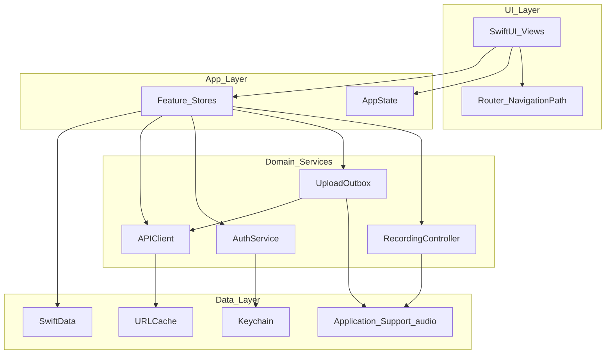

# iOS Architecture — Afterna

**Audience:** iOS Architecture Manager  
**Status:** CEO-approved (SwiftData over GRDB — see DECISIONS.md ADR-007)  
**Target:** iPhone-first (iOS 17+ baseline; adopt iOS 18/26 APIs where useful)  
**Principle:** Simple modern architecture over over-abstraction. Prefer Apple frameworks + thin app services.

---

## 1. Executive recommendation

| Concern | Recommendation | Why |
|---|---|---|
| UI | SwiftUI + `NavigationStack` | Stable, type-safe, deep-linkable |
| State | Swift Observation (`@Observable`) | Official, less boilerplate than Combine ViewModels |
| DI | Environment + `AppContainer` (manual) | Enough for production; skip heavy DI frameworks |
| Local DB | **SwiftData** for metadata | Clean SwiftUI/`@Query` integration |
| Audio blobs | **FileManager** on disk (not in DB) | Multi-hour AAC must not live in SQLite/SwiftData |
| Cloud sync | **Supabase backend** for audio + jobs | Large uploads, transcription, AI require a real API |
| Networking | `URLSession` (+ background upload session) | System-managed resume; no Alamofire required |
| Auth | Sign in with Apple → JWT in **Keychain** | Industry standard; secure at rest |
| Offline-first | Local write → outbox → upload when online | Recording must never depend on network |
| Feature flags | Typed local defaults + remote JSON overlay | Ship dark launches without overbuilding |
| Multiplatform | Shared `ConversationCore` package | iPhone now; iPad/`NavigationSplitView` / macOS later |

**Avoid for V1:** TCA/Coordinator hierarchies, Realm, dual Core Data + SwiftData, GRDB dual-stack, GraphQL, enterprise DI containers.

---

## 2. App shape (layers)



### Ownership rules

- **Views** render and send intents; they do not own network or file I/O.
- **Feature stores** own screen-facing state.
- **Services** are long-lived, injected once at launch, actor-isolated where concurrency matters.
- **SwiftData** stores metadata only (session id, title, duration, status, local paths, remote ids, error codes).
- **Audio files** live under `Application Support/Recordings/{sessionId}/…`.

---

## 3. SwiftUI navigation

1. One `NavigationStack` per tab (or single stack if no tabs).
2. Typed `Route` enum (`Hashable`, optionally `Codable`).
3. Thin `@Observable Router` holding `[Route]`.
4. Never mutate path inside `body`.
5. Sheets for auth, consent, minutes — not the navigation path.
6. iPad later: same routes in `NavigationSplitView`.

```swift
enum Route: Hashable, Codable {
  case session(UUID)
  case transcript(UUID)
  case settings
}

@Observable
final class Router {
  var path: [Route] = []
  func push(_ route: Route) { path.append(route) }
  func pop() { _ = path.popLast() }
  func popToRoot() { path.removeAll() }
  func replace(with routes: [Route]) { path = routes }
}
```

---

## 4. Dependency injection

`AppContainer` + SwiftUI Environment. Construct once in `@main`. Protocols only at test boundaries: `AudioCapturing`, `Uploading`, `TokenStore`, `Clock`.

- Prefer `actor` for `UploadOutbox`, `APIClient` token refresh, file writers.
- Keep UI stores `@MainActor`.

---

## 5. Local persistence

**SwiftData for metadata; FileManager for audio.**

```
Application Support/
  Recordings/{sessionId}/
    meta.json
    chunk-000.m4a
    chunk-001.m4a
  Outbox/
```

Store recording **paths** and byte sizes — never audio bytes in the DB.

---

## 6. Offline-first upload

1. Stop → finalize chunks → mark upload pending (works offline).
2. Request presigned URLs.
3. Background `URLSession` **file** upload (`uploadTask(with:fromFile:)`).
4. Complete → enqueue transcription.
5. Poll/push for ready; cache transcript locally.

Idempotency keys on all upload/complete calls. Recreate background session with same identifier after relaunch.

---

## 7. Auth & Keychain

- Sign in with Apple; short-lived access + rotating refresh token.
- Refresh token: `AfterFirstUnlockThisDeviceOnly` (background upload needs).
- Logout clears Keychain; App Store–compliant account deletion flow.

---

## 8. Feature flags

Typed flags + **usage/ad remote config** (day one): `base_free_minutes`, `reward_minutes`, `max_daily_rewards`, `banner_enabled`, `native_feed_interval`, `banner_refresh_interval`, `ads_on_summary_enabled`, `ai_daily_limit`, plus `chunkSeconds`, `enableBluetoothHQRecording`, `cellularUploadDefault`, `onDeviceVAD`, `maxRecordingHours`. Disk-cached JSON overlay + kill switches.

---

## 9. Module map

```
App/        RootView, AppContainer, Router
Features/   Library, Recording, Transcript, AskAI, Search, Settings, Auth
Core/       Models, Networking, Auth, Uploads, FeatureFlags, Keychain
Audio/      Isolated AVFoundation (see AUDIO_ARCHITECTURE.md)
Packages/   ConversationCore
```

---

## 10. Acceptance checklist

- [ ] Airplane mode: record → save → appears in library
- [ ] Kill during upload → requeues after relaunch
- [ ] Deep link opens conversation deterministically
- [ ] Logout clears tokens; local files policy explicit
- [ ] Disk-full path leaves recoverable chunks + clear UI

**Companion:** [AUDIO_ARCHITECTURE.md](./AUDIO_ARCHITECTURE.md) · [BACKEND_ARCHITECTURE.md](./BACKEND_ARCHITECTURE.md)
