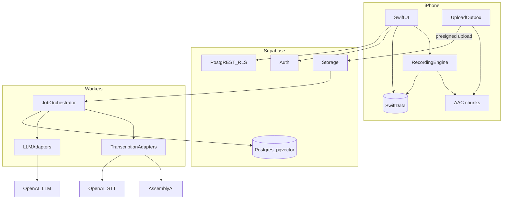

# Master Technical Plan — Afterna

**CEO / Principal Architect**  
**Date:** 2026-08-07

---

## 1. Chosen stack

| Layer | Choice |
|---|---|
| Client | Swift, SwiftUI, Swift Concurrency, Observation |
| Local DB | SwiftData (metadata) + FileManager (AAC chunks) |
| Recording | AVAudioSession + AVAudioEngine, chunked AAC, Live Activity |
| Backend | Supabase (Auth, Postgres, pgvector, Storage, Realtime) |
| Workers | Cloudflare Queues / Fly machine for ASR + LLM jobs |
| Transcription | AssemblyAI primary; OpenAI fallback; protocol `TranscriptionProviding` |
| LLM | OpenAI primary (extract/Ask/embeddings); Anthropic fallback; protocol `LLMProviding` |
| Search | Hybrid Postgres FTS + pgvector + entity filters |
| Secrets | Server-side API keys only; Keychain for user tokens |
| Billing-ready | Minute quotas + Recording Credits ledger (not subscription MVP) |
| Ads | In-feed native every 4–6 library/search rows + rewarded credits; **ad-free** recording, processing, transcript, Ask AI, settings; Summary prefer none |
| Remote config | Day-one: `base_free_minutes`, `reward_minutes`, `max_daily_rewards`, `banner_enabled`, `native_feed_interval`, `banner_refresh_interval`, `ads_on_summary_enabled`, `ai_daily_limit` |

---

## 2. System diagram



---

## 3. Cost estimates (planning)

Assumptions: AssemblyAI ~$0.23/hr with diarisation; extract/summary ~$0.005/session; Ask ~$0.003/question; blended ~18 recorded min/MAU/month (power-law).

| Metric | Estimate |
|---|---|
| Cost per recorded hour (STT+diar+extract) | **~$0.24–0.28** |
| Cost per AI question | **~$0.003** |
| COGS per MAU / month (blended) | **~$0.09** |
| 1K MAU variable COGS | **~$90** |
| 10K MAU variable COGS | **~$900** |
| 100K MAU variable COGS | **~$9K** (before power-user spikes — caps essential) |

Ad ARPMAU base alone is insufficient; **60 min/week + Recording Credits (1 credit = N min, default 5) + in-feed native (`native_feed_interval`) + `max_daily_rewards`** keeps free/no-subscription near break-even and tunable via remote config—without glued banners on value screens.

---

## 4. Biggest technical risks

1. Background recording reliability across interruptions/routes (hardware matrix).  
2. App Review scrutiny of `audio` background mode.  
3. Diarisation quality in noisy field audio (AU accents).  
4. Provider outages → need failover path.  
5. Cost spikes from power users without enforced quotas.  
6. iOS cannot capture Zoom system audio or Phone.app calls — product honesty.

---

## 5. Biggest product risks

1. “Good enough” competition from Apple Notes / Voice Memos.  
2. Consent / privacy category backlash.  
3. Weak differentiation if Ask AI citations are poor.  
4. Ad UX damaging premium feel.  
5. Wedge too broad → muddy onboarding.

---

## 6. Provider abstraction (must ship)

```swift
protocol TranscriptionProviding: Sendable {
  func startBatch(_ request: TranscriptionRequest) async throws -> ProviderJobHandle
  func fetchBatch(job: ProviderJobHandle) async throws -> TranscriptionJobState
  func normalize(rawPayload: Data, request: TranscriptionRequest) throws -> CanonicalTranscript
}

protocol LLMProviding: Sendable {
  func complete(request: LLMRequest) async throws -> LLMResponse
}
```

No business logic hardcoded to one vendor SDK in feature code.

---

## 7. Multiplatform readiness

- Shared `ConversationCore` package for models, API, outbox, flags.
- UI remains iPhone-focused; routes designed for future `NavigationSplitView`.
- Audio capture protocol-backed (`AudioCapturing`) for platform variants.
