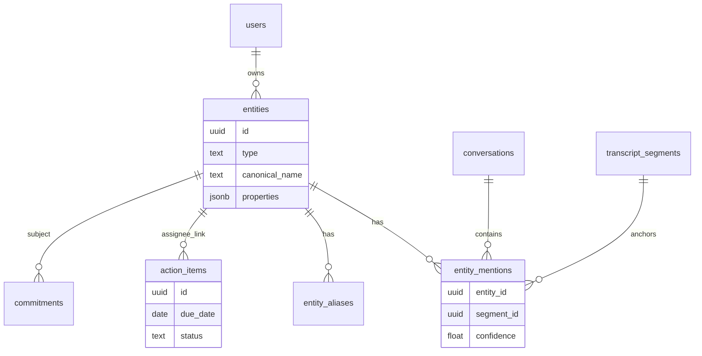
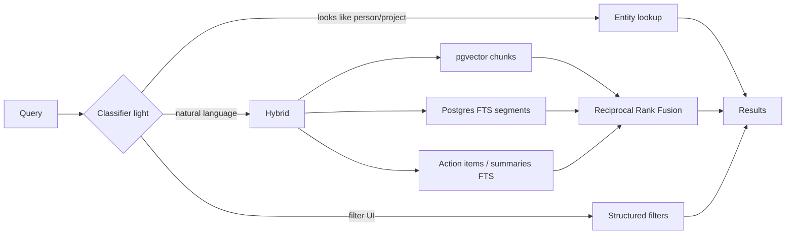
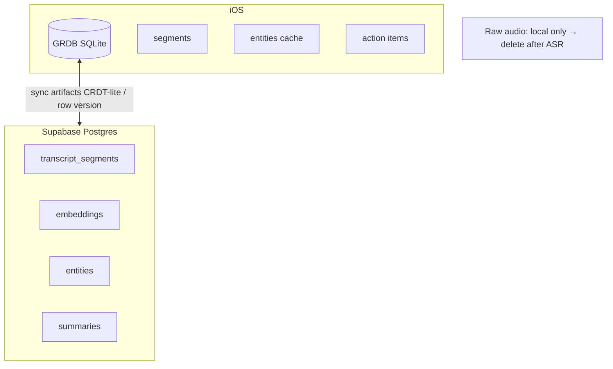
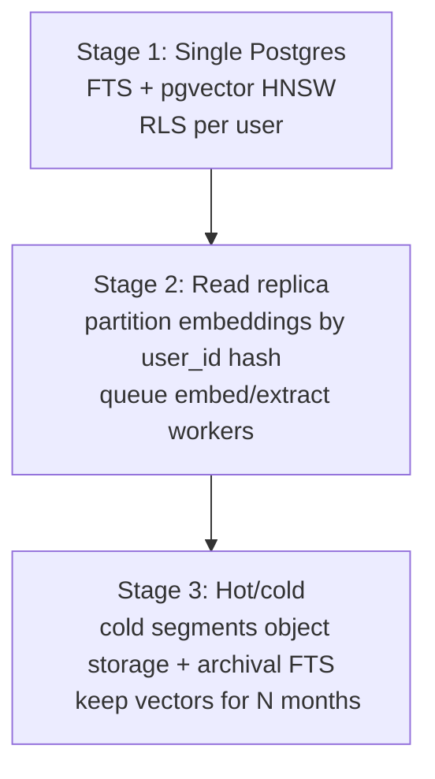

# Memory & Search Architecture — Afterna

**Product:** iPhone AI conversation memory app  
**Scope:** Entity memory, hybrid search, scaling path, knowledge graph V1 decision  
**Companion docs:** [AI_ARCHITECTURE.md](./AI_ARCHITECTURE.md) · [BACKEND_ARCHITECTURE.md](./BACKEND_ARCHITECTURE.md)

---

## 1. What “memory” means here

Users care about **people, companies, projects, topics, dates, and commitments** — not a free-form chatbot brain.

| Memory type | Source | User-facing |
|-------------|--------|-------------|
| **Episodic** | Transcript segments + timestamps | “What did we say about X on Tuesday?” |
| **Structured** | LLM extraction → action items, decisions, deadlines | To-do lists, commitment reminders |
| **Entity** | Extracted mentions + light resolution | Person/company/project pages |
| **Organizational** | Folders, tags, pins | Browse & filter |

V1 stores memory as **rows + vectors + FTS**, not as a graph query engine.

---

## 2. Entity model (V1)



### Types

| Type | Examples | Properties (jsonb) |
|------|----------|-------------------|
| `person` | “Sarah Chen”, “Mom” | `role`, `email?`, `relationship?` |
| `company` | “Acme”, “Notion” | `domain?` |
| `project` | “Q3 launch”, “Website redesign” | `status?` |
| `topic` | “pricing”, “school pickup” | — |
| `date_ref` | normalized from speech | `resolved_date` |
| `commitment` | often modeled as `action_items` | assignee, due, status |

**Commitments:** Prefer first-class `action_items` (+ optional `decisions`) over a separate commitment entity type. Surface them on entity pages via assignee/mention links.

### Resolution (keep it simple)

1. Exact / alias match within user scope (case-fold, punctuation-strip).  
2. Fuzzy match (pg_trgm) for near-duplicates; suggest merge in UI.  
3. LLM linking only during extraction (“same as existing entity_id?”) with top-20 candidate names in prompt — **no** global clustering job in V1.  
4. User can merge/rename/split entities; merges rewrite FKs + aliases.

---

## 3. Hybrid search (simplest architecture that scales)



### Query paths

| Path | Mechanism | When |
|------|-----------|------|
| **Lexical** | `tsvector` on `transcript_segments.text`, summaries, action_items | Keywords, names, rare terms |
| **Vector** | pgvector on `embedding_chunks` | Paraphrase, topical |
| **Structured** | SQL filters: date range, folder, tag, speaker, entity_id, open action items | Facets / “Sarah’s open tasks” |
| **Fusion** | RRF (k=60) over lexical + vector lists | Default Ask AI + search tab |

### Ranking signals (V1, cheap)

- RRF score  
- Recency boost (`updated_at` / conversation `started_at`)  
- Optional: folder pin boost  
- **No** learning-to-rank in V1

### Result types (unified search UI)

```ts
type SearchHit =
  | { kind: "segment"; segment_id; t_start_ms; snippet; conversation_id }
  | { kind: "conversation"; conversation_id; title; summary_snippet }
  | { kind: "action_item"; action_item_id; text; due_date }
  | { kind: "entity"; entity_id; name; type; mention_count };
```

Ask AI uses the same retrieval substrate but returns a generated answer + citations ([AI_ARCHITECTURE.md](./AI_ARCHITECTURE.md)).

---

## 4. Local-first + cloud sync for memory



| Artifact | Local | Cloud | Notes |
|----------|-------|-------|-------|
| Raw audio | Yes (ephemeral) | Optional short-lived upload | Delete after successful transcription |
| Transcript segments | Yes | Yes | Source of truth after sync |
| Summaries / action items / entities | Yes (cache) | Yes | Cloud wins on conflict with `updated_at` + device clock skew rules |
| Embeddings | No (optional) | Yes | Too heavy; Ask AI hits API |
| Search index | FTS local for offline | FTS + vector cloud | Offline: local FTS only |

**Conflict policy (V1):** Last-write-wins on user edits (titles, action status, entity merges); server-generated extractions are immutable versions (`summary_version`).

---

## 5. Do we need a knowledge graph for V1?

### Decision: **No graph database / no KG engine in V1**

| Need | V1 approach | When to revisit |
|------|-------------|-----------------|
| “All meetings with Acme” | `entity_mentions` + SQL | — |
| “Tasks assigned to Sarah” | `action_items.assignee_entity_id` | — |
| “Related projects” | Co-occurrence count query | If users ask for multi-hop |
| Multi-hop (“Who introduced me to the lawyer working on Project X?”) | Not supported well | KG or heavier agentic retrieval |
| Ontology / RDF | Out of scope | Enterprise |

**Why not Neo4j/etc. in V1**

- Same answers from relational joins + entities for 90% of mobile UX.  
- Operational cost and sync complexity dominate benefit before ~product-market fit.  
- pgvector + FTS + entity tables already form a **soft graph** (nodes=entities, edges=mentions/co-occurrence).

**V1.5 “soft graph” (still Postgres)**

```sql
-- materialized later if needed
entity_cooccurrence(user_id, entity_a, entity_b, conversation_count, last_seen_at)
```

**V2 KG trigger:** Ship only if eval shows multi-hop questions are a top-3 user need and SQL co-occurrence fails quality bar.

---

## 6. Scaling path (simplest → next)



| Stage | Users (order of mag.) | Architecture |
|-------|----------------------|--------------|
| **1** | → ~50K AU | Supabase/Postgres, one primary, HNSW, `tsvector` GIN |
| **2** | ~50K–500K | Separate worker fleet; replica for search; batch embed; connection pooling (PgBouncer) |
| **3** | 500K+ | Shard-by-user or tenant; cold storage for old transcripts; optional OpenSearch only if FTS pressure proven |

**Avoid early:** Elasticsearch/OpenSearch + separate vector DB (Pinecone/Weaviate) **until** Postgres metrics say so. One system for sync, RLS, and RAG keeps the mobile backend small.

### Indexing guidelines

- HNSW on `embedding_chunks.embedding` with `WHERE user_id = ...` via restrictive queries (always include `user_id` predicate).  
- Partial indexes for `action_items` where `status = 'open'`.  
- GIN on `to_tsvector('english', text)` — add language configs when you expand locales.  
- Cap chunk count per conversation; don’t embed every 2-second micro-utterance.

---

## 7. Privacy & deletion

| Event | Behavior |
|-------|----------|
| Delete conversation | Cascade segments, chunks, embeddings, mentions, summaries; recompute entity mention counts |
| Delete entity | Soft-delete or merge; don’t delete transcript text |
| Account delete | Hard delete all user rows within SLA (e.g. 30 days); wipe queues |
| Audio | Default delete post-ASR; tombstone `audio_deleted_at` |

Search must never resurface deleted conversations (RLS + hard delete).

---

## 8. Concrete V1 recommendations

1. **Memory = entities + action_items + decisions + dated segments**, not a KG product.  
2. **Search = hybrid RRF** (Postgres FTS + pgvector) + structured filters.  
3. **Entity resolution = aliases + trgm + user merge**; light LLM assist at extract time only.  
4. **Offline = local FTS + cached summaries/actions**; cloud for semantic Ask AI.  
5. **Scale = vertical Postgres first**; postpone separate search/vector vendors.  
6. **Skip Neo4j/KG for V1**; add `entity_cooccurrence` if relationship UX needs it.

---

## 9. Success metrics

| Metric | Target (directional) |
|--------|----------------------|
| Search success rate (tap result within 30s) | >70% |
| Ask AI citation precision (human spot-check) | >85% |
| Action-item useful rate (not dismissed as junk) | >60% |
| Entity merge conflict rate | Low enough that users aren’t cleaning weekly |
| p95 search latency (cloud) | <400ms hybrid retrieve (ex-LLM) |
